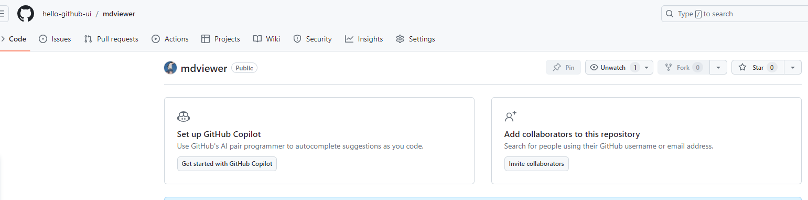

# 说明

本项目是将本地 `markdown` 文件通过 `vite3`、`vue2`、`github action` `github pages` 静态部署在 `github` 上的一个 Demo。

# 开始

## 新建仓库

## 创建分支

在 `github` 上建好仓库后，将代码 `clone` 到本地，然后你开发好相关代码，将代码第一次先推送到 `master` 分支上。

然后再在此基础上新建一个 `gh-pages` 分支。

