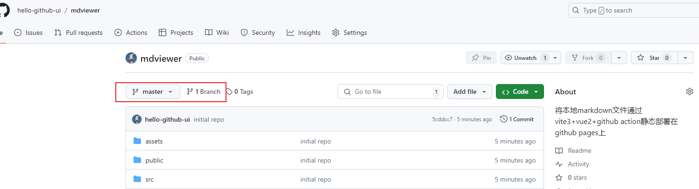
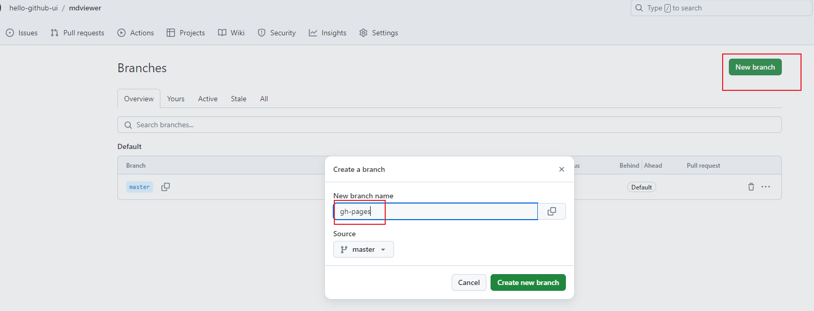
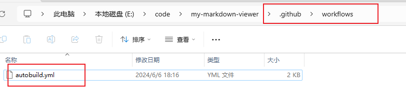
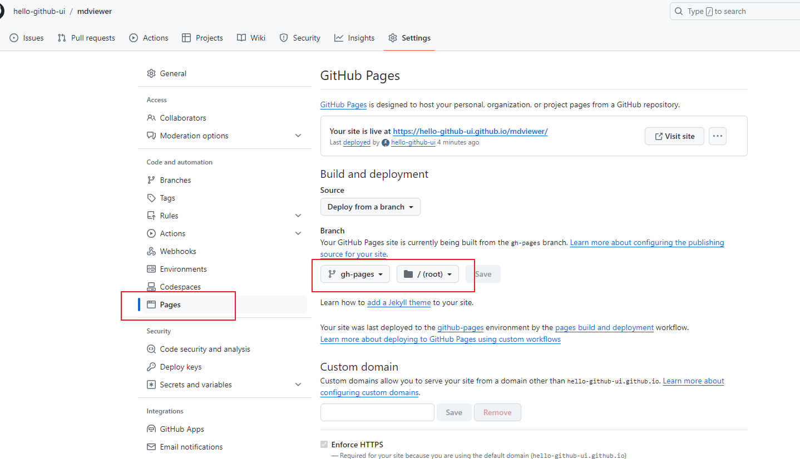
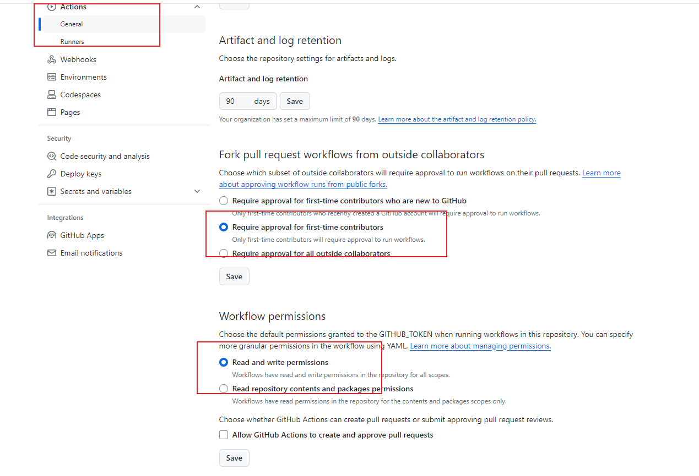
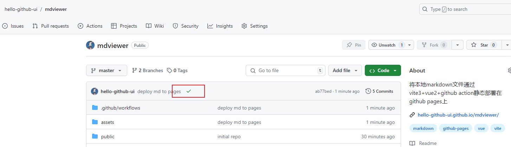
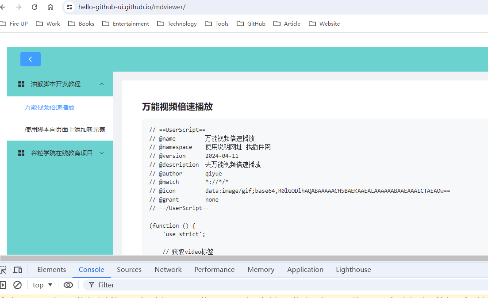
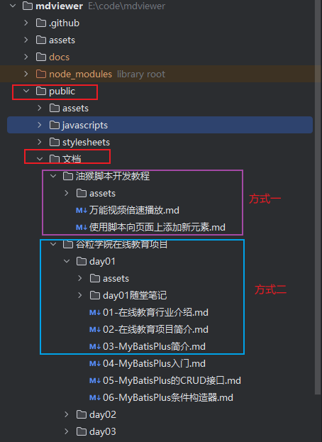

# 说明

本项目是将本地 `markdown` 文件通过 `vite3`、`vue2`、`github action` `github pages` 静态部署在 `github` 上的一个 Demo。

# 开始

## 新建仓库


## 创建分支

在 `github` 上建好仓库后，将代码 `clone` 到本地，然后你开发好相关代码，将代码第一次先推送到 `master` 分支上。


然后点击如下地方，在 `github` 上进行创建 `gh-pages` 分支的操作：





这样 `gh-pages` 分支就创建好了。

## 编写 Action

进入项目目录，手动创建 `.github\workflows` 目录，并在其下新建一个 `autobuild.yml` 文件，写入如下内容：



```yaml
name: Deploy Pages

on:
  push:
    branches:
      - master

jobs:
  build-and-deploy:
    runs-on: ubuntu-latest
    steps:
      - name: Checkout master branch
        uses: actions/checkout@v4
        with:
          ref: master

      - name: Set up Node.js
        uses: actions/setup-node@v4
        with:
          node-version: "20"

      - name: Install dependencies
        run: npm install

      - name: Build
        run: npm run build # 这会生成 docs 目录

      - name: Checkout gh-pages branch
        uses: actions/checkout@v4
        with:
          ref: gh-pages
          path: gh-pages

      - name: Clear old documentation
        working-directory: gh-pages
        run: |
          find . -maxdepth 1 ! -name 'CNAME' ! -name '.git' ! -name '.' ! -name '..' -exec rm -rf {} +

      - name: Copy docs to gh-pages directory
        run: cp -r docs/* gh-pages/

      - name: Commit and push to gh-pages
        working-directory: gh-pages
        run: |
          git config user.email "util.you.come@github.com"
          git config user.name "hello-github-ui"
          git add .
          git commit -m "Update documentation" -a || echo "No changes to commit"
          git push --force origin gh-pages
```

## 设置仓库

请按照下图进行配置：



配置 `Actions`，允许 `Workflow` 进行读写操作：



## 部署

1、本地先执行 `npm install`安装一下依赖，

2、再执行 `npm run build` 构建一下 `docs` 目录

之后再次提交本地代码即可完成自动部署到 `github pages`。






# 添加文档

## 指定位置

后续在添加 `markdown` 文档时，请将文档放入如下地方：



方式一二都可以用，目前只支持 `最多两层目录`的嵌套，因此请确保你的 `md` 文件至多嵌套两层目录（多了会报错）

## 更新 files.json

在 `python` 中执行如下代码，使用生成的 `files.json` 覆盖掉 `/public/files.json` 的内容：

```python
import os
import json

def generate_file_structure(root_dir):
    def traverse_dir(directory, parent_path=""):
        folder_structure = []
        for item in sorted(os.listdir(directory)):
            item_path = os.path.join(directory, item)
            relative_path = os.path.join(parent_path, item)

            # 跳过 "assets" 和含有“随堂笔记”字样的目录
            if item == "assets" or "随堂笔记" in item:
                continue

            if os.path.isdir(item_path):
                children = traverse_dir(item_path, relative_path)
                if children:  # 仅在有子项时添加目录
                    folder_structure.append({
                        "name": item,
                        "path": relative_path.replace("\\", "/"),
                        "children": children,
                        "open": False
                    })
            elif item.endswith(".md"):
                folder_structure.append({
                    "name": item,
                    "path": relative_path.replace("\\", "/")
                })
        return folder_structure

    structure = traverse_dir(root_dir)
    return structure

def save_to_json(data, filename):
    with open(filename, 'w', encoding='utf-8') as f:
        json.dump(data, f, ensure_ascii=False, indent=4)

root_directory = "E:\\code\\mdviewer\\public"  # 请根据实际情况修改目录
output_file = "files.json"

file_structure = generate_file_structure(root_directory)
save_to_json(file_structure, output_file)
print(f"File structure saved to {output_file}")
```

## 更新

提交代码即可自动更新。
