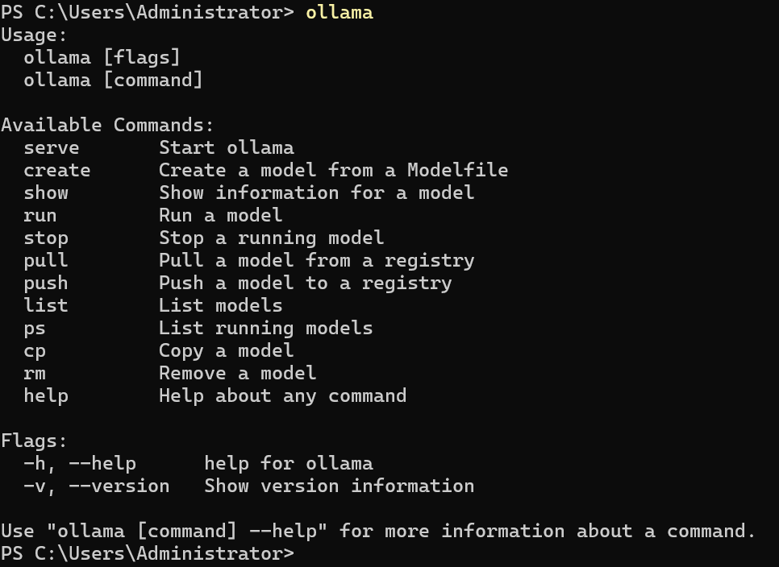
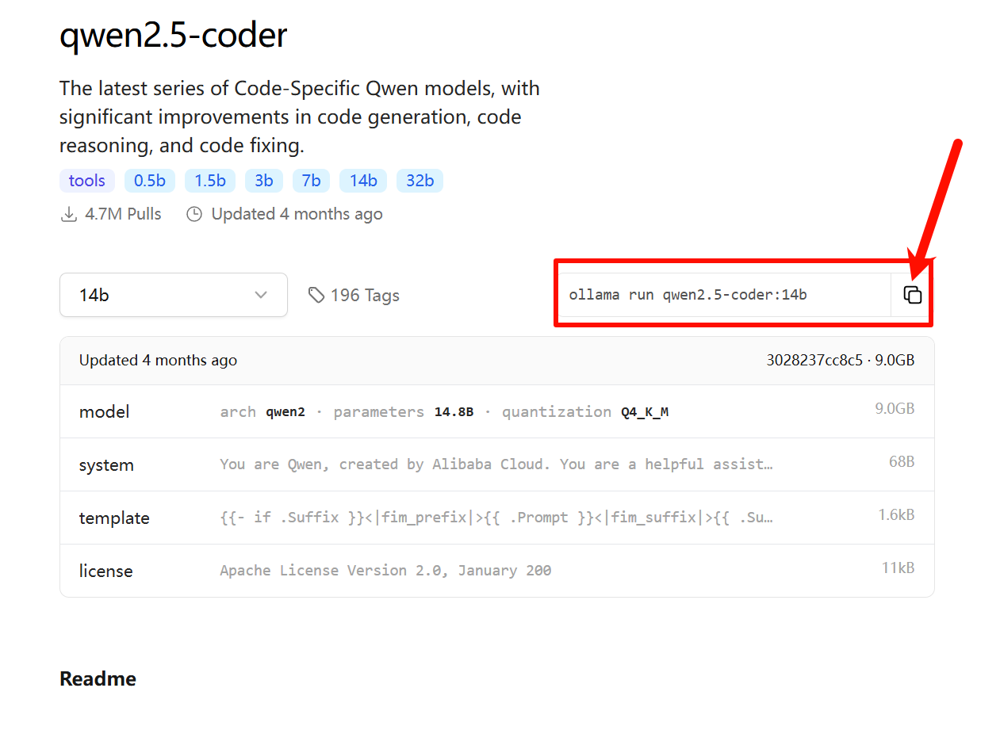
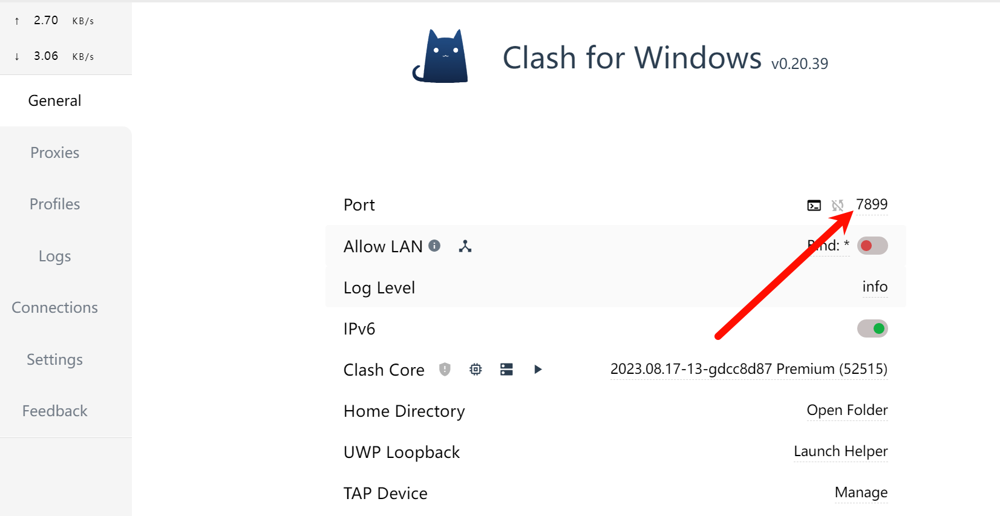
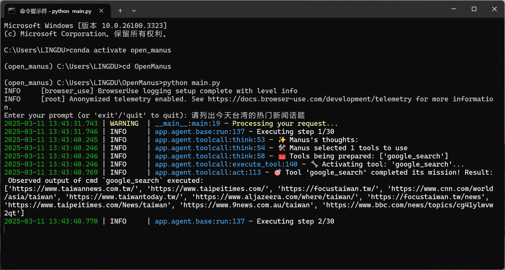
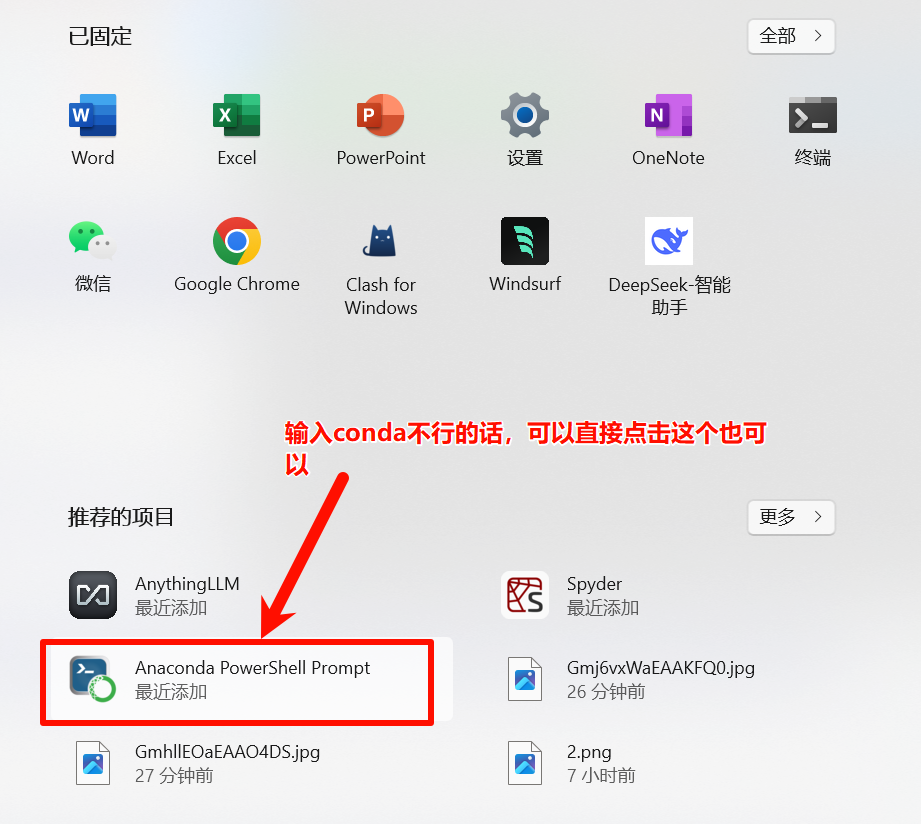
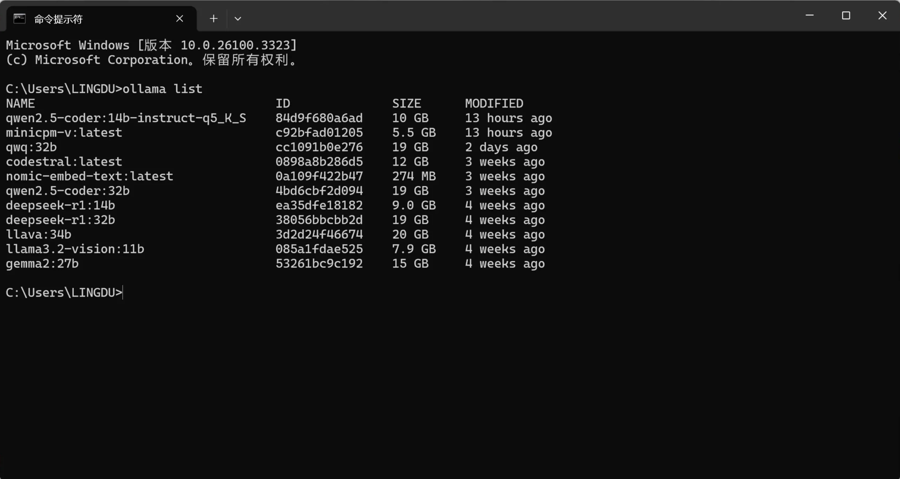

# [OpenManus 本地部署！ 完全免费，对接 Ollama 本地大模型，真香！](https://www.freedidi.com/18739.html)

> 短短 3 天，39K Stars，Manus 开源版 OpenManus 彻底爆火！完全免费，无需等待，无需任何费用，无需APIKEY，直接对接我们本地的开源大模型！通过调用本地的 Ollama ，不要太香！

**本地部署过程：**

提前准备安装 python 3.12 【[点击下载](https://www.python.org/downloads/release/python-3120/)】和 conda 【[点击前往](https://repo.anaconda.com/)】

下面我会提供两种不同的安装方法，分别适合Windows 和 macOS 、Linux用户

### 方法 1：使用 conda （ 适合 Windows 用户）

#### 1、创建一个新的 conda 环境：

```bash
conda create -n open_manus python=3.12

conda activate open_manus
```

#### 2、克隆存储库：

```bash
git clone https://github.com/mannaandpoem/OpenManus.git

cd OpenManus
```

#### 3、安装依赖项：

```bash
pip install -r requirements.txt
```

#### 4、安装Ollama 本地部署AI大模型

Ollama 官方下载：【[点击前往](https://ollama.com/)】

##### 4.1 安装

> Ollama 默认是安装刀C盘路径下，这里我将其安装到D盘下：

* 创建文件夹

在D盘创建一个Ollama文件夹如：`D:\software\ollama`

* 利用命令行安装

将Ollama安装包 `OllamaSetup.exe` 放入上一步创建好的文件夹内。

在这个文件夹下打开CMD窗口，运行安装命令：

```bash
PS D:\software\ollama> .\OllamaSetup.exe /DIR="D:\software\ollama"
```

* 按照提示完成安装即可

##### 4.2 配置环境变量

> 配置Ollama的模型存储路径，默认是C盘，这里我们更改Ollama的模型存储为D盘，直接在安装目录下，创建 `ollama_models` 目录：`D:\software\ollama\ollama_models`

* 配置模型存储目录的环境变量，打开环境变量，新增

```bash
变量名：OLLAMA_MODELS
变量值：D:\ollama_models
```


* 配置监听地址：

```bash
变量名：OLLAMA_HOST
变量值：127.0.0.1
```


* 配置监听端口：

```bash
变量名：OLLAMA_PORT
变量值：11438
```


* 为HTTP开放请求

```bash
变量名：OLLAMA_ORIGINS
变量值：*
```


##### 4.3 验证安装成功否

打开CMD，输入 `ollama`，是否显示如下：



##### 4.4 下载大模型（以qwen2.5-coder:14b为例）

下载地址：https://ollama.com/search



安装：

由于本地对接的AI模型，必须使用有函数调用的模型才可以， 比如 qwen2.5-coder:14b、qwen2.5-coder:14b-instruct-q5_K_S、qwen2.5-coder:32b 都可以，视觉模型可以使用 minicpm-v

本地模型安装命令：

```bash
ollama run qwen2.5-coder:14b
```

视觉模型安装命令:

```bash
ollama run minicpm-v
```

当然你可以安装任何你想要的，只要支持函数调用的模型就可以， 只需在安装命令 ollama run 后面跟上模型名称即可！

如果遇到这样的报错：


你只需要修改一下你代理软件的端口即可：




#### 5、修改配置文件

在安装目录下，找到 OpenManus\config\config.example.toml ，把config.example.toml 改成 config.toml

然后将里面的内容改成如下：

```toml
# Global LLM configuration
[llm]
model = "qwen2.5-coder:14b"
base_url = "http://localhost:11434/v1"
api_key = "sk-..."
max_tokens = 4096
temperature = 0.0

# [llm] #AZURE OPENAI:
# api_type= 'azure'
# model = "YOUR_MODEL_NAME" #"gpt-4o-mini"
# base_url = "{YOUR_AZURE_ENDPOINT.rstrip('/')}/openai/deployments/{AZURE_DEPOLYMENT_ID}"
# api_key = "AZURE API KEY"
# max_tokens = 8096
# temperature = 0.0
# api_version="AZURE API VERSION" #"2024-08-01-preview"

# Optional configuration for specific LLM models
[llm.vision]
model = "qwen2.5-coder:14b"
base_url = "http://localhost:11434/v1"
api_key = "sk-..."
```

**注意：里面的模型文件名称要改成你自己安装的，后面的视觉模型可以和上面的一致，也可以自定义其它的视觉模型!**

如果你在中国大陆，可能需要把代码里的 localhost 改成 127.0.0.1 

最后运行即可

```bash
python main.py
```

详细的使用教程如下：

https://youtu.be/U-9VvdChGYE

运行以后就可以进行使用了！它就可以完全自动调用浏览器，打开并浏览，查询并收集需要的信息




#### 6、下次打开运行的命令如下：

```bash
conda activate open_manus

cd OpenManus

python main.py
```



### 方法 2：使用 uv（适合macOS用户）

#### 1、安装 uv（快速 Python 包安装程序和解析器）：

```bash
curl -LsSf https://astral.sh/uv/install.sh | sh
```

#### 2、克隆存储库：

```bash
git clone https://github.com/mannaandpoem/OpenManus.git

cd OpenManus
```

#### 3、创建一个新的虚拟环境并激活它：

Windows 系统

```bash
uv venv

.venv\Scripts\activate
```

macOS系统

```
uv venv

source .venv/bin/activate
```

#### 4、安装依赖：

```
uv pip install -r requirements.txt
```

#### 5、安装Ollama 本地部署AI大模型

更多内容，详细见零度教程

官方开源项目：【[链接直达](https://github.com/mannaandpoem/OpenManus)】

**如何卸载已安装过的模型？在CMD终端下，通过命令：**

```bash
ollama list  # 查询已安装的模型
ollama rm 模型名称  # 卸载并删除模型
```



比如需要删除gemma2:27b 模型，那么只需输入：

```bash
ollama rm gemma2:27b
```

即可删除模型