# Git_Tutorial

## 配置 SSH

### 生成 SSH 密钥

```bash
ssh-keygen -t rsa -C "email@example.com"
```

### GitHub 配置

```bash
cat ~/.ssh/id_rsa.pub
```

复制这个文件中的内容，然后登录 GitHub ，配置即可。

### 配置用户名和邮箱

```bash
git config --global user.name "username"
git config --global user.email "email@example.com"
```

一台机器上配置多个 GitHub
账户参考：[如何用 SSH 密钥在一台机器上管理多个 GitHub 账户](https://www.freecodecamp.org/chinese/news/manage-multiple-github-accounts-the-ssh-way/)

## clone

### 只Clone指定Commit的代码

以下图所示为例：

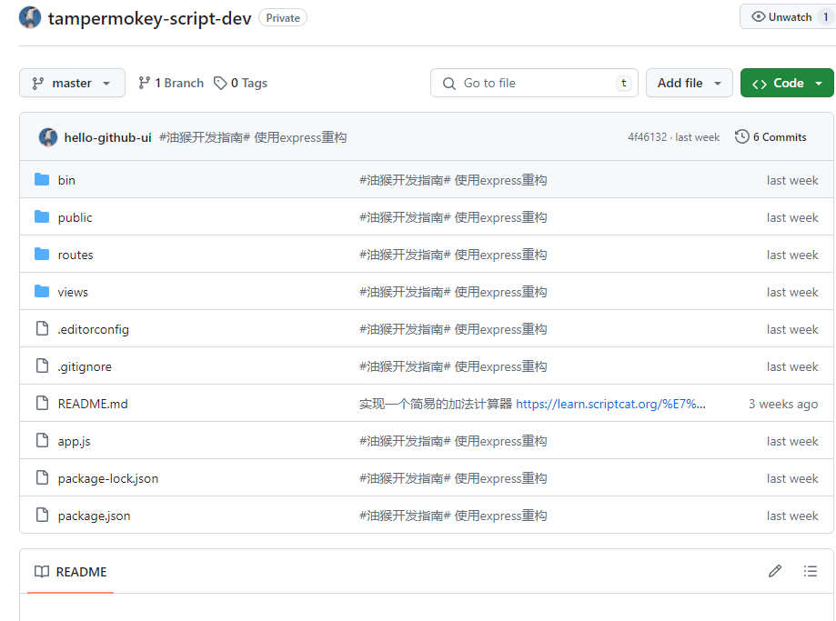

这个仓库在原先的历史记录在根目录下有一个 `assets` 文件夹，但是在最新代码仓库中已经不存在了，这时候如果你只想使用那个
`commit` 记录的代码，那就需要如下操作：

```bash
# make a new folder
cd C:\Users\Admin\WebstormProjects
make new folder
# make a new blank repository in the current directory
git init
```

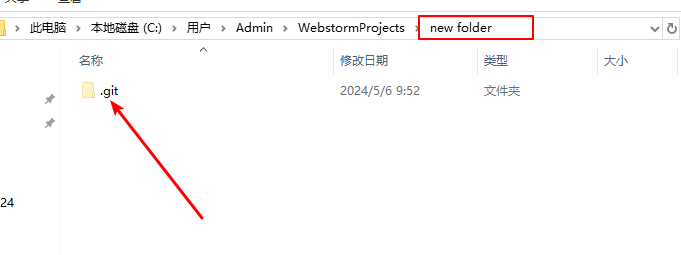

```bash
# add a remote
git remote add origin git@github.com:hello-github-ui/tampermokey-script-dev.git

# fetch a commit (or branch or tag) of interest
# Note: the full history up to this commit will be retrieved unless
#       you limit it with '--depth=...' or '--shallow-since=...'
# git fetch origin <sha1-of-commit-of-interest>
git fetch origin e9f7b04d18cb926a1ac0147b62039d6840d94510
```

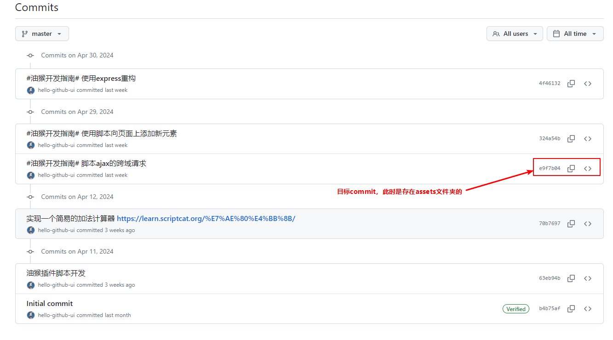

```bash
# reset this repository's master branch to the commit of interest
git reset --hard FETCH_HEAD
```

最终可以看到此时本地代码仓库是已经变成你需要的目录了：

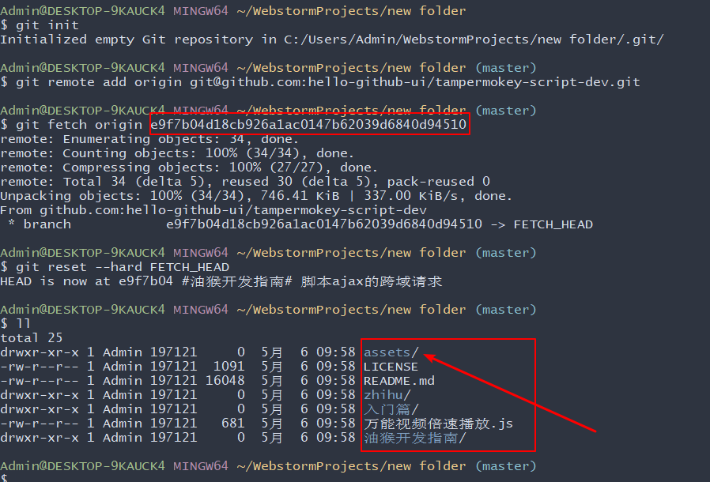

参考来源：[stackoverflow](https://stackoverflow.com/questions/3489173/how-to-clone-git-repository-with-specific-revision-changeset)

### 只Clone指定分支的代码

> 有两种方式可以clone一个特定的分支。
>
> 1. 直接clone仓库，这会获取到所有分支，然后立即切换到指定的分支。
> 2. 只clone目标分支，其它的分支代码不获取。

~~==第一种方式就不演示了，默认都会。==~~

直接演示方式二

这个仓库有三个分支，我们现在只想获取 `express` 分支：

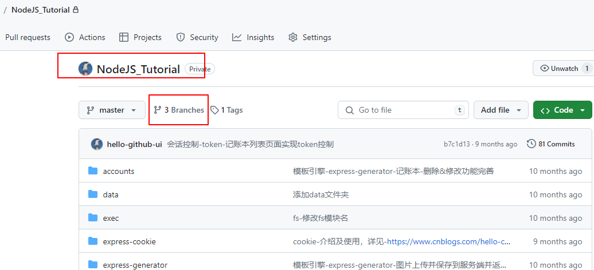

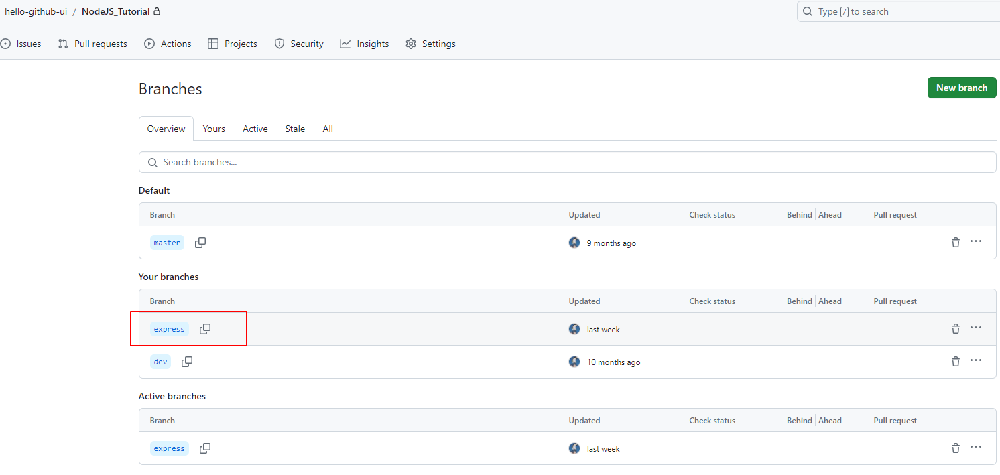

```bash
# 同样进入这个新建的空目录
cd C:\Users\Admin\WebstormProjects\new folder

# 只克隆express分支的代码，注意这种方式是不会获取到远程的其它分支的
git clone -b express --single-branch git@github.com:hello-github-ui/NodeJS_Tutorial.git
```

> 这里 `-b` 这是 `--branch` 的别名
>
> 注意：`--single-branch` 是 Git 在版本 `1.7.10` 及更高版本中引入的，因此使用时请注意你的 Git 版本。

此时，我们看一下本地仓库的分支情况：

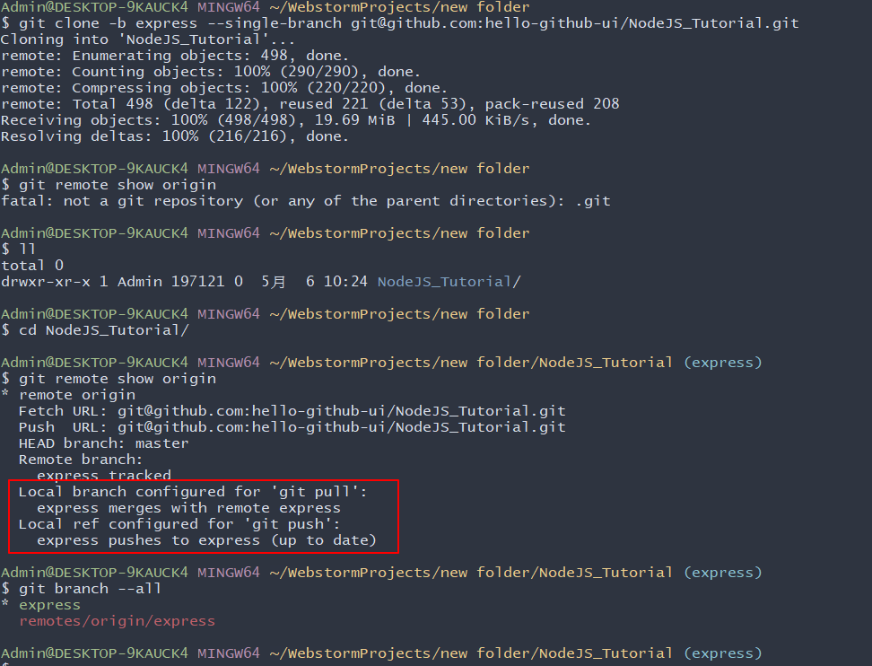

### 只clone指定tag的代码

> 需求：还是使用上面演示的那个仓库，现在我们只需要克隆 `v1.0.0` 这个tag的代码，并且不需要 `历史记录`。

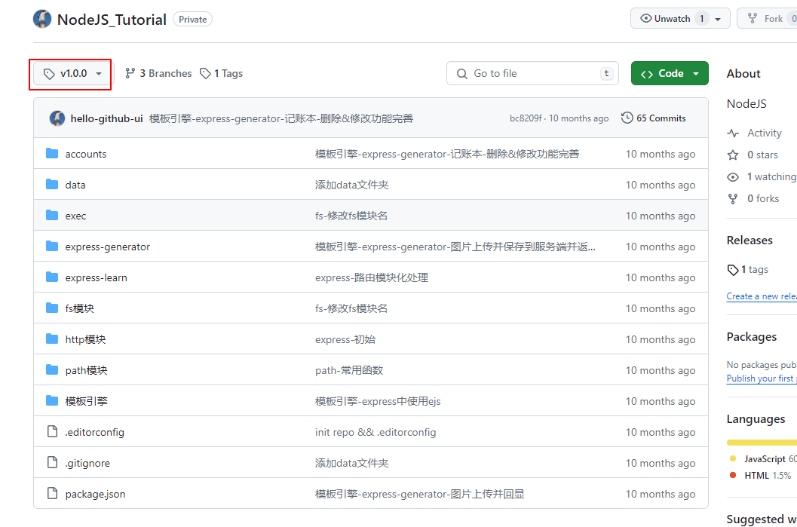

准备一个空目录：

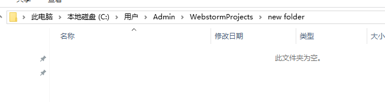

```bash
# git clone --depth 1 --branch <tag_name> <repo_url>
git clone --depth 1 --branch v1.0.0 git@github.com:hello-github-ui/NodeJS_Tutorial.git
```

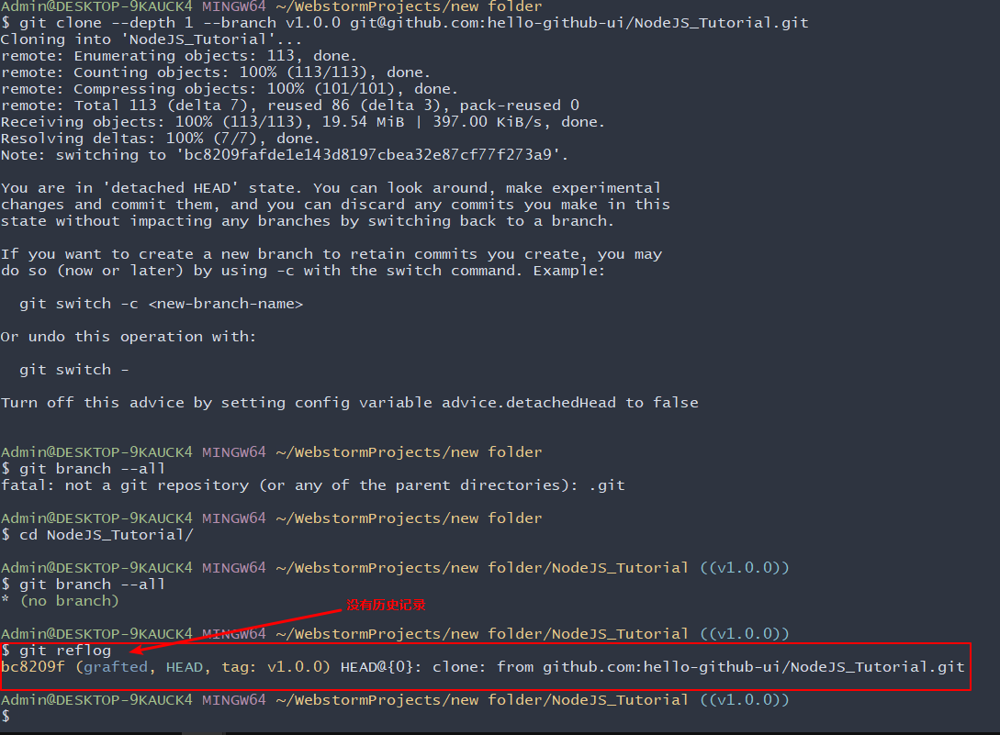

> 命令解释：
>
> `--branch` can also take tags and detaches the HEAD at that commit in the resulting repository.
>
> `--depth 1` is optional but if you only need the state at that one revision, you probably want to skip downloading all
> the history up to that revision.

参考来源：[stackoverflow](https://stackoverflow.com/questions/20280726/how-to-clone-a-specific-git-tag)

## .gitignore

### 只忽略某个具体目录下的文件

如果你想只忽略一个特定的文件，你需要提供该文件在项目根目录下的完整路径。

例如，如果你想忽略位于根目录下的 `text.txt` 文件，你可以做如下操作：

```bash
/text.txt
```

而如果你想忽略一个位于根目录下的 `test` 目录中的 `text.txt` 文件，你需要如下做：

```bash
/test/text.txt
```

当然你也可以这样写上述内容：

```bash
test/text.txt
```

### 只忽略任意目录下的某个文件

> 需求：比如在你的项目的好些目录中都有 `text.txt` 文件，你都想把它忽略掉，不限目录。

此时你只需要写出该文件的字面名称即可，不需要添加这个文件的完整路径，这样的话它就会忽略位于项目中任何地方的具有该特定名称的所有文件

```bash
text.txt
```

### 忽略整个目录及其所有内容

要忽略整个目录以及其所有内容，你需要包括目录的名称，并在最后一定要加上斜线 `/`：

```bash
test/
```

这个命令将忽略位于你的项目中任何地方的名为 `test` 的目录（包括目录中的其他文件和其他子目录）。

需要注意的是，如果你只写一个文件的名字或者只写目录的名字而不写斜线 `/`，那么这个模式将同时匹配任何带有这个名字的文件或目录：

```bash
# 匹配任何名字带有 test 的文件和目录
test
```

### 忽略以特定单词开头的文件或目录

例如，你想忽略所有名称以 `img` 开头的文件和目录。要做到这一点，你需要指定你想忽略的名称，后面跟着 `*` 通配符选择器，像这样：

```bash
img*
```

这个命令将忽略所有名字以 `img` 开头的文件和目录。

### 忽略以特定单词结尾的文件或目录

如果你想忽略所有以特定文件扩展名结尾的文件，你需要使用 `*` 通配符选择器，后面跟你想忽略的文件扩展名。

例如，如果你想忽略所有以 `.md` 文件扩展名结尾的 markdown 文件，你可以在你的 `.gitignore` 文件中添加以下内容：

```bash
*.md
```

这个模式将匹配位于项目中任何地方的以 `.md` 为扩展名的任何文件。

现在如果你想做一个例外，在上述规则的前提下，有一个 `.md` 后缀的文件你不想被忽略掉，怎么做？

要做到这一点，你需要使用带有感叹号的否定模式，即 `!` ，来排除一个本来被忽略的文件：

```bash
# 忽略所有 .md 文件
.md

# 不忽略 README.md 文件
!README.md
```

&#x1F4A1; 在 `.gitignore` 文件中同时使用这两种模式，所有以 `.md` 结尾的文件都会被忽略掉，除了 `README.md` 文件。

&#x1F6A8; 需要记住的是，==如果你忽略了整个目录，这个模式就不起作用==。

例如，你忽略了所有的 `test` 目录：

```bash
test/
```

假设在一个 `test` 文件夹内，你有一个文件，`example.md`，你不想忽略它。此时，你就==不能==像下面这样在一个被忽略的目录内排除一个文件：

```bash
# 忽略所有名字带有 test 的目录
test/

# 试图在一个被忽略的目录内排除一个文件是行不通的
!test/example.md
```

### 如何忽略以前提交的文件

当你创建一个新的仓库时，最好的做法是创建一个 `.gitignore` 文件，包含所有你想被忽略的文件和不同的文件模式 **--在提交之前**。

Git 只能忽略==尚未提交到仓库的未被追踪==的文件。

如果你过去已经提交了一个文件，但希望没有提交，会发生什么？

比如你不小心提交了一个存储环境变量的 `.env` 文件。

你首先需要更新 `.gitignore` 文件以包括 `.env` 文件：

```bash
# 给 .gitignore 添加 .env 文件
echo ".env" >> .gitignore
```

现在，你需要告诉 Git 不要追踪这个文件，把它从索引中删除：

```bash
git rm --cached .env
```

> `git rm` 命令，连同 `--cached` 选项，从版本库中删除文件，但不删除实际的文件。这意味着该文件仍然在你的本地系统和工作目录中作为一个被忽略的文件。

`git status` 会显示该文件已不在版本库中，而输入 `ls` 命令会显示该文件仍存在于你的本地文件系统中。

如果你想从版本库和你的本地系统中删除该文件，省略 `--cached` 选项。

接下来，用 `git add` 命令将 `.gitignore` 添加到暂存区：

```bash
git add .gitignore
```

最后，使用 `git commit` 命令提交 `.gitignore` 文件：

```bash
git commit -m "update ignored files"
```

本节内容参考：[freecodecamp](https://www.freecodecamp.org/chinese/news/gitignore-file-how-to-ignore-files-and-folders-in-git/)

## 如何重命名Git分支

要重命名当前不在操作的分支，通常运行命令： `git branch -m old-name new-name`。

如何在 Git 中重命名当前分支？使用命令：`git branch -m new-name`。

> `-m` 是 move 的缩写。

本节内容参考：[freeCodeCamp](https://www.freecodecamp.org/chinese/news/renaming-a-git-branch-how-to-rename-the-current-branch-in-git/)

## 如何在Git中推送一个空的提交

### 为什么需要推送一个空的提交？

有可能你需要在部队项目做任何修改的情况下启动构建。或者你可能无法手动启动构建，启动构建的唯一方法是使用
Git。这时你可以在不对项目做任何修改的情况下，通过推送一个空的提交来启动构建。

Git 让推送空提交的过程变得非常简单。这就像推送普通的提交一样，只不过你要加上 `--allo-empty` 标志。

```bash
git commit --allow-empty -m "Empty-Commit"
# 之后正常推送到远端即可
git push origin master
```

现在你可以看到，运行上述命令后，提交的内容已经被推送到你的相应分支上了 ，代码没有任何改动。

本节内容参考：[freeCodeCamp](https://www.freecodecamp.org/chinese/news/how-to-push-an-empty-commit-with-git/)

## 如何使用 `.github` 存储库

GitHub 拥有许多特殊的存储库。比如，你可以创建一个与你用户名相匹配的存储库，添加 `README` 文件，其包含的所有信息都将在你的
GitHub 个人资料中可见。

你可能已经对许多仓库中的 `.github` 目录很熟悉了，而 `.github` 目录中包含了工作流（Workflow）、议题模板（Issue
Template）、拉取请求模板（Pull Request Template）、资助信息（Funding Information）及那个项目所特有的文件。

但另一个你能创建的特殊仓库却是 `.github` 仓库。它的作用是为你那些实质上没有 `.github` 目录的库**提供默认的议题模板以及其它社区健康文件
**。

举个例子，假如说我有一个名为 `.github` 的存储库，其中包含通用的故障报告（Bug Report）和功能请求的议题模板（Feature Request
Issue Template）。然后再建另一个名为 `new-project` 的库，但我没有在其中添加包含议题模板的 `.github` 目录。

那么当有人看到这个 `new-project` 库并打开一个议题时，他将看到一个选项用来选择 `.github` 仓库的同名目录中已有的通用模板。

同样的，当我为我的 `.github` 库中添加行为准则（Code of Conduct）后，它将在我所有未明确规定过的库中展示出来。

请注意，相对于 `.github` 仓库中的文件，当前仓库会优先选择自己 `.github` 目录中的那份文件。比如说，当我 `new-project` 库的
`.github` 目录中有功能请求的议题模板时，`.github` 库中的那份就不会被展示出来。

### 如何在私人GitHub账号中使用.github

在GitHub上，创建特殊的仓库同创建其他库一样简单。所以打开浏览器，登上GitHub，像这样创建一个仓库：

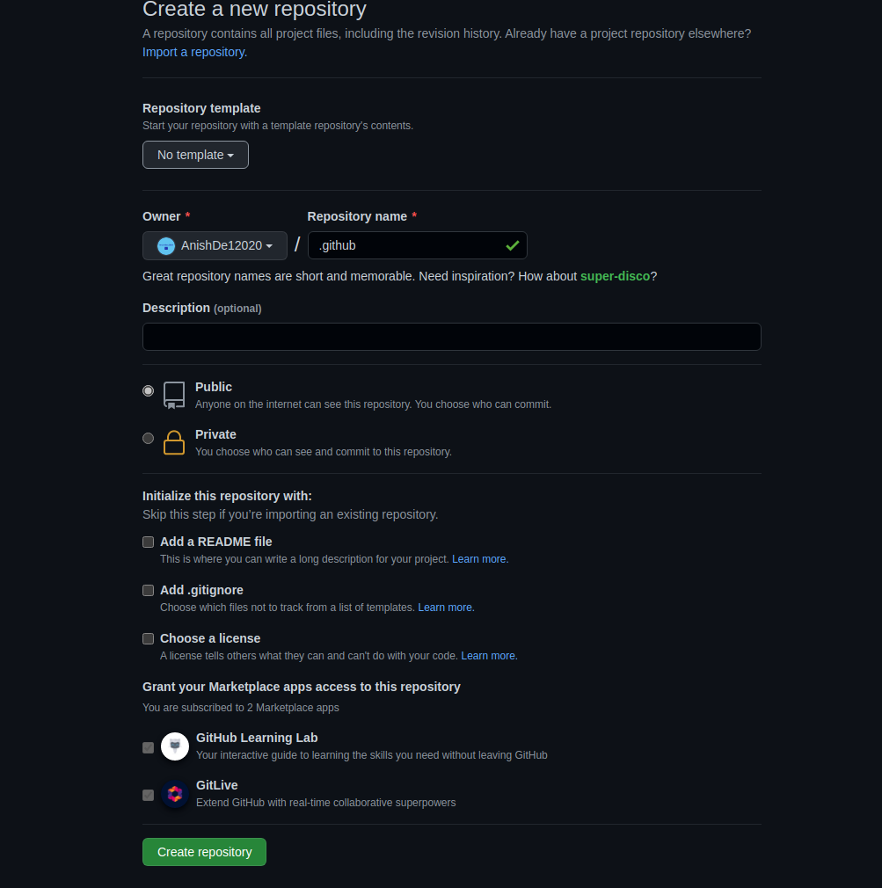

完成后，i可以开始往里添加文件。我要加的第一个文件是故障报告表单（Bug Report Issue
Form）。我并不准备详细地将表格的详情，不过你可以浏览我[先前有关GitHub议题表单的文章](https://blog.anishde.dev/creating-a-bug-report-form-in-github)。

`.github/ISSUE_TEMPLATE/bug_report.yml`

```yaml
name: 🐛Bug Report
description: File a bug report here
title: "[BUG]: "
labels: ["bug"]
assignees: ["AnishDe12020"]
body:
  - type: markdown
    attributes:
      value: |
        Thanks for taking the time to fill out this bug report 🤗
        Make sure there aren't any open/closed issues for this topic 😃

  - type: textarea
    id: bug-description
    attributes:
      label: Description of the bug
      description: Give us a brief description of what happened and what should have happened
    validations:
      required: true

  - type: textarea
    id: steps-to-reproduce
    attributes:
      label: Steps To Reproduce
      description: Steps to reproduce the behavior.
      placeholder: |
        1. Go to '...'
        2. Click on '...'
        3. Scroll down to '...'
        4. See error
    validations:
      required: true
  - type: textarea
    id: additional-information
    attributes:
      label: Additional Information
      description: |
        Provide any additional information such as logs, screenshots, likes, scenarios in which the bug occurs so that it facilitates resolving the issue.
```

功能请求表单：

`.github/ISSUE_TEMPLATE/feature_request.yml`

```yaml
name: ✨Feature Request
description: Request a new feature or enhancement
labels: ["enhancement"]
title: "[FEAT]: "
body:
  - type: markdown
    attributes:
      value: |
        Please make sure this feature request hasn't been already submitted by someone by looking through other open/closed issues

  - type: textarea
    id: description
    attributes:
      label: Description
      description: Give us a brief description of the feature or enhancement you would like
    validations:
      required: true

  - type: textarea
    id: additional-information
    attributes:
      label: Additional Information
      description: Give us some additional information on the feature request like proposed solutions, links, screenshots, etc.
```

我要加的最后一个文件是行为准则————不过它要放在库的根目录下。尽管如此，它也能正常工作（行为准则通常都被保存在根目录下）。注意，我在使用的是 [Contributor Convent](https://www.contributor-covenant.org/)
公约。

`CODE_OF_CONDUCT.md`

```markdown
# Contributor Covenant Code of Conduct

## Our Pledge

We as members, contributors, and leaders pledge to make participation in our
community a harassment-free experience for everyone, regardless of age, body
size, visible or invisible disability, ethnicity, sex characteristics, gender
identity and expression, level of experience, education, socio-economic status,
nationality, personal appearance, race, caste, color, religion, or sexual
identity and orientation.

We pledge to act and interact in ways that contribute to an open, welcoming,
diverse, inclusive, and healthy community.

## Our Standards

Examples of behavior that contributes to a positive environment for our
community include:

* Demonstrating empathy and kindness toward other people
* Being respectful of differing opinions, viewpoints, and experiences
* Giving and gracefully accepting constructive feedback
* Accepting responsibility and apologizing to those affected by our mistakes,
  and learning from the experience
* Focusing on what is best not just for us as individuals, but for the overall
  community

Examples of unacceptable behavior include:

* The use of sexualized language or imagery, and sexual attention or advances of
  any kind
* Trolling, insulting or derogatory comments, and personal or political attacks
* Public or private harassment
* Publishing others' private information, such as a physical or email address,
  without their explicit permission
* Other conduct which could reasonably be considered inappropriate in a
  professional setting

## Enforcement Responsibilities

Community leaders are responsible for clarifying and enforcing our standards of
acceptable behavior and will take appropriate and fair corrective action in
response to any behavior that they deem inappropriate, threatening, offensive,
or harmful.

Community leaders have the right and responsibility to remove, edit, or reject
comments, commits, code, wiki edits, issues, and other contributions that are
not aligned to this Code of Conduct, and will communicate reasons for moderation
decisions when appropriate.

## Scope

This Code of Conduct applies within all community spaces, and also applies when
an individual is officially representing the community in public spaces.
Examples of representing our community include using an official e-mail address,
posting via an official social media account, or acting as an appointed
representative at an online or offline event.

## Enforcement

Instances of abusive, harassing, or otherwise unacceptable behavior may be
reported to the community leaders responsible for enforcement at
[INSERT CONTACT METHOD].
All complaints will be reviewed and investigated promptly and fairly.

All community leaders are obligated to respect the privacy and security of the
reporter of any incident.

## Enforcement Guidelines

Community leaders will follow these Community Impact Guidelines in determining
the consequences for any action they deem in violation of this Code of Conduct:

### 1. Correction

**Community Impact**: Use of inappropriate language or other behavior deemed
unprofessional or unwelcome in the community.

**Consequence**: A private, written warning from community leaders, providing
clarity around the nature of the violation and an explanation of why the
behavior was inappropriate. A public apology may be requested.

### 2. Warning

**Community Impact**: A violation through a single incident or series of
actions.

**Consequence**: A warning with consequences for continued behavior. No
interaction with the people involved, including unsolicited interaction with
those enforcing the Code of Conduct, for a specified period of time. This
includes avoiding interactions in community spaces as well as external channels
like social media. Violating these terms may lead to a temporary or permanent
ban.

### 3. Temporary Ban

**Community Impact**: A serious violation of community standards, including
sustained inappropriate behavior.

**Consequence**: A temporary ban from any sort of interaction or public
communication with the community for a specified period of time. No public or
private interaction with the people involved, including unsolicited interaction
with those enforcing the Code of Conduct, is allowed during this period.
Violating these terms may lead to a permanent ban.

### 4. Permanent Ban

**Community Impact**: Demonstrating a pattern of violation of community
standards, including sustained inappropriate behavior, harassment of an
individual, or aggression toward or disparagement of classes of individuals.

**Consequence**: A permanent ban from any sort of public interaction within the
community.

## Attribution

This Code of Conduct is adapted from the [Contributor Covenant][homepage],
version 2.1, available at
[https://www.contributor-covenant.org/version/2/1/code_of_conduct.html][v2.1].

Community Impact Guidelines were inspired by
[Mozilla's code of conduct enforcement ladder][Mozilla CoC].

For answers to common questions about this code of conduct, see the FAQ at
[https://www.contributor-covenant.org/faq][FAQ]. Translations are available at
[https://www.contributor-covenant.org/translations][translations].

[homepage]: https://www.contributor-covenant.org
[v2.1]: https://www.contributor-covenant.org/version/2/1/code_of_conduct.html
[Mozilla CoC]: https://github.com/mozilla/diversity
[FAQ]: https://www.contributor-covenant.org/faq
[translations]: https://www.contributor-covenant.org/translations
```

### 如何将 `.github` 存储库用于组织或公共账号

组织账号中的 `.github` 存储库和个人账号上的 .github 存储库工作原理相同 --只有一处区别。

组织也可以在GitHub上拥有 README 资料，它将展示在组织页面上。这个 README 位于组织 `.github` 仓库的 `profile`
目录下。为了展示，我将快速地建一个演示组织。

当为组织创建 `.github` 仓库时，你应该得到如下消息：

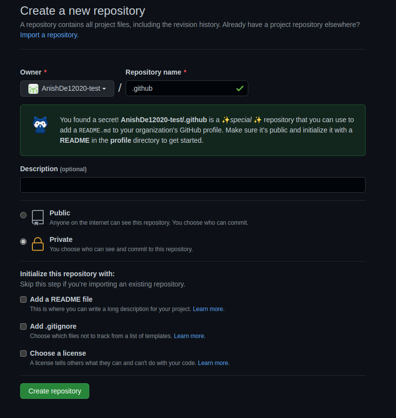

同样的，当你给 `profile/README.md` 添加内容时，你也应该会收到这样的消息：


现在，我准备向 README 里添加一些内容并提交。当我访问组织首页时，我们应当看到下面内容：

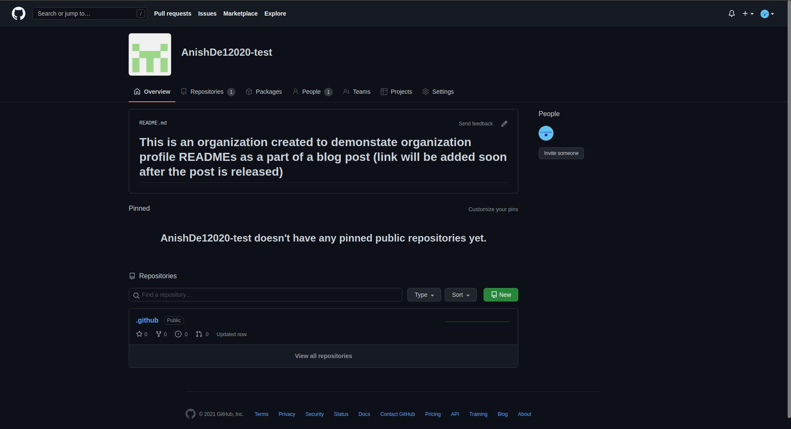

本节内容参考自：

[how-to-use-the-dot-github-repository]: https://www.freecodecamp.org/chinese/news/how-to-use-the-dot-github-repository/    "how-to-use-the-dot-github-repository"

本节内容参考自：[freeCodeCamp](https://www.freecodecamp.org/chinese/news/how-to-use-the-dot-github-repository/)

## Git Revert 或 Git Reset 重置文件或提交

当与团队一起做一个项目或你自己做一个项目时，通过版本控制来跟踪代码库的变化是很重要的。

Git 为你提供了不同的命令来跟踪文件变化。这些命令将使你能够与其他开发人员协作、访问文件历史、管理代码，等等。

在这篇文章中，你将学习如何恢复和重置一个文件或提交到之前的提交。

我们将使用一些简单的 HTML 代码来演示如何使用 Git 恢复和重置到之前的提交。

让我们开始吧！

### 如何重置一个文件或提交

在本节中，你将学习如何使用以下命令来恢复/重置一个文件或提交：

- git revert
- git reset

如何使用 git revert 命令来恢复文件或提交

下面是 `git revert` 命令的语法：

```bash
git revert [commit ID]
```

下面是我们将使用的代码：

```html
<!DOCTYPE html>
<html lang="en">
  <head>
    <title>Document</title>
  </head>
  <body>
    <h1>Hello World!</h1>
  </body>
</html>
```

让我们假设上面的文件是每个在项目上工作的开发人员的代码库的当前状态。

我们将对该文件做一些修改，然后添加、提交和推送这些修改，即：

```html
<!DOCTYPE html>
<html lang="en">
  <head>
    <title>Document</title>
  </head>
  <body>
    <h1>Hello World!</h1>

    <ul>
        <li>Red</li>
        <li>Yellow</li>
        <li>Orange</li>
    </ul>

  </body>
</html>
```

我们已经在代码中添加了一个颜色列表。让我们用下面的命令推送这些变化：

```bash
git add .
git commit -m "added colors to the HTML file"
git push -u origin main
```

现在，新的变化已经为在特定代码分支上工作的所有人更新了。

但如果添加的颜色是应该在未来为用户发布的功能的一部分呢？你提前发布了这个功能，就犯了一个错误。

要恢复到之前的提交，你需要那个特定提交的 ID，要得到提交 ID，请执行下面的命令：

```bash
git log
```

该命令会显示每个提交的 ID、作者和日期。它应该是这样的：

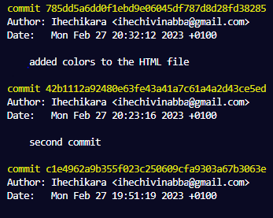

在我们的例子中，提交 ID 是

785dd5a6dd0f1ebd9e06045df787d8d28fd38285

所以，要重置文件，就用 `git revert [commit ID]`，即：

```bash
git revert 785dd5a6dd0f1ebd9e06045df787d8d28fd38285
```

上面的命令将重置某个特定提交之前对文件所作的所有修改。下面是现在的HTML文件：

```htlm
<!DOCTYPE html>
<html lang="en">
  <head>
    <title>Document</title>
  </head>
  <body>
    <h1>Hello World!</h1>
  </body>
</html>
```

现在你可以推送这个新状态了。

请注意，`git revert` 命令并不从远程仓库中删除被恢复的提交。相反，它为被恢复的改动创建一个新的提交。

这意味着你将拥有被恢复的提交的历史和包含被恢复的修改的文件的新提交。

### 如何使用 git reset 命令重置文件或提交

`git reset` 命令也可以用来恢复修改。请看下面的提交历史：

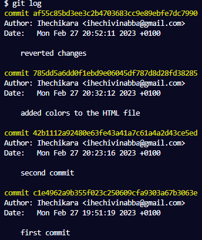

上面的图片显示了所有的提交历史--从第一次提交到最后一节的还原提交。

如果我们用 `git reset [commit ID]` 来还原某个特定的提交，之后的其他提交都会从提交历史中被删除。

下面是一个例子：

```bash
git reset c1e4962a9b355f023c250609cfa9303a67b3063e
```

使用第一次提交的提交 ID，我们回到了第一次提交的状态。

运行 `git log` 命令，你会有一个这样的提交历史：

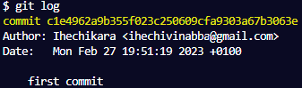

虽然你已经成功地恢复到了第一次提交，但代码中其他提交的历史却被抹去了。这在与其他开发者合作时，会产生非常负面的影响。

### 总结

在这篇文章中，我们谈到了两个重要的 Git 命令，即 `git revert` 和 `git reset`，用于撤销 Git 仓库中的修改。

这两个命令都能让你回到代码库中之前的指定状态，但后果不同。

`git revert` 命令会恢复到指定的提交，但会保留代码库中其他所有提交的历史，并为恢复的改动创建一个新的提交。这是一种在与他人合作时撤销修改的更有效的方式。

另外，`git reset` 命令会恢复到指定的提交，然后删除指定提交之后的所有提交。

为了安全起见，在撤销有其他开发者工作的 repo 中的修改时，请使用 `git revert`。

你可以在撤销修改后想完全删除提交的情况下使用 `git reset`。

本节内容参考自：[freeCodeCamp](https://www.freecodecamp.org/chinese/news/git-revert-how-to-reset-a-file-or-commit/)

## 如何使用 GitHub Actions 实现开源项目的自动化

### GitHub Actions 是什么

GitHub Actions 是一种工具，可以让你在 GitHub 仓库中执行不同的自动化操作。它允许你创建自定义工作流，你可以使用这些工作流来自动化开发过程，例如构建、测试和部署代码。

### 如何在你的仓库中设置 GitHub Actions

一切都从根文件夹开始。默认情况下，GitHub Actions 通常集成在你的 GitHub 仓库中，因此你无需在安装时注册单独的账户。但是你需要执行几个步骤才能访问它的功能。

- 在你的 GitHub 仓库中，在顶部导航选项卡上，你将看到 Actions 选项卡。单机它，你可以访问推荐的工作流列表以及创建自己的工作流的选项。
- 现在，根据项目的性质，你可以选择从可用列表中选择一个已经创建的工作流，也可以选择自己创建一个。由于你了解项目的全部内容以及可能需要自动化的内容，因此我建议你自己设置一个新的工作流，这将使你更好地了解正在发生的事情。
- 要设置新的工作流程，请单机 ***\*Set up a workflow yourself\**** （自行设置工作流程）。这将带你进去一个工作流创建界面，其中包含一个名为
  `main.yml` 的新 YAML 文件。既然你选择编写自己的工作流程，在这里，我应该提到了解 YAML 非常重要。

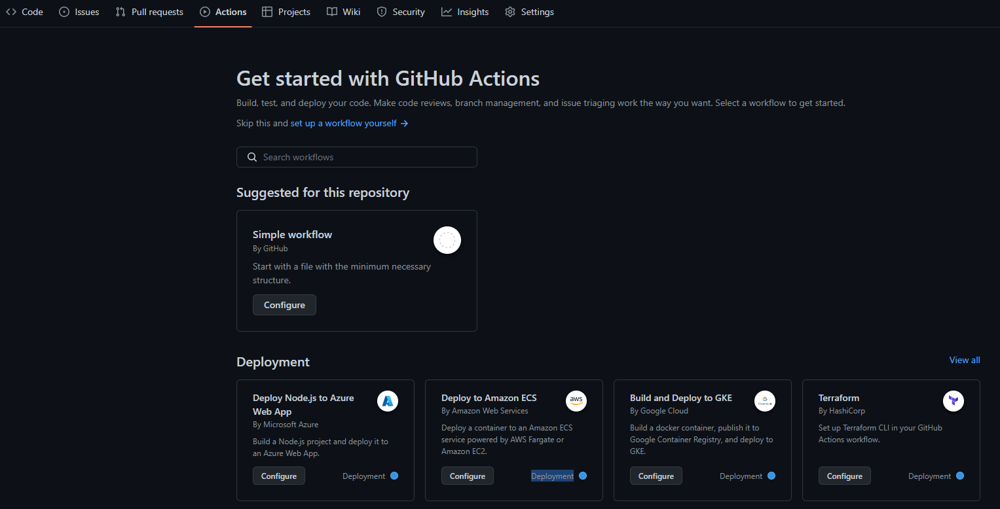

在幕后发生的事情是，一旦你单机此选项，就会在 `main.yml` 文件旁边创建两个文件夹。如果你之后访问你的仓库或查看文件名之前的路径，你将看到：
`.github/workflows/<filename>`。

- 在 `main.yml` 文件中是你定义工作流程的地方，在编写完所有内容后，你可以提交更改（commit the
  changes），就像对仓库进行更改时所作的那样。这样，你就设置了工作流，它将根据 YAML 文件中定义的触发器运行。

或者，你仍然可以在你最喜欢的代码编辑器中完成这一切。你需要做的就是将仓库克隆到你的计算机上，在项目的根文件夹中创建一个
`.github` 文件夹，在其中创建另一个名为 `workflows` 的文件夹，最后添加一个扩展名为 `.yml` 的文件并将你的脚本写入这个文件。

在下面的示例中，我将引用我在项目中实现的代码来帮助你理解。

### GitHub Actions 组件

GitHub Actions 主要由三个主要组件组成，包括：

- 工作流（Workflows） - 这些是定义自动化过程的规则集。它们在 YAML 文件中定义，该文件存储在 `.github/workflows` 目录中。
- 事件（Events） - 它们启动工作流。例如，你可以将事件设置为在创建 PR 或新开 issue 时运行工作流。要在工作流中定义事件，请使用关键字
  `on` 后跟事件名称。

例如：

```yaml
on:
    issues:
        types: [opened]
    pull_request_target:
        types: [opened]
```

- 任务（Jobs） - 这些构成了工作流程。默认情况下，任务是同时运行的。要在给定的工作流中定义你的任务，请使用关键字 `jobs`
  ，后跟每个任务及其配置的唯一标识符。

例如：

```yaml
jobs:
  build:
    runs-on: ubuntu-latest
    steps:
      - name: Check out repository
        uses: actions/checkout@v2
      - name: Set up Python
        uses: actions/setup-python@v2
        with:
          python-version: 3.10
      - name: Install dependencies
        run: |
          pip install -r requirements.txt
```

所有这些组件确保一组特定的规则被成功执行。现在看看我们的项目。

### 如何创建 issue 和 pull request 模板

如果你是一个活跃的开源贡献者，你有可能遇到过一个指南，告诉你在创建 issue 或提交 PR 时应该包括什么。这种模板的主要目的是提供指导，确保贡献者提供所有必要的信息。

现在，让我们看看你如何在你的项目中创建这个模板：

- 第一步是确保在仓库的 root 中有一个 `.github` 目录，如果你还没有的话。
- 在 `.github` 文件夹内，创建两个文件夹 `ISSUE_TEMPLATE` 和 `PULL_REQUEST_TEMPLATE`。
- 在这两个文件夹中，添加代表你想自动化内容的 markdown 文件：例如，你可以将 `feature_request.md` 和 `issue_report.md` 作为
  issue 模板，将 `pull_request_template.md` 作为 PR 模板。

下面是我在 `pull_request_template.md` 文件中写的内容，作为参考。这是一个简单的指南，告诉贡献者在提交 pull request 之前应该包括什么。

```markdown
**Related Issue(s):**
Please provide a title for this pull request.

**Description:**
Please provide a brief description of the changes you are proposing.

**Checklist:**

-   [ ] I have read and followed the [contributing guidelines](/CONTRIBUTING.md).
-   [ ] I have included a README file for my project.
-   [ ] I have updated the main README file where necessary.
-   [ ] I have included a requirements.txt file.
-   [ ] I have added tests that prove my changes are effective or that my feature works.
-   [ ] All new and existing tests pass.

**Screenshots**
If applicable, add screenshots to help explain behavior of your code.

**Additional Notes:**
Please provide any additional information about the changes you are proposing.
```

### 欢迎新的贡献者并表彰社区的努力

作为一个维护者，与社区打交道是很重要的。

例如，这里有一些示例代码，当新的贡献者创建 pull request 或在仓库上创建一个新的 issue
时，我通过这些代码来欢迎他们。在其中，你可以看到我有一条信息，感谢他们的努力，也向他们保证我将尽快审核他们提交的修改。尽管如此，如果需要额外的东西或提出新的想法，我还是会通过对话去跟进。

```yaml
name: Welcome New Contributors

on:
    issues:
        types: [opened]
    pull_request_target:
        types: [opened]

jobs:
    welcome:
        runs-on: ubuntu-latest
        steps:
            - name: Welcome Issue
              if: github.event_name == 'issues'
              uses: actions/github-script@v5
              with:
                  script: |
                      const issue = context.issue;
                      const repo = context.repo;
                      const issueAuthor = context.payload.sender.login;
                      const welcomeMessage = `
                        Hi @${issueAuthor}! :wave:
                        Thank you for creating an issue in our repository! We appreciate your contribution and will get back to you as soon as possible.
                      `;
                      github.rest.issues.createComment({
                        ...repo,
                        issue_number: issue.number,
                        body: welcomeMessage
                      });
            - name: Welcome Pull Request
              if: github.event_name == 'pull_request_target'
              uses: actions/github-script@v5
              with:
                  script: |
                      const pr = context.issue;
                      const repo = context.repo;
                      const prAuthor = context.payload.sender.login;
                      const welcomeMessage = `
                        Hi @${prAuthor}! :wave:
                        Thank you for submitting a pull request! We appreciate your contribution and will review your changes as soon as possible.
                      `;
                      github.rest.issues.createComment({
                        ...repo,
                        issue_number: pr.number,
                        body: welcomeMessage
                      });
```

### 如何实现代码 QA 的自动化

在代码自动化工具的帮助下，你可以保持一致的编码风格，并快速和容易地识别潜在的错误，保持你的项目整洁。

那么，如何用 GitHub Actions 设置持续集成（CI），整合代码 formatting 和 linting 工具，并在项目中使用自动化代码审核服务？

持续集成（CI）帮助你实现流程自动化，如构建、测试和验证代码更改。就像其他自动化代码一样，CI 代码写在一个 `.yml` 文件中，存储在
`.github/workflows` 文件夹中。

下面是一个 Python 项目 CI 工作流程的例子，它在向仓库的 `main` 分支 pull request 时运行。它测试 Python 多个版本的代码，安装必要的依赖，并使用
`unittest` 模块运行测试。

```yaml
name: Python CI

on:
  push:
    branches:
      - main
  pull_request:
    branches:
      - main

jobs:
  build:
    runs-on: ubuntu-latest
    strategy:
      matrix:
        python-version: [3.7, 3.8, 3.9, 3.10]

    steps:
    - uses: actions/checkout@v2
    - name: Set up Python ${{ matrix.python-version }}
      uses: actions/setup-python@v2
      with:
        python-version: ${{ matrix.python-version }}
    - name: Install dependencies
      run: |
        python -m pip install --upgrade pip
        pip install -r requirements.txt
    - name: Run tests
      run: |
        python -m unittest discover
```

除了上面的代码，如果你想保持代码风格的一致性，你可以整合代码 formatting 和 linting 工具，如 `black`、`isort` 或 `flake8`
。为此，你只需要在 `requirements.txt` 文件中加入这些工具，该文件已经包含在上述代码中。下面的代码块运行这些工具。

```yaml
#...
    # ...
    - name: Run black for code formatting
      run: |
        black --check .
    - name: Run isort for import sorting
      run: |
        isort --check --diff .
    - name: Run flake8 for linting
      run: |
        flake8 .
```

如果它发现任何代码格式问题，CI 构建将失败。要解决这个问题，你必须手动检查日志。

上面的想法只是你可以在项目中使用的一些自动程序。对于一个更复杂的应用，你可以考虑增加工作流程，用 `Sphinx` 或 `MkDocs`
等工具生成文档，自动化依赖性更新，自动化发布管理和项目跟踪，等等。

本节内容参考自：[freeCodeCamp](https://www.freecodecamp.org/chinese/news/automate-open-source-projects-with-github-actions/)

## git config

如何配置 Git 设置以改善你的开发工作流程？

> git config 是 Git 的一个强大命令。你可以使用 Git 配置文件来定制 Git 的工作方式。
>
> 这个文件存在于初始化 Git 的项目目录（`/project/.git/config`）或用户根目录（`~/.gitconfig`）。如果没有指定配置，Git 会使用其默认设置。

### Git 配置技巧

#### 为 Git 选择默认的编辑器

当你试图在 Git 中进行提交时，它默认会打开一个 `VI` 编辑器，看起来像这样：

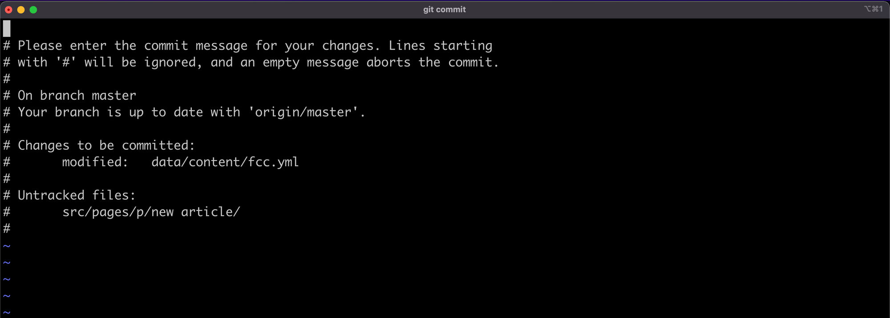

这个文本编辑器可能很难使用，如果你像我一样，你可能想用你喜欢的编辑器来写提交。在你的 `~/.gitconfig` 文件中，添加以下内容：

```bash
[core]
    editor = code --wait
```

这个配置告诉 Git，对于提交和标签等操作，我想使用我的 [VSCode 编辑器](https://code.visualstudio.com/)。

对于其他类型的编辑器，请参考 [Atlassian](https://www.atlassian.com/git/tutorials/setting-up-a-repository/git-config)
的这个图片：

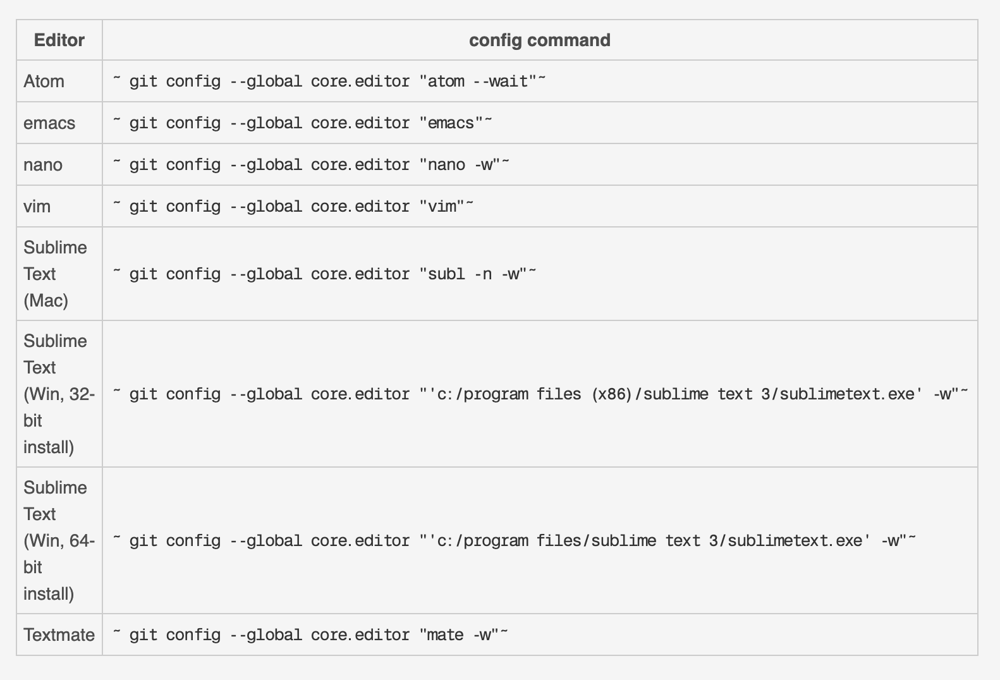

#### fetch 过程中的 Git 修剪（pruning）

你知道 `prune` 命令在 `fetch`
过程中的作用吗？如果不知道，你可能想先看看这篇文章，它涵盖了如何 [用prune git选项和分支删除命令删除过时的本地分支](https://dillionmegida.com/p/delete-outdated-branches/#git-fetch---prune)。

&#x2139; 在 `fetch` 过程中修剪是一种清理方法，当你进行 `git fetch --prune` 时，会删除你的 `.git` 目录中过时的远程引用。

正如我在刚才的文章中解释的那样，你可以自动执行这个操作，而不必总是添加 `--prune` 选项。要做到这一点，在 `~/.gitconfig`
中添加以下内容：

```bash
[fetch]
    prune = true
```

或使用以下命令：

```bash
git config --global fetch.prune true
```

有了这个，每当你进行 `git fetch` 时，就会发生修剪（pruning）。

#### Git 别名

在 Git 配置文件中，你可以为那些你时常输入的长命令添加别名。例如 commits、stashing，等等。

比方说，你想添加一个别名，用于添加一个空的提交。在这种情况下，你可以在配置文件中添加以下内容：

```bash
[alias]
    empty = "git commit --allow-empty"
```

或在终端：

```bash
git config --global alias.empty "git commit --allow-empty"
```

你可以像这样使用该命令：

```bash
git empty "Empty commit"
```

#### 设置默认分支

在初始化版本库时（`git init`），默认的分支是 `master`。今天，一些开发者希望是 `main` 或其他完全不同的东西。

你不必创建一个名为 `main` 的新分支，删除 `master` 分支，并使用 `main` 作为默认分支。这是个漫长的过程。在 Git 配置文件中，你可以在
Git 初始化时设置一个默认分支，下面是方法：

```bash
[init]
    defaultBranch = main（或任何你想要的名字）
```

这样，`git init` 会创建一个 “main” 分支作为默认。

#### 默认显示简短状态

默认情况下，`git status` 命令显示你的项目中的变化，并有很长的细节。它的格式是这样的：

```bash
On branch [branch name]
Your branch is up to date with ...

Changes not staged for commit:
  (use "git add <file>..." to update what will be committed)
  (use "git restore <file>..." to discard changes in the working directory)
    modified: ...

Untracked files:
  (use "git add <file>..." to include in what will be committed)
    ...

no changes added to commit (use "git add" and/or "git commit -a")
```

这是一个具有指导意义的输出，但有时你只需要一个版本库状态的总结。在 `git status` 中添加 `--short`
选项，可以得到一个简短的格式化输出。结果会是这样的：

```bash
M [file]
?? [file]
```

“M” 表示已修改，“??” 表示未跟踪。我们可以通过使用以下配置使其成为默认的状态视图来进一步改进 `git status` 的输出：

```bash
[status]
    short = true
```

更多内容，请翻阅：[git-config文档](https://git-scm.com/docs/git-config)

本节内容参考自：[freeCodeCamp](https://www.freecodecamp.org/chinese/news/git-config-how-to-configure-git-settings/)
