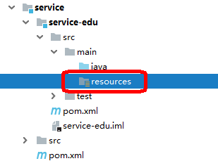
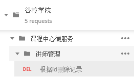

# 一、讲师管理模块配置

**1、在service下面service-edu模块中创建配置文件**



**resources目录下创建文件 application.properties**

```
# 服务端口
server.port=8001
# 服务名
spring.application.name=service-edu

# 环境设置：dev、test、prod
spring.profiles.active=dev

# mysql数据库连接
spring.datasource.driver-class-name=com.mysql.cj.jdbc.Driver
spring.datasource.url=jdbc:mysql://localhost:3306/guli?serverTimezone=GMT%2B8
spring.datasource.username=root
spring.datasource.password=root

#mybatis日志
mybatis-plus.configuration.log-impl=org.apache.ibatis.logging.stdout.StdOutImpl
```

##

**或者在resources目录下创建文件 application.yml**

```
#### application.yml
spring:
  application:
    name: service-edu
profiles:
    active: dev


####  application-dev.yml
server:
  port: 8001
mybatis-plus:
  configuration:
    log-impl: org.apache.ibatis.logging.stdout.StdOutImpl
mapper-locations: classpath:com/atguigu/service/*/mapper/*.xml
global-config:
    db-config:
      logic-delete-value: 1
logic-not-delete-value: 0
spring:
datasource:
    type: com.zaxxer.hikari.HikariDataSource
driver-class-name: com.mysql.cj.jdbc.Driver
url: jdbc:mysql://localhost:3306/guli?serverTimezone=GMT%2B8
username: root
password: root
hikari:
      connection-test-query: SELECT 1
connection-timeout: 60000
idle-timeout: 500000
max-lifetime: 540000
maximum-pool-size: 12
minimum-idle: 10
pool-name: GuliHikariPool
jackson:
    date-format: yyyy-MM-dd HH:mm:ss
time-zone: GMT+8

```

##

## 2、创建MP代码生成器

在test/java目录下创建包com.atguigu.eduservice，创建代码生成器：CodeGenerator.java

```
public class getCode {

    @Test
    public void main1() {

        // 1、创建代码生成器
        AutoGenerator mpg = new AutoGenerator();

        // 2、全局配置
        GlobalConfig gc = new GlobalConfig();
        String projectPath = System.getProperty("user.dir");
        System.out.println(projectPath);
        gc.setOutputDir(projectPath + "/src/main/java");
        gc.setAuthor("atguigu");
        gc.setOpen(false); //生成后是否打开资源管理器
        gc.setFileOverride(false); //重新生成时文件是否覆盖
        /*
         * mp生成service层代码，默认接口名称第一个字母有 I
         * UcenterService
         * */
        gc.setServiceName("%sService"); //去掉Service接口的首字母I
        gc.setIdType(IdType.ID_WORKER); //主键策略
        gc.setDateType(DateType.ONLY_DATE);//定义生成的实体类中日期类型
        gc.setSwagger2(true);//开启Swagger2模式

        mpg.setGlobalConfig(gc);

        // 3、数据源配置
        DataSourceConfig dsc = new DataSourceConfig();
        dsc.setUrl("jdbc:mysql://localhost:3306/guli?serverTimezone=GMT%2B8");
        dsc.setDriverName("com.mysql.cj.jdbc.Driver");
        dsc.setUsername("root");
        dsc.setPassword("root");
        dsc.setDbType(DbType.MYSQL);
        mpg.setDataSource(dsc);

        // 4、包配置
        PackageConfig pc = new PackageConfig();
        pc.setModuleName("serviceedu"); //模块名
        pc.setParent("com.atguigu");
        pc.setController("controller");
        pc.setEntity("entity");
        pc.setService("service");
        pc.setMapper("mapper");
        mpg.setPackageInfo(pc);

        // 5、策略配置
        StrategyConfig strategy = new StrategyConfig();
        strategy.setInclude("edu_teacher");
        strategy.setNaming(NamingStrategy.underline_to_camel);//数据库表映射到实体的命名策略
        strategy.setTablePrefix(pc.getModuleName() + "_"); //生成实体时去掉表前缀

        strategy.setColumnNaming(NamingStrategy.underline_to_camel);//数据库表字段映射到实体的命名策略
        strategy.setEntityLombokModel(true); // lombok 模型 @Accessors(chain = true) setter链式操作

        strategy.setRestControllerStyle(true); //restful api风格控制器
        strategy.setControllerMappingHyphenStyle(true); //url中驼峰转连字符

        mpg.setStrategy(strategy);

        // 6、执行
        mpg.execute();
    }
}
```

## 二、编写后台管理api接口

**1、编写controller代码**

```
@Autowired
private TeacherService teacherService;

@GetMapping
public List<Teacher> list(){
    return teacherService.list(null);
}
```

## **2、创建SpringBoot配置类**

在edu包下创建config包，创建MyBatisPlusConfig.java

```
package com.guli.edu.config;

@Configuration
@EnableTransactionManagement
@MapperScan("com.atguigu.eduservice.mapper")
public class MyBatisPlusConfig {

}
```

**3、配置SQL执行性能分析插件**

```
/**
     * SQL 执行性能分析插件
     * 开发环境使用，线上不推荐。 maxTime 指的是 sql 最大执行时长
     */
@Bean
@Profile({"dev","test"})// 设置 dev test 环境开启
public PerformanceInterceptor performanceInterceptor() {
    PerformanceInterceptor performanceInterceptor = new PerformanceInterceptor();
    performanceInterceptor.setMaxTime(1000);//ms，超过此处设置的ms则sql不执行
    performanceInterceptor.setFormat(true);
    return performanceInterceptor;
}
```

## **4、创建SpringBoot启动类**

创建启动类 EduApplication.java，注意启动类的创建位置

```
@SpringBootApplication
public class EduApplication {

    public static void main(String[] args) {
        SpringApplication.run(EduApplication.class, args);
    }
}
```

## **5、运行启动类**

访问http://localhost:8001/eduservice/teacher

得到json数据

## 6、统一返回的json时间格式

默认情况下json时间格式带有时区，并且是世界标准时间，和我们的时间差了八个小时

在application.properties中设置

```
#返回json的全局时间格式
spring.jackson.date-format=yyyy-MM-dd HH:mm:ss
spring.jackson.time-zone=GMT+8
```

# 三、讲师逻辑删除功能

## 1、EduTeacherController添加删除方法

```
@DeleteMapping("{id}")
public boolean removeById(@PathVariable String id){
    return teacherService.removeById(id);
}
```

## 2、配置逻辑删除插件

```
MyBatisPlusConfig中配置
/**
      * 逻辑删除插件
      */
@Bean
public ISqlInjector sqlInjector() {
    return new LogicSqlInjector();
}
```

## 3、使用postman测试删除



测试结果：数据库中的is_deleted字段被修改为1

# 四、跨域配置

## 1、什么是跨域

浏览器从一个域名的网页去请求另一个域名的资源时，域名、端口、协议任一不同，都是跨域 。前后端分离开发中，需要考虑ajax跨域的问题。

这里我们可以从服务端解决这个问题

## 2、配置

在Controller类上添加注解

```
@CrossOrigin //跨域
```
