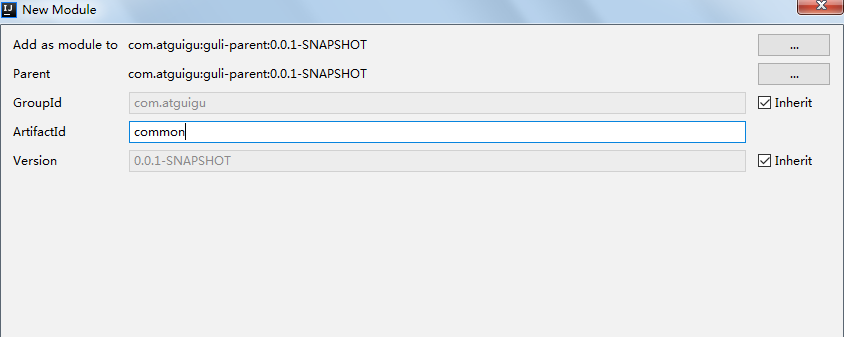
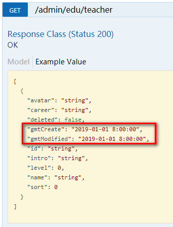

# 一、Swagger2介绍

前后端分离开发模式中，api文档是最好的沟通方式。

Swagger 是一个规范和完整的框架，用于生成、描述、调用和可视化 RESTful 风格的 Web 服务。

及时性 (接口变更后，能够及时准确地通知相关前后端开发人员)规范性 (
并且保证接口的规范性，如接口的地址，请求方式，参数及响应格式和错误信息)一致性 (
接口信息一致，不会出现因开发人员拿到的文档版本不一致，而出现分歧)可测性 (直接在接口文档上进行测试，以方便理解业务)

# 二、配置Swagger2

**1、创建common模块**

**在guli-parent下创建模块common**

配置：

groupId：com.atguigu

artifactId：common



**2、在common中引入相关依赖**

```
 <dependencies>
        <dependency>
            <groupId>org.springframework.boot</groupId>
            <artifactId>spring-boot-starter-web</artifactId>
            <scope>provided </scope>
        </dependency>

        <!--mybatis-plus-->
        <dependency>
            <groupId>com.baomidou</groupId>
            <artifactId>mybatis-plus-boot-starter</artifactId>
            <scope>provided </scope>
        </dependency>

        <!--lombok用来简化实体类：需要安装lombok插件-->
        <dependency>
            <groupId>org.projectlombok</groupId>
            <artifactId>lombok</artifactId>
            <scope>provided </scope>
        </dependency>

        <!--swagger-->
        <dependency>
            <groupId>io.springfox</groupId>
            <artifactId>springfox-swagger2</artifactId>
            <scope>provided </scope>
        </dependency>
        <dependency>
            <groupId>io.springfox</groupId>
            <artifactId>springfox-swagger-ui</artifactId>
            <scope>provided </scope>
        </dependency>

        <!-- redis -->
        <dependency>
            <groupId>org.springframework.boot</groupId>
            <artifactId>spring-boot-starter-data-redis</artifactId>
        </dependency>

        <!-- spring2.X集成redis所需common-pool2
        <dependency>
            <groupId>org.apache.commons</groupId>
            <artifactId>commons-pool2</artifactId>
            <version>2.6.0</version>
        </dependency>-->
    </dependencies>
```

## 3、在common下面创建子模块service-base


## 3、在模块service-base中，创建swagger的配置类

创建包com.atguigu.servicebase.config，创建类SwaggerConfig

```
@Configuration
@EnableSwagger2
public class SwaggerConfig {

    @Bean
    public Docket webApiConfig(){

        return new Docket(DocumentationType.SWAGGER_2)
                .groupName("webApi")
                .apiInfo(webApiInfo())
                .select()
                .paths(Predicates.not(PathSelectors.regex("/admin/.*")))
                .paths(Predicates.not(PathSelectors.regex("/error.*")))
                .build();

    }

    private ApiInfo webApiInfo(){

        return new ApiInfoBuilder()
                .title("网站-课程中心API文档")
                .description("本文档描述了课程中心微服务接口定义")
                .version("1.0")
                .contact(new Contact("Helen", "http://atguigu.com", "55317332@qq.com"))
                .build();
    }
}
```

## 4、在模块service模块中引入service-base

```
<dependency>
    <groupId>com.atguigu</groupId>
    <artifactId>service-base</artifactId>
    <version>0.0.1-SNAPSHOT</version>
</dependency>
```

**5、在service-edu启动类上添加注解，进行测试**


## 6、API模型

可以添加一些自定义设置，例如：

定义样例数据

```
@ApiModelProperty(value = "创建时间", example = "2019-01-01 8:00:00")
@TableField(fill = FieldFill.INSERT)
private Date gmtCreate;

@ApiModelProperty(value = "更新时间", example = "2019-01-01 8:00:00")
@TableField(fill = FieldFill.INSERT_UPDATE)
private Date gmtModified;
```



## 5、定义接口说明和参数说明

定义在类上：@Api

定义在方法上：@ApiOperation

定义在参数上：@ApiParam

```
@Api(description="讲师管理")
@RestController
@RequestMapping("/admin/edu/teacher")
public class TeacherAdminController {

    @Autowired
    private TeacherService teacherService;

    @ApiOperation(value = "所有讲师列表")
    @GetMapping
    public List<Teacher> list(){
        return teacherService.list(null);
    }

    @ApiOperation(value = "根据ID删除讲师")
    @DeleteMapping("{id}")
    public boolean removeById(
            @ApiParam(name = "id", value = "讲师ID", required = true)
            @PathVariable String id){
        return teacherService.removeById(id);
    }
}
```
