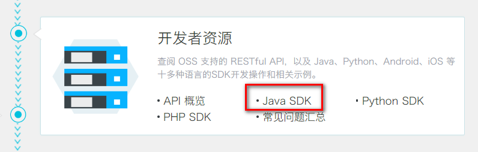

# **一、****对象存储OSS**

为了解决海量数据存储与弹性扩容，项目中我们采用云存储的解决方案- 阿里云OSS。

## 1、开通“对象存储OSS”服务

（1）申请阿里云账号

（2）实名认证

（3）开通“对象存储OSS”服务

（4）进入管理控制台

## 2、创建Bucket

选择：标准存储、公共读、不开通


## 3、上传默认头像

创建文件夹avatar，上传默认的用户头像


## 4、创建RAM子用户


# **二、使用SDK**



## **1、创建Mavaen项目**

com.atguigu

aliyun-oss

## 2、pom

```
<dependencies>
    <!--aliyunOSS-->
    <dependency>
        <groupId>com.aliyun.oss</groupId>
        <artifactId>aliyun-sdk-oss</artifactId>
        <version>2.8.3</version>
    </dependency>

    <dependency>
        <groupId>junit</groupId>
        <artifactId>junit</artifactId>
        <version>4.12</version>
    </dependency>
</dependencies>
```

## 3、找到编码时需要用到的常量值

（1）endpoint

（2）bucketName

（3）accessKeyId

（4）accessKeySecret

## 4、测试创建Bucket的连接


```
package com.atguigu.oss;

public class OSSTest {

    // Endpoint以杭州为例，其它Region请按实际情况填写。
    String endpoint = "your endpoint";
    // 阿里云主账号AccessKey拥有所有API的访问权限，风险很高。强烈建议您创建并使用RAM账号进行API访问或日常运维，请登录 https://ram.console.aliyun.com 创建RAM账号。
    String accessKeyId = "your accessKeyId";
    String accessKeySecret = "your accessKeySecret";
    String bucketName = "guli-file";

    @Test
    public void testCreateBucket() {

        // 创建OSSClient实例。
        OSSClient ossClient = new OSSClient(endpoint, accessKeyId, accessKeySecret);

        // 创建存储空间。
        ossClient.createBucket(bucketName);

        // 关闭OSSClient。
        ossClient.shutdown();
    }
}
```

## 5、判断存储空间是否存在


```
@Test
public void testExist() {

    // 创建OSSClient实例。
    OSSClient ossClient = new OSSClient(endpoint, accessKeyId, accessKeySecret);

    boolean exists = ossClient.doesBucketExist(bucketName);
    System.out.println(exists);

    // 关闭OSSClient。
    ossClient.shutdown();
}
```

## 6、设置存储空间的访问权限

```
@Test
public void testAccessControl() {

    // 创建OSSClient实例。
    OSSClient ossClient = new OSSClient(endpoint, accessKeyId, accessKeySecret);

    // 设置存储空间的访问权限为：公共读。
    ossClient.setBucketAcl(bucketName, CannedAccessControlList.PublicRead);

    // 关闭OSSClient。
    ossClient.shutdown();
}
```


