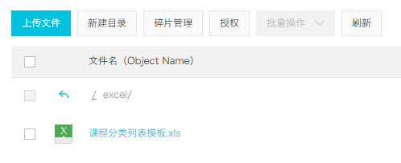
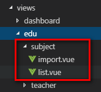

# 一、Excel模板

## 1、编辑Excel模板

## 2、将文件上传至阿里云OSS



# 二、配置路由

## 1、添加路由

```
// 课程分类管理
{
  path: '/edu/subject',
  component: Layout,
  redirect: '/edu/subject/list',
  name: 'Subject',
  meta: { title: '课程分类管理', icon: 'nested' },
  children: [
    {
      path: 'list',
      name: 'EduSubjectList',
      component: () => import('@/views/edu/subject/list'),
      meta: { title: '课程分类列表' }
    },
    {
      path: 'import',
      name: 'EduSubjectImport',
      component: () => import('@/views/edu/subject/import'),
      meta: { title: '导入课程分类' }
    }
  ]
},
```

## 2、添加vue组件



三、表单组件import.vue1、js定义数据

```
<script>
export default {

  data() {
    return {
      BASE_API: process.env.BASE_API, // 接口API地址
      OSS_PATH: process.env.OSS_PATH, // 阿里云OSS地址
      fileUploadBtnText: '上传到服务器', // 按钮文字
      importBtnDisabled: false, // 按钮是否禁用,
      loading: false
    }
  }
}
</script>
```

## 2、template

```
<template>
  <div class="app-container">
    <el-form label-width="120px">
      <el-form-item label="信息描述">
        <el-tag type="info">excel模版说明</el-tag>
        <el-tag>
          <i class="el-icon-download"/>
          <a :href="OSS_PATH + '/excel/%E8%AF%BE%E7%A8%8B%E5%88%86%E7%B1%BB%E5%88%97%E8%A1%A8%E6%A8%A1%E6%9D%BF.xls'">点击下载模版</a>
        </el-tag>

      </el-form-item>

      <el-form-item label="选择Excel">
        <el-upload
          ref="upload"
          :auto-upload="false"
          :on-success="fileUploadSuccess"
          :on-error="fileUploadError"
          :disabled="importBtnDisabled"
          :limit="1"
          :action="BASE_API+'/admin/edu/subject/import'"
          name="file"
          accept="application/vnd.ms-excel">
          <el-button slot="trigger" size="small" type="primary">选取文件</el-button>
          <el-button
            :loading="loading"
            style="margin-left: 10px;"
            size="small"
            type="success"
            @click="submitUpload">{{ fileUploadBtnText }}</el-button>
        </el-upload>
      </el-form-item>
    </el-form>
  </div>
</template>
```

## 3、js上传方法

```
methods: {
    submitUpload() {
      this.fileUploadBtnText = '正在上传'
      this.importBtnDisabled = true
      this.loading = true
      this.$refs.upload.submit()
    },

    fileUploadSuccess(response) {
      
    },

    fileUploadError(response) {
      
    }
}
```

## 4、回调函数

```
fileUploadSuccess(response) {
    if (response.success === true) {
    this.fileUploadBtnText = '导入成功'
    this.loading = false
    this.$message({
        type: 'success',
        message: response.message
    })
    } 
},

fileUploadError(response) {
    this.fileUploadBtnText = '导入失败'
    this.loading = false
    this.$message({
    type: 'error',
    message: '导入失败'
    })
}
```