# 一、阿里云视频点播技术能力盘点

**参考文章：**

https://blog.csdn.net/qq_33857573/article/details/79564255

视频点播（ApsaraVideo for VoD）是集音视频采集、编辑、上传、自动化转码处理、媒体资源管理、分发加速于一体的一站式音视频点播解决方案。

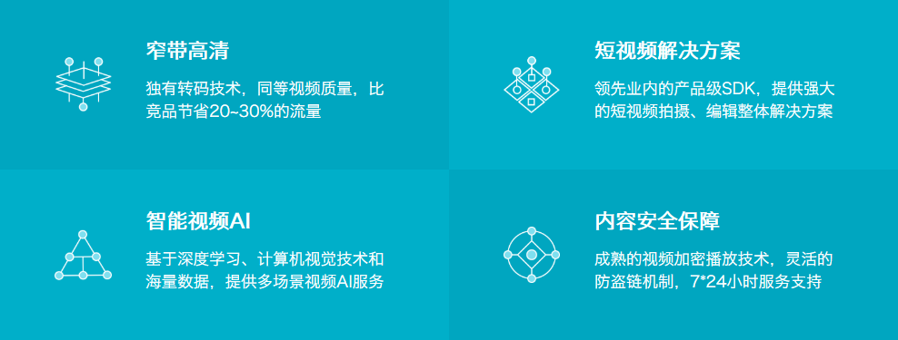

## 1、应用场景

- 音视频网站：无论是初创视频服务企业，还是已拥有海量视频资源，可定制化的点播服务帮助客户快速搭建拥有极致观看体验、安全可靠的视频点播应用。
- 短视频：集音视频拍摄、特效编辑、本地转码、高速上传、自动化云端转码、媒体资源管理、分发加速、播放于一体的完整短视频解决方案。目前已帮助1000+APP快速实现手机短视频功能。
- 直播转点播：将直播流同步录制为点播视频，用于回看。并支持媒资管理、媒体处理（转码及内容审核/智能首图等AI处理）、内容制作（云剪辑）、CDN分发加速等一系列操作。
- 在线教育：为在线教育客户提供简单易用、安全可靠的视频点播服务。可通过控制台/API等多种方式上传教学视频，强大的转码能力保证视频可以快速发布，覆盖全网的加速节点保证学生观看的流畅度。防盗链、视频加密等版权保护方案保护教学内容不被窃取。
- 视频生产制作：提供在线可视化剪辑平台及丰富的OpenAPI，帮助客户高效处理、制作视频内容。除基础的剪切拼接、混音、遮标、特效、合成等一系列功能外，依托云剪辑及点播一体化服务还可实现标准化、智能化剪辑生产，大大降低视频制作的槛，缩短制作时间，提升内容生产效率。
- 内容审核：应用于短视频平台、传媒行业审核等场景，帮助客户从从语音、文字、视觉等多维度精准识别视频、封面、标题或评论的违禁内容进行AI智能审核与人工审核。

## 2、功能介绍

[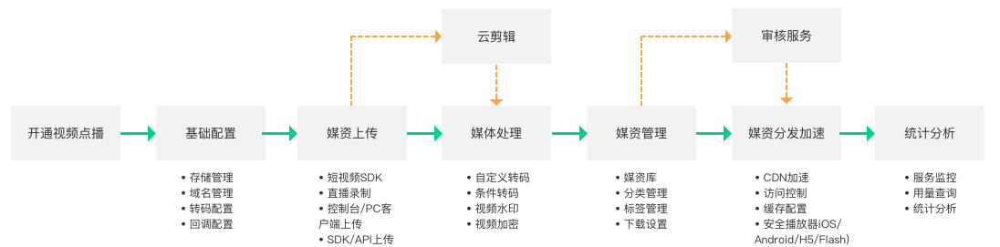](http://docs-aliyun.cn-hangzhou.oss.aliyun-inc.com/assets/pic/85506/cn_zh/1542030629145/产品功能.png)

# 二、开通视频点播云平台

## 1、选择视频点播服务

产品->企业应用->视频云->视频点播

## 2、开通视频点播

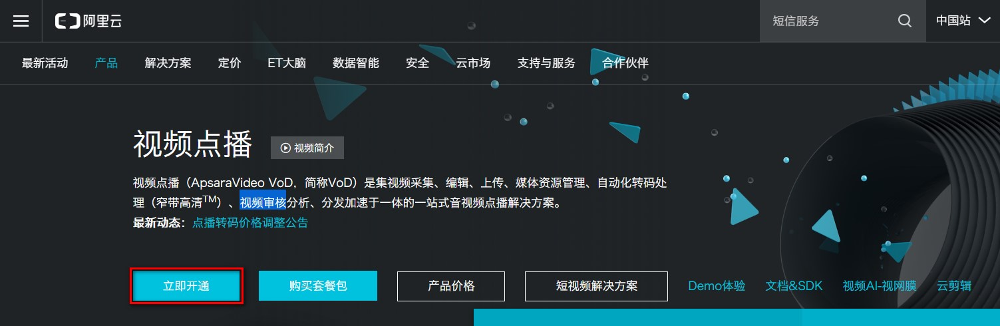

## 3、选择按使用流量计费

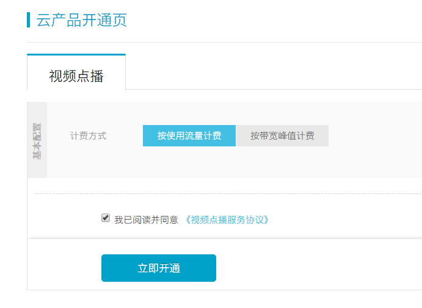

## 4、资费说明

https://www.aliyun.com/price/product?spm=a2c4g.11186623.2.12.7fbd59b9vmXVN6#/vod/detail

- 后付费
- 套餐包
- 欠费说明
- 计费案例：https://help.aliyun.com/document_detail/64032.html?spm=a2c4g.11186623.4.3.363db1bcfdvxB5

## 5、整体流程

使用视频点播实现音视频上传、存储、处理和播放的整体流程如下：

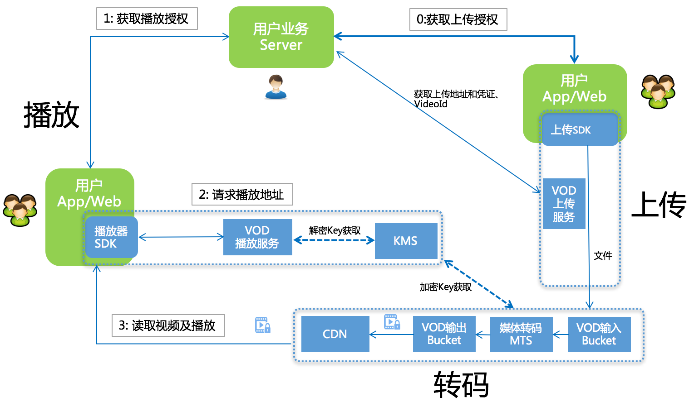

- 用户获取上传授权。
- VoD下发 上传地址和凭证 及 VideoId。
- 用户上传视频保存视频ID(VideoId)。
- 用户服务端获取播放凭证。
- VoD下发带时效的播放凭证。
- 用户服务端将播放凭证下发给客户端完成视频播放。

# 三、视频点播服务的基本使用

完整的参考文档

https://help.aliyun.com/product/29932.html?spm=a2c4g.11186623.6.540.3c356a58OEmVZJ

## 1、设置转码格式

选择全局设置 > 转码设置，单击添加转码模板组。

在视频转码模板组页面，根据业务需求选择封装格式和清晰度。

或直接将已有的模板设置为默认即可

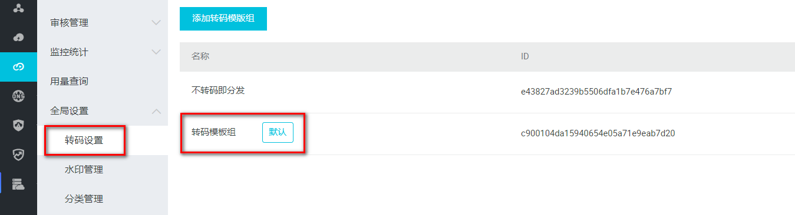

## 2、分类管理

选择全局设置 > 分类管理

## 3、上传视频文件

## 

选择媒资库 > 音视频，单击上传音视频

## 4、配置域名

音视频上传完成后，必须配一个已备案的域名，并完成CNAME绑定

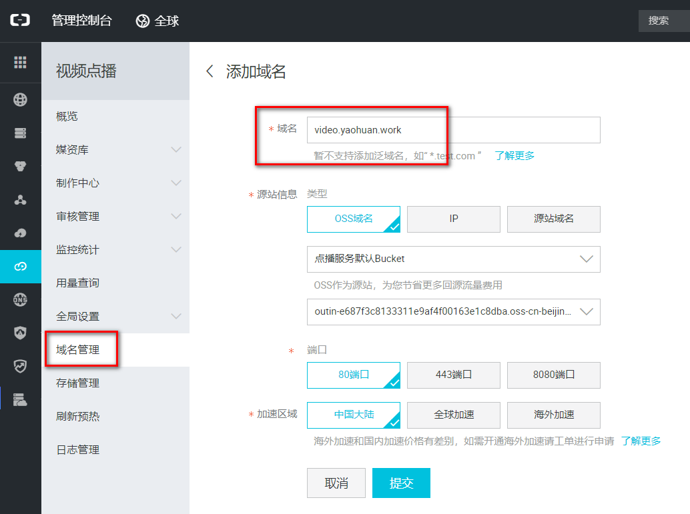

得到CNAME

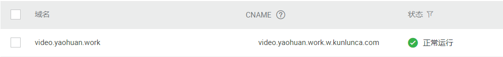

在购买域名的服务商处的管理控制台配置域名解析

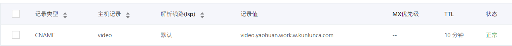

**5、在控制台查看视频**

此时视频可以在阿里云控制台播放

## 6、获取web播放器代码

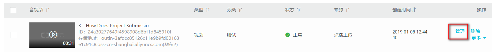

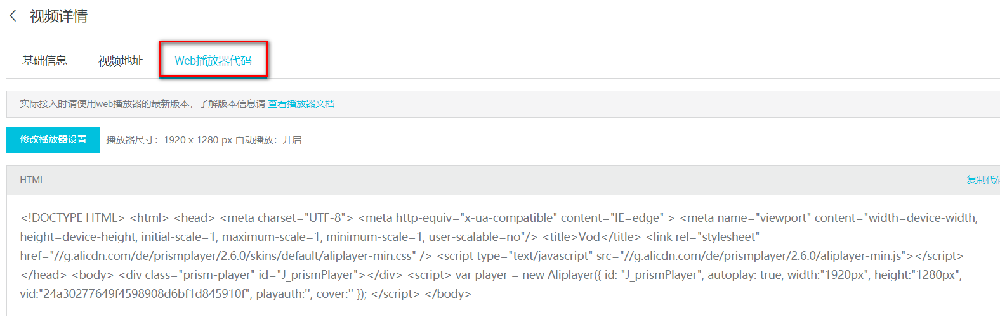