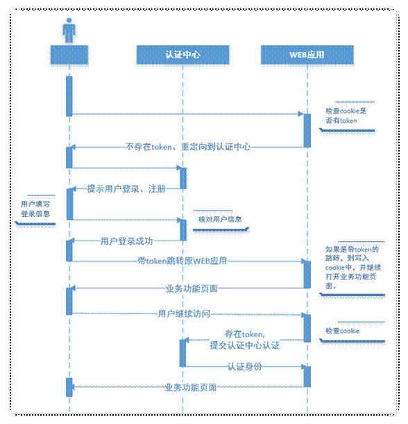

# 1.  用户登录业务介绍

## 1.1. 单一服务器模式

早期单一服务器，用户认证。

缺点：单点性能压力，无法扩展

 

## 1.2. SSO(single sign on)模式

分布式，SSO(single sign on)模式

**优点 ：** 

用户身份信息独立管理，更好的分布式管理。

 可以自己扩展安全策略

**缺点：**

   认证服务器访问压力较大。

## 1.3. Token模式

业务流程图{用户访问业务时，必须登录的流程}

**优点：**

无状态： token无状态，session有状态的

基于标准化: 你的API可以采用标准化的 JSON Web Token (JWT)

**缺点：**

占用带宽

无法在服务器端销毁

注：基于微服务开发，选择token的形式相对较多，因此我使用token作为用户认证的标准