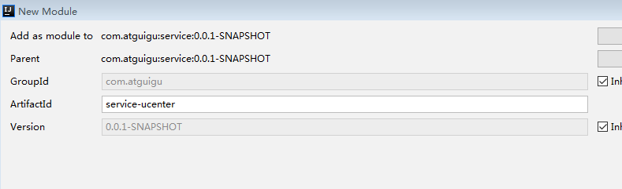
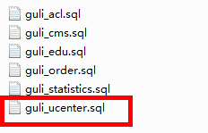
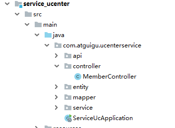

# 一、新建用户微服务

## 1、在service模块下创建子模块service-ucenter



**2、使用代码生成器生成代码**

**（1）创建ucenter_member表**




**（2）生成代码**



3、配置application.properties

```
# 服务端口
server.port=8005
# 服务名
spring.application.name=service-ucenter

# mysql数据库连接
spring.datasource.driver-class-name=com.mysql.cj.jdbc.Driver
spring.datasource.url=jdbc:mysql://localhost:3306/guli?serverTimezone=GMT%2B8
spring.datasource.username=root
spring.datasource.password=root

spring.redis.host=192.168.44.131
spring.redis.port=6379
spring.redis.database= 0
spring.redis.timeout=1800000
spring.redis.lettuce.pool.max-active=20
spring.redis.lettuce.pool.max-wait=-1
  #最大阻塞等待时间(负数表示没限制)
spring.redis.lettuce.pool.max-idle=5
spring.redis.lettuce.pool.min-idle=0
#最小空闲

#返回json的全局时间格式
spring.jackson.date-format=yyyy-MM-dd HH:mm:ss
spring.jackson.time-zone=GMT+8

#配置mapper xml文件的路径
mybatis-plus.mapper-locations=classpath:com/atguigu/cmsservice/mapper/xml/*.xml

#mybatis日志
mybatis-plus.configuration.log-impl=org.apache.ibatis.logging.stdout.StdOutImpl
```

## 4、创建启动类

创建ServiceUcApplication.java

```
@ComponentScan({"com.atguigu"})
@SpringBootApplication//取消数据源自动配置
@MapperScan("com.atguigu.ucenterservice.mapper")
public class ServiceUcApplication {
    public static void main(String[] args) {
        SpringApplication.run(ServiceUcApplication.class, args);
    }
}
```

## 二、创建登录和注册接口 

## 1、创建LoginVo和RegisterVo用于数据封装

**LoginVo**

```
@Data
@ApiModel(value="登录对象", description="登录对象")
public class LoginVo {

    @ApiModelProperty(value = "手机号")
    private String mobile;

    @ApiModelProperty(value = "密码")
    private String password;
}
```

**RegisterVo**

```
@Data
@ApiModel(value="注册对象", description="注册对象")
public class RegisterVo {

    @ApiModelProperty(value = "昵称")
    private String nickname;

    @ApiModelProperty(value = "手机号")
    private String mobile;

    @ApiModelProperty(value = "密码")
    private String password;

    @ApiModelProperty(value = "验证码")
    private String code;
}
```

## 2、创建controller编写登录和注册方法 

**MemberApiController.java**

```
@RestController
@RequestMapping("/ucenterservice/apimember")
@CrossOrigin
public class MemberApiController {

    @Autowired
    private MemberService memberService;

    @ApiOperation(value = "会员登录")
    @PostMapping("login")
    public R login(@RequestBody LoginVo loginVo) {
        String token = memberService.login(loginVo);
        return R.ok().data("token", token);
    }

    @ApiOperation(value = "会员注册")
    @PostMapping("register")
    public R register(@RequestBody RegisterVo registerVo){
        memberService.register(registerVo);
        return R.ok();
    }
}
```

# 

## 3、创建service接口和实现类

```
@Service
public class MemberServiceImpl extends ServiceImpl<MemberMapper, Member> implements MemberService {

    @Autowired
    private RedisTemplate<String, String> redisTemplate;

    /**
     * 会员登录
     * @param loginVo
     * @return
     */
    @Override
    public String login(LoginVo loginVo) {
        String mobile = loginVo.getMobile();
        String password = loginVo.getPassword();

        //校验参数
        if(StringUtils.isEmpty(mobile) ||
                StringUtils.isEmpty(password) ||
                StringUtils.isEmpty(mobile)) {
            throw new GuliException(20001,"error");
        }

        //获取会员
        Member member = baseMapper.selectOne(new QueryWrapper<Member>().eq("mobile", mobile));
        if(null == member) {
            throw new GuliException(20001,"error");
        }

        //校验密码
        if(!MD5.encrypt(password).equals(member.getPassword())) {
            throw new GuliException(20001,"error");
        }

        //校验是否被禁用
        if(member.getIsDisabled()) {
            throw new GuliException(20001,"error");
        }

        //使用JWT生成token字符串
        String token = JwtUtils.getJwtToken(member.getId(), member.getNickname());
        return token;
    }

    /**
     * 会员注册
     * @param registerVo
     */
    @Override
    public void register(RegisterVo registerVo) {
        //获取注册信息，进行校验
        String nickname = registerVo.getNickname();
        String mobile = registerVo.getMobile();
        String password = registerVo.getPassword();
        String code = registerVo.getCode();

        //校验参数
        if(StringUtils.isEmpty(mobile) ||
                StringUtils.isEmpty(mobile) ||
                StringUtils.isEmpty(password) ||
                StringUtils.isEmpty(code)) {
            throw new GuliException(20001,"error");
        }

        //校验校验验证码
        //从redis获取发送的验证码
        String mobleCode = redisTemplate.opsForValue().get(mobile);
        if(!code.equals(mobleCode)) {
            throw new GuliException(20001,"error");
        }

        //查询数据库中是否存在相同的手机号码
        Integer count = baseMapper.selectCount(new QueryWrapper<Member>().eq("mobile", mobile));
        if(count.intValue() > 0) {
            throw new GuliException(20001,"error");
        }

        //添加注册信息到数据库
        Member member = new Member();
        member.setNickname(nickname);
        member.setMobile(registerVo.getMobile());
        member.setPassword(MD5.encrypt(password));
        member.setIsDisabled(false);
     member.setAvatar("http://thirdwx.qlogo.cn/mmopen/vi_32/DYAIOgq83eoj0hHXhgJNOTSOFsS4uZs8x1ConecaVOB8eIl115xmJZcT4oCicvia7wMEufibKtTLqiaJeanU2Lpg3w/132");
        this.save(member);
    }
}
```

## 三、创建接口根据token获取用户信息 

## 在**MemberApiController中创建方法**

```
@ApiOperation(value = "根据token获取登录信息")
    @GetMapping("auth/getLoginInfo")
    public R getLoginInfo(HttpServletRequest request){
        try {
            String memberId = JwtUtils.getMemberIdByJwtToken(request);
            LoginInfoVo loginInfoVo = memberService.getLoginInfo(memberId);
            return R.ok().data("item", loginInfoVo);
        }catch (Exception e){
            e.printStackTrace();
            throw new GuliException(20001,"error");
        }
    }
```

**创建service**

```
    @Override
    public LoginInfoVo getLoginInfo(String memberId) {
        Member member = baseMapper.selectById(memberId);
        LoginInfoVo loginInfoVo = new LoginInfoVo();
        BeanUtils.copyProperties(member, loginInfoVo);
        return loginInfoVo;
    }
```