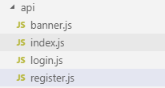
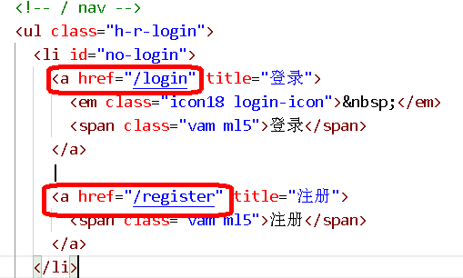
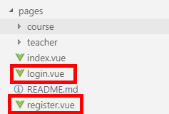
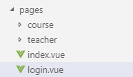

# 一、在nuxt环境中安装插件

## 1、安装element-ui 和 vue-qriously

（1）执行命令安装

npm install element-ui

npm install vue-qriously

2、修改配置文件 nuxt-swiper-plugin.js，使用插件

nuxt-swiper-plugin.js

```
import Vue from 'vue'
import VueAwesomeSwiper from 'vue-awesome-swiper/dist/ssr'
import VueQriously from 'vue-qriously'
import ElementUI from 'element-ui' //element-ui的全部组件
import 'element-ui/lib/theme-chalk/index.css'//element-ui的css
Vue.use(ElementUI) //使用elementUI
Vue.use(VueQriously)
Vue.use(VueAwesomeSwiper)
```

## 二、用户注册功能前端整合 

## 1、在api文件夹中创建注册的js文件，定义接口



**register.js**

```
import request from '@/utils/request'

export default {
  //根据手机号码发送短信
  getMobile(mobile) {
    return request({
      url: `/edumsm/send/${mobile}`,
      method: 'get'
    })
  },
  //用户注册
  submitRegister(formItem) {
    return request({
      url: `/ucenterservice/apimember/register`,
      method: 'post',
      data: formItem
    })
  }
}
```

**2****、在pages文件夹中创建注册页面，调用方法**

**（1）在layouts创建布局页面**

**sign.vue**

```
<template>
  <div class="sign">
    <!--标题-->
    <div class="logo">
      
    </div>
    <!--表单-->
    <nuxt/>
  </div>
</template>
```

（2）创建注册页面

修改layouts文件夹里面default.vue页面，修改登录和注册超链接地址



在pages文件夹下，创建注册和登录页面



**register.vue**

```
<template>
  <div class="main">
    <div class="title">
      <a href="/login">登录</a>
      <span>·</span>
      <a class="active" href="/register">注册</a>
    </div>

    <div class="sign-up-container">
      <el-form ref="userForm" :model="params">

        <el-form-item class="input-prepend restyle" prop="nickname" :rules="[{ required: true, message: '请输入你的昵称', trigger: 'blur' }]">
          <div>
            <el-input type="text" placeholder="你的昵称" v-model="params.nickname"/>
            <i class="iconfont icon-user"/>
          </div>
        </el-form-item>

        <el-form-item class="input-prepend restyle no-radius" prop="mobile" :rules="[{ required: true, message: '请输入手机号码', trigger: 'blur' },{validator: checkPhone, trigger: 'blur'}]">
          <div>
            <el-input type="text" placeholder="手机号" v-model="params.mobile"/>
            <i class="iconfont icon-phone"/>
          </div>
        </el-form-item>

        <el-form-item class="input-prepend restyle no-radius" prop="code" :rules="[{ required: true, message: '请输入验证码', trigger: 'blur' }]">
          <div style="width: 100%;display: block;float: left;position: relative">
            <el-input type="text" placeholder="验证码" v-model="params.code"/>
            <i class="iconfont icon-phone"/>
          </div>
          <div class="btn" style="position:absolute;right: 0;top: 6px;width: 40%;">
            <a href="javascript:" type="button" @click="getCodeFun()" :value="codeTest" style="border: none;background-color: none">{{codeTest}}</a>
          </div>
        </el-form-item>

        <el-form-item class="input-prepend" prop="password" :rules="[{ required: true, message: '请输入密码', trigger: 'blur' }]">
          <div>
            <el-input type="password" placeholder="设置密码" v-model="params.password"/>
            <i class="iconfont icon-password"/>
          </div>
        </el-form-item>

        <div class="btn">
          <input type="button" class="sign-up-button" value="注册" @click="submitRegister()">
        </div>
        <p class="sign-up-msg">
          点击 “注册” 即表示您同意并愿意遵守简书
          <br>
          <a target="_blank" href="http://www.jianshu.com/p/c44d171298ce">用户协议</a>
          和
          <a target="_blank" href="http://www.jianshu.com/p/2ov8x3">隐私政策</a> 。
        </p>
      </el-form>
      <!-- 更多注册方式 -->
      <div class="more-sign">
        <h6>社交帐号直接注册</h6>
        <ul>
          <li><a id="weixin" class="weixin" target="_blank" href="http://huaan.free.idcfengye.com/api/ucenter/wx/login"><i
            class="iconfont icon-weixin"/></a></li>
          <li><a id="qq" class="qq" target="_blank" href="#"><i class="iconfont icon-qq"/></a></li>
        </ul>
      </div>
    </div>
  </div>
</template>

<script>
  import '~/assets/css/sign.css'
  import '~/assets/css/iconfont.css'

  import registerApi from '@/api/register'

  export default {
    layout: 'sign',
    data() {
      return {
        params: {
          mobile: '',
          code: '',
          nickname: '',
          password: ''
        },
        sending: true,      //是否发送验证码
        second: 60,        //倒计时间
        codeTest: '获取验证码'
      }
    },
    methods: {
      getCodeFun() {
        //sending = false
        //his.sending原为true,请求成功，!this.sending == true，主要是防止有人把disabled属性去掉，多次点击；
        if (!this.sending)
          return;

        //debugger
        // prop 换成你想监听的prop字段
        this.$refs.userForm.validateField('mobile', (errMsg) => {
          if (errMsg == '') {
            registerApi.getMobile(this.params.mobile).then(res => {
              this.sending = false;
              this.timeDown();
            });
          }
        })
      },

      timeDown() {
        let result = setInterval(() => {
          --this.second;
          this.codeTest = this.second
          if (this.second < 1) {
            clearInterval(result);
            this.sending = true;
            //this.disabled = false;
            this.second = 60;
            this.codeTest = "获取验证码"
          }
        }, 1000);

      },
      submitRegister() {
        this.$refs['userForm'].validate((valid) => {
          if (valid) {
            registerApi.submitRegister(this.params).then(response => {
              //提示注册成功
              this.$message({
                type: 'success',
                message: "注册成功"
              })
              this.$router.push({path: '/login'})
            })
          }
        })
      },

      checkPhone (rule, value, callback) {
        //debugger
        if (!(/^1[34578]\d{9}$/.test(value))) {
          return callback(new Error('手机号码格式不正确'))
        }
        return callback()
      }
    }
  }
</script>

```

## 三、用户登录功能前端整合 

## 1、在api文件夹中创建登录的js文件，定义接口


**login.js**

```
import request from '@/utils/request'
export default {
  //登录
  submitLogin(userInfo) {
    return request({
      url: `/ucenterservice/apimember/login`,
      method: 'post',
      data: userInfo
    })
  },
  //根据token获取用户信息
  getLoginInfo() {
    return request({
      url: `/ucenterservice/apimember/auth/getLoginInfo`,
      method: 'get',
     // headers: {'token': cookie.get('guli_token')}
    })
    //headers: {'token': cookie.get('guli_token')} 
  }
}
```

**2、在pages文件夹中创建登录页面，调用方法**



**（1）安装js-cookie插件**

npm install js-cookie

**（2）login.vue**

```
<template>
  <div class="main">
    <div class="title">
      <a class="active" href="/login">登录</a>
      <span>·</span>
      <a href="/register">注册</a>
    </div>

    <div class="sign-up-container">
      <el-form ref="userForm" :model="user">

        <el-form-item class="input-prepend restyle" prop="mobile" :rules="[{ required: true, message: '请输入手机号码', trigger: 'blur' },{validator: checkPhone, trigger: 'blur'}]">
          <div >
            <el-input type="text" placeholder="手机号" v-model="user.mobile"/>
            <i class="iconfont icon-phone" />
          </div>
        </el-form-item>

        <el-form-item class="input-prepend" prop="password" :rules="[{ required: true, message: '请输入密码', trigger: 'blur' }]">
          <div>
            <el-input type="password" placeholder="密码" v-model="user.password"/>
            <i class="iconfont icon-password"/>
          </div>
        </el-form-item>

        <div class="btn">
          <input type="button" class="sign-in-button" value="登录" @click="submitLogin()">
        </div>
      </el-form>
      <!-- 更多登录方式 -->
      <div class="more-sign">
        <h6>社交帐号登录</h6>
        <ul>
          <li><a id="weixin" class="weixin" target="_blank" href="http://qy.free.idcfengye.com/api/ucenter/weixinLogin/login"><i class="iconfont icon-weixin"/></a></li>
          <li><a id="qq" class="qq" target="_blank" href="#"><i class="iconfont icon-qq"/></a></li>
        </ul>
      </div>
    </div>

  </div>
</template>

<script>
  import '~/assets/css/sign.css'
  import '~/assets/css/iconfont.css'
  import cookie from 'js-cookie'

  import loginApi from '@/api/login'
  export default {
    layout: 'sign',

    data () {
      return {
        user:{
          mobile:'',
          password:''
        },
        loginInfo:{}
      }
    },

    methods: {
      submitLogin(){
            loginApi.submitLogin(this.user).then(response => {
              if(response.data.success){

                //把token存在cookie中、也可以放在localStorage中
                cookie.set('guli_token', response.data.data.token, { domain: 'localhost' })
                //登录成功根据token获取用户信息
                loginApi.getLoginInfo().then(response => {
                  
                  this.loginInfo = response.data.data.item
                  //将用户信息记录cookie
                  cookie.set('guli_ucenter', this.loginInfo, { domain: 'localhost' })
                  //跳转页面
                  window.location.href = "/";
                })
              }
            })
      },

      checkPhone (rule, value, callback) {
        //debugger
        if (!(/^1[34578]\d{9}$/.test(value))) {
          return callback(new Error('手机号码格式不正确'))
        }
        return callback()
      }
    }
  }
</script>
<style>
   .el-form-item__error{
    z-index: 9999999;
  }
</style>
```

**3、在request.js添加拦截器，用于传递token信息**

```
import axios from 'axios'
import { MessageBox, Message } from 'element-ui'
import cookie from 'js-cookie'

// 创建axios实例
const service = axios.create({
   //baseURL: 'http://qy.free.idcfengye.com/api', // api 的 base_url
  //baseURL: 'http://localhost:8210', // api 的 base_url
  baseURL: 'http://localhost:9001',
  timeout: 15000 // 请求超时时间
  
})

// http request 拦截器
service.interceptors.request.use(
  config => {
  //debugger
  if (cookie.get('guli_token')) {
    config.headers['token'] = cookie.get('guli_token');
  }
    return config
  },
  err => {
  return Promise.reject(err);
})
// http response 拦截器
service.interceptors.response.use(
  response => {
    //debugger
    if (response.data.code == 28004) {
        console.log("response.data.resultCode是28004")
        // 返回 错误代码-1 清除ticket信息并跳转到登录页面
        //debugger
        window.location.href="/login"
        return
    }else{
      if (response.data.code !== 20000) {
        //25000：订单支付中，不做任何提示
        if(response.data.code != 25000) {
          Message({
            message: response.data.message || 'error',
            type: 'error',
            duration: 5 * 1000
          })
        }
      } else {
        return response;
      }
    }
  },
  error => {
    return Promise.reject(error.response)   // 返回接口返回的错误信息
});

export default service
```

4**、修改layouts中的default.vue页面**

**（1）显示登录之后的用户信息**

```
<script>
import "~/assets/css/reset.css";
import "~/assets/css/theme.css";
import "~/assets/css/global.css";
import "~/assets/css/web.css";

import cookie from 'js-cookie'
import userApi from '@/api/login'

export default {
  data() {
    return {
      token: '',
      loginInfo: {
        id: '',
        age: '',
        avatar: '',
        mobile: '',
        nickname: '',
        sex: ''
      }
    }
  },

  created() {
    this.showInfo()
  },

  methods: {
    showInfo() {
      //debugger
      var jsonStr = cookie.get("guli_ucenter");
      //alert(jsonStr)
      if (jsonStr) {
        this.loginInfo = JSON.parse(jsonStr)
      }
    },

    logout() {
      //debugger
      cookie.set('guli_ucenter', "", {domain: 'localhost'})
      cookie.set('guli_token', "", {domain: 'localhost'})

      //跳转页面
      window.location.href = "/"
    }
  }
}
</script>
```

**（2）\**default.vue页面\**显示登录之后的用户信息**

```
 <!-- / nav -->
<ul class="h-r-login">
    <li v-if="!loginInfo.id" id="no-login">
        <a href="/login" title="登录">
            <em class="icon18 login-icon">&nbsp;</em>
            <span class="vam ml5">登录</span>
        </a>
        |
        <a href="/register" title="注册">
            <span class="vam ml5">注册</span>
        </a>
    </li>
    <li v-if="loginInfo.id" id="is-login-one" class="mr10">
        <a id="headerMsgCountId" href="#" title="消息">
            <em class="icon18 news-icon">&nbsp;</em>
        </a>
        <q class="red-point" style="display: none">&nbsp;</q>
    </li>
    <li v-if="loginInfo.id" id="is-login-two" class="h-r-user">
        <a href="/ucenter" title>
            
            <span id="userName" class="vam disIb">{{ loginInfo.nickname }}</span>
        </a>
        <a href="javascript:void(0);" title="退出" @click="logout()" class="ml5">退出</a>
    </li>
    <!-- /未登录显示第1 li；登录后显示第2，3 li -->
</ul>
```