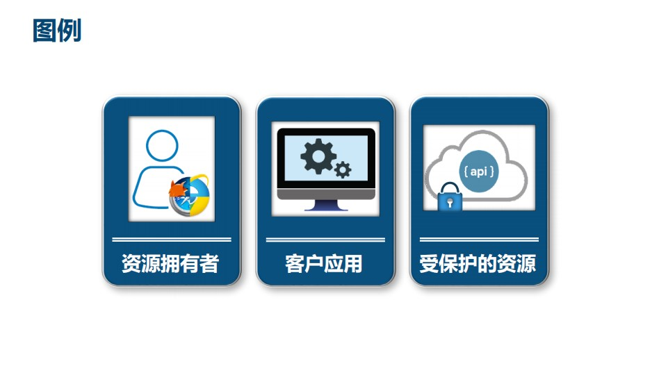
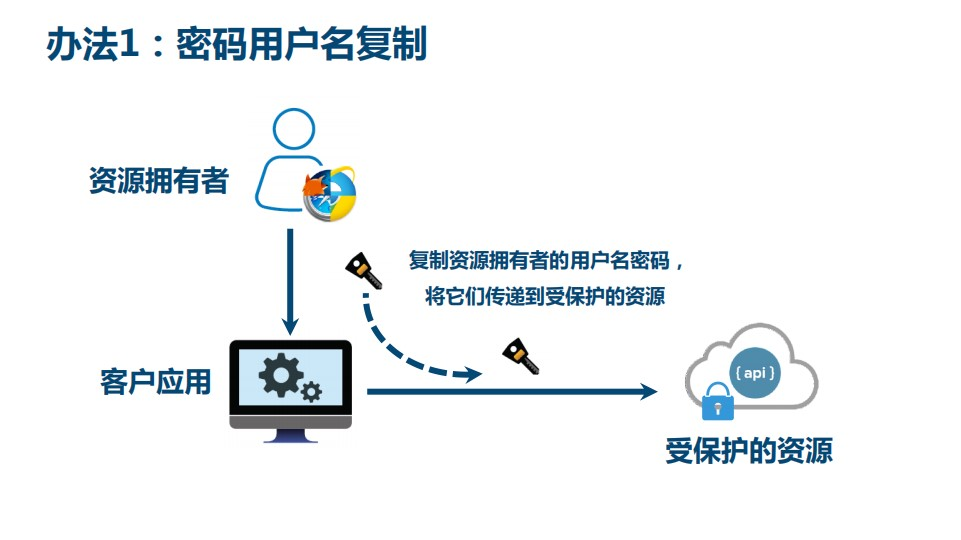
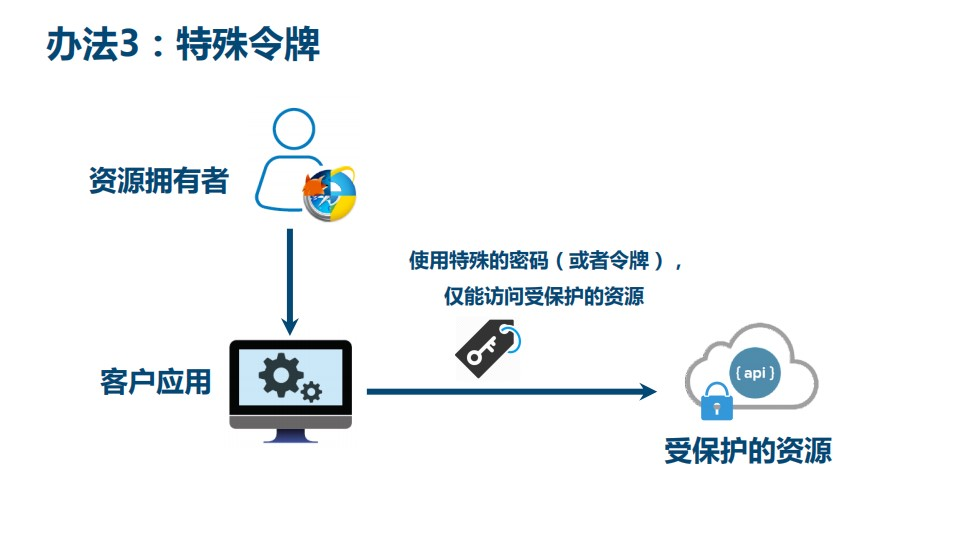
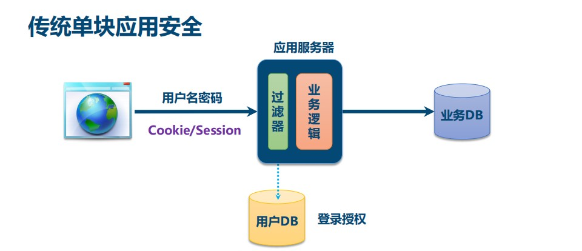
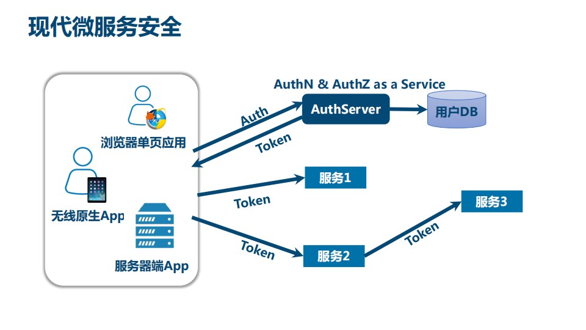
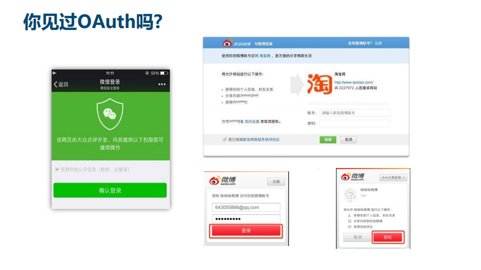

# 一、OAuth2解决什么问题

## 1、OAuth2提出的背景

照片拥有者想要在云冲印服务上打印照片，云冲印服务需要访问云存储服务上的资源

## 

## 2、图例

资源拥有者：照片拥有者

客户应用：云冲印

受保护的资源：照片

## 3、方式一：用户名密码复制

适用于同一公司内部的多个系统，不适用于不受信的第三方应用

## 4、方式二：通用开发者key

适用于合作商或者授信的不同业务部门之间

## 5、方式三：办法令牌

接近OAuth2方式，需要考虑如何管理令牌、颁发令牌、吊销令牌，需要统一的协议，因此就有了OAuth2协议

# 二、现代微服务安全

除了开放系统授权，OAuth2还可以应用于现代微服务安全

## 1、传统单块应用的安全

## 2、现代微服务安全

现代微服务中系统微服务化以及应用的形态和设备类型增多，不能用传统的登录方式

核心的技术不是用户名和密码，而是token，由AuthServer颁发token，用户使用token进行登录

## 3、典型的OAuth2应用

# 三、总结

**四、****OAuth2最简向导**

川崎高彦：OAuth2领域专家，开发了一个OAuth2 sass服务，OAuth2 as Service，并且做成了一个公司

再融资的过程中为了向投资人解释OAuth2是什么，于是写了一篇文章，《OAuth2最简向导》