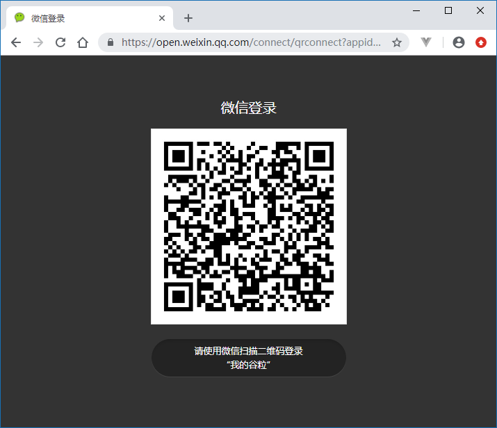
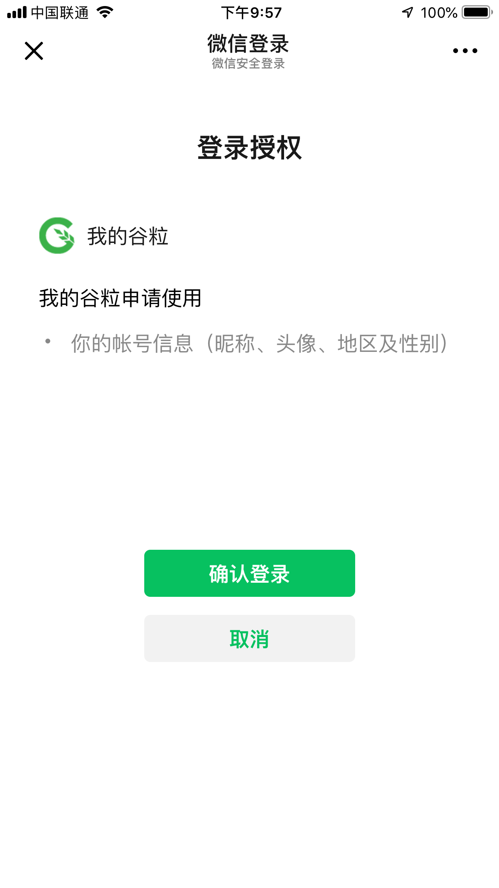
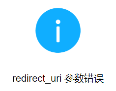

# **一、准备工作**

https://open.weixin.qq.com

## 1、注册

## 2、邮箱激活

## 3、完善开发者资料

## 4、开发者资质认证

准备营业执照，1-2个工作日审批、300元

## 5、创建网站应用

提交审核，7个工作日审批

## 6、熟悉微信登录流程

参考文档：https://open.weixin.qq.com/cgi-bin/showdocument?action=dir_list&t=resource/res_list&verify=1&id=open1419316505&token=e547653f995d8f402704d5cb2945177dc8aa4e7e&lang=zh_CN

**获取access_token时序图**


# 二、后端开发

## 1、添加配置

application.properties添加相关配置信息

```
# 微信开放平台 appid
wx.open.app_id=你的appid
# 微信开放平台 appsecret
wx.open.app_secret=你的appsecret
# 微信开放平台 重定向url
wx.open.redirect_url=http://你的服务器名称/api/ucenter/wx/callback
```

## **2、创建常量类**

创建util包，创建ConstantPropertiesUtil.java常量类

```
package com.guli.ucenter.util;

@Component
//@PropertySource("classpath:application.properties")
public class ConstantPropertiesUtil implements InitializingBean {

    @Value("${wx.open.app_id}")
    private String appId;

    @Value("${wx.open.app_secret}")
    private String appSecret;

    @Value("${wx.open.redirect_url}")
    private String redirectUrl;

    public static String WX_OPEN_APP_ID;
    public static String WX_OPEN_APP_SECRET;
    public static String WX_OPEN_REDIRECT_URL;

    @Override
    public void afterPropertiesSet() throws Exception {
        WX_OPEN_APP_ID = appId;
        WX_OPEN_APP_SECRET = appSecret;
        WX_OPEN_REDIRECT_URL = redirectUrl;
    }
}
```

## 3、创建controller

guli-microservice-ucenter微服务中创建api包

api包中创建WxApiController

```
package com.guli.ucenter.controller.api;

@CrossOrigin
@Controller//注意这里没有配置 @RestController
@RequestMapping("/api/ucenter/wx")
public class WxApiController {

    @GetMapping("login")
    public String genQrConnect(HttpSession session) {

        // 微信开放平台授权baseUrl
        String baseUrl = "https://open.weixin.qq.com/connect/qrconnect" +
                "?appid=%s" +
                "&redirect_uri=%s" +
                "&response_type=code" +
                "&scope=snsapi_login" +
                "&state=%s" +
                "#wechat_redirect";

        // 回调地址
        String redirectUrl = ConstantPropertiesUtil.WX_OPEN_REDIRECT_URL; //获取业务服务器重定向地址
        try {
            redirectUrl = URLEncoder.encode(redirectUrl, "UTF-8"); //url编码
        } catch (UnsupportedEncodingException e) {
            throw new GuliException(20001, e.getMessage());
        }

        // 防止csrf攻击（跨站请求伪造攻击）
        //String state = UUID.randomUUID().toString().replaceAll("-", "");//一般情况下会使用一个随机数
        String state = "imhelen";//为了让大家能够使用我搭建的外网的微信回调跳转服务器，这里填写你在ngrok的前置域名
        System.out.println("state = " + state);

        // 采用redis等进行缓存state 使用sessionId为key 30分钟后过期，可配置
        //键："wechar-open-state-" + httpServletRequest.getSession().getId()
        //值：satte
        //过期时间：30分钟

        //生成qrcodeUrl
        String qrcodeUrl = String.format(
                baseUrl,
                ConstantPropertiesUtil.WX_OPEN_APP_ID,
                redirectUrl,
                state);

        return "redirect:" + qrcodeUrl;
    }
}
```

授权url参数说明

| 参数            | 是否必须 | 说明                                                                                    |
|---------------|------|---------------------------------------------------------------------------------------|
| appid         | 是    | 应用唯一标识                                                                                |
| redirect_uri  | 是    | 请使用urlEncode对链接进行处理                                                                   |
| response_type | 是    | 填code                                                                                 |
| scope         | 是    | 应用授权作用域，拥有多个作用域用逗号（,）分隔，网页应用目前仅填写snsapi_login即                                        |
| state         | 否    | 用于保持请求和回调的状态，授权请求后原样带回给第三方。该参数可用于防止csrf攻击（跨站请求伪造攻击），建议第三方带上该参数，可设置为简单的随机数加session进行校验 |

## 4、测试

访问：[http://localhost:8201/api/ucenter/wx/login](http://localhost:8104/api/ucenter/wx/login)

访问授权url后会得到一个微信登录二维码



用户扫描二维码会看到确认登录的页面



用户点击“确认登录”后，微信服务器会向谷粒学院的业务服务器发起回调，因此接下来我们需要开发回调controller

**注意：**如果没有正确的配置业务服务器的回调url，则会看到以下错误提示


