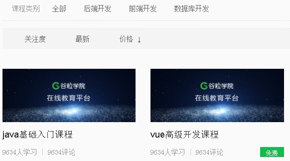
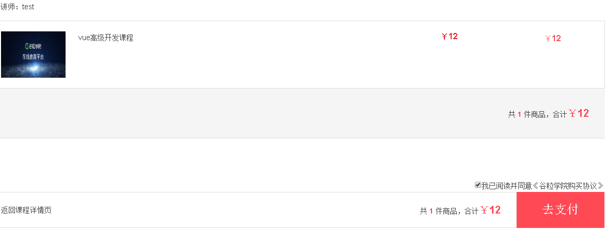

# 一、课程支付需求描述

**1、课程支付说明**

## （1）课程分为免费课程和付费课程，如果是免费课程可以直接观看，如果是付费观看的课程，用户需下单支付后才可以观看

**（2）如果是免费课程，在用户选择课程，进入到课程详情页面时候，直接显示 “立即观看”，用户点击立即观看，可以切换到播放列表进行视频播放
**

**2、付费课程流程**

**（1）如果是付费课程，在用户选择课程，进入到课程详情页面时候，会显示 “立即购买”**

**（2）点击“立即购买”，会生成课程的订单，跳转到订单页面**

**（3）点击“去支付”，会跳转到支付页面，生成微信扫描的二维码**

**（4）使用微信扫描支付后，会跳转回到课程详情页面，同时显示“立即观看”**

