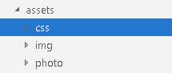
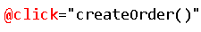
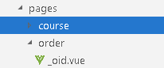

# 一、页面样式修改

**1、复制样式文件到assets**



**2、修改default.vue页面**

```
import '~/assets/css/reset.css'
import '~/assets/css/theme.css'
import '~/assets/css/global.css'
import '~/assets/css/web.css'
import '~/assets/css/base.css'
import '~/assets/css/activity_tab.css'
import '~/assets/css/bottom_rec.css'
import '~/assets/css/nice_select.css'
import '~/assets/css/order.css'
import '~/assets/css/swiper-3.3.1.min.css'
import "~/assets/css/pages-weixinpay.css"
```

**二、课程支付前端**

## 1、在api文件夹下创建order.js文件

```
import request from '@/utils/request'

export default {
    
    //1、创建订单
    createOrder(cid) {
        return request({
            url: '/orderservice/order/createOrder/'+cid,
            method: 'post'
        })
    },
    //2、根据id获取订单
    getById(cid) {
        return request({
            url: '/orderservice/order/getOrder/'+cid,
            method: 'get'
        })
    },
    //3、生成微信支付二维码
    createNative(cid) {
        return request({
            url: '/orderservice/log/createNative/'+cid,
            method: 'get'
        })
    },
    //4、根据id获取订单支付状态
    queryPayStatus(cid) {
        return request({
            url: '/orderservice/log/queryPayStatus/'+cid,
            method: 'get'
        })
    }
}
```

**2、在课程详情页面中添加创建订单方法**

**在“立即购买”位置添加事件**



```
methods:{
    //根据课程id，调用接口方法生成订单
    createOrder(){
        order.createOrder(this.courseId).then(response => {
            if(response.data.success){
                //订单创建成功，跳转到订单页面
                this.$router.push({ path: '/order/'+ response.data.data.orderId })
            }
        })
    },
}
```

## 

**3、创建订单页面，显示订单信息**

**在pages下面创建order文件夹，创建_oid.vue页面**



在_oid.vue页面调用方法，获取订单信息

（1）页面部分

```
<template>
  <div class="Page Confirm">
    <div class="Title">
      <h1 class="fl f18">订单确认</h1>
      
      <div class="clear"></div>
    </div>
    <form name="flowForm" id="flowForm" method="post" action="">
      <table class="GoodList">
        <tbody>
        <tr>
          <th class="name">商品</th>
          <th class="price">原价</th>
          <th class="priceNew">价格</th>
        </tr>
        </tbody>
        <tbody>
        <!-- <tr>
          <td colspan="3" class="Title red f18 fb"><p>限时折扣</p></td>
        </tr> -->
        <tr>
          <td colspan="3" class="teacher">讲师：{{order.teacherName}}</td>
        </tr>
        <tr class="good">
          <td class="name First">
            <a target="_blank" :href="'https://localhost:3000/course/'+order.courseId">
              </a>
            <div class="goodInfo">
              <input type="hidden" class="ids ids_14502" value="14502">
              <a target="_blank" :href="'https://localhost:3000/course/'+ order.courseId">{{order.courseTitle}}</a>
            </div>
          </td>
          <td class="price">
            <p>￥<strong>{{order.totalFee}}</strong></p>
            <!-- <span class="discName red">限时8折</span> -->
          </td>
          <td class="red priceNew Last">￥<strong>{{order.totalFee}}</strong></td>
        </tr>
        <tr>
          <td class="Billing tr" colspan="3">
            <div class="tr">
              <p>共 <strong class="red">1</strong> 件商品，合计<span
                class="red f20">￥<strong>{{order.totalFee}}</strong></span></p>
            </div>
          </td>
        </tr>
        </tbody>
      </table>
      <div class="Finish">
        <div class="fr" id="AgreeDiv">
          
          <label for="Agree"><p class="on"><input type="checkbox" checked="checked">我已阅读并同意<a href="javascript:" target="_blank">《谷粒学院购买协议》</a></p></label>
        </div>
        <div class="clear"></div>
        <div class="Main fl">
          <div class="fl">
            <a :href="'/course/'+order.courseId">返回课程详情页</a>
          </div>
          <div class="fr">
            <p>共 <strong class="red">1</strong> 件商品，合计<span class="red f20">￥<strong
              id="AllPrice">{{order.totalFee}}</strong></span></p>
          </div>
        </div>
        <input name="score" value="0" type="hidden" id="usedScore">
        <button class="fr redb" type="button" id="submitPay" @click="toPay()">去支付</button>
        <div class="clear"></div>
      </div>
    </form>
  </div>
</template>
```

## （2）调用部分

```
<script>
import orderApi from '@/api/order'
export default {
  //根据订单id获取订单信息
  asyncData({params, error}) {
      return orderApi.getById(params.oid).then(response => {
        return {
            order: response.data.data.item
            }
      })
  },
  methods: {
    //点击去支付，跳转到支付页面
    toPay() {
      this.$router.push({path: '/pay/' + this.order.orderNo})
    }
  }
}
</script>
```

## 4、创建支付页面，生成二维码完成支付

**（1）页面部分**

```
<template>
  <div class="cart py-container">
    <!--主内容-->
    <div class="checkout py-container  pay">
      <div class="checkout-tit">
        <h4 class="fl tit-txt"><span class="success-icon"></span><span class="success-info">订单提交成功，请您及时付款！订单号：{{payObj.out_trade_no}}</span>
        </h4>
        <span class="fr"><em class="sui-lead">应付金额：</em><em class="orange money">￥{{payObj.total_fee}}</em></span>
        <div class="clearfix"></div>
      </div>
      <div class="checkout-steps">
        <div class="fl weixin">微信支付</div>
        <div class="fl sao">
          <p class="red">请使用微信扫一扫。</p>
          <div class="fl code">
            <!--  -->
            <!-- <qriously value="weixin://wxpay/bizpayurl?pr=R7tnDpZ" :size="338"/> -->
            <qriously :value="payObj.code_url" :size="338"/>
            <div class="saosao">
              <p>请使用微信扫一扫</p>
              <p>扫描二维码支付</p>
            </div>

          </div>

        </div>
        <div class="clearfix"></div>
        <!-- <p><a href="pay.html" target="_blank">> 其他支付方式</a></p> -->
        
      </div>
    </div>
  </div>
</template>
```

# （2）调用部分

```
<script>
  import orderApi from '@/api/course'

  export default {
    //根据订单id生成微信支付二维码
    asyncData({params, error}) {
      return orderApi.createNative(params.pid).then(response => {
        return {
          payObj: response.data.data
        }
      })
    },
    data() {
      return {
        timer: null,  // 定时器名称
        initQCode: '',
        timer1:''
      }
    },
    mounted() {
      //在页面渲染之后执行
      //每隔三秒，去查询一次支付状态
      this.timer1 = setInterval(() => {
        this.queryPayStatus(this.payObj.out_trade_no)
      }, 3000);
    },
    methods: {
      //查询支付状态的方法
      queryPayStatus(out_trade_no) {
        orderApi.queryPayStatus(out_trade_no).then(response => {
          if (response.data.success) {
              //如果支付成功，清除定时器
              clearInterval(this.timer1)
            this.$message({
              type: 'success',
              message: '支付成功!'
            })
            //跳转到课程详情页面观看视频
            this.$router.push({path: '/course/' + this.payObj.course_id})
          }
        })
      }
    }
  }
</script>
```