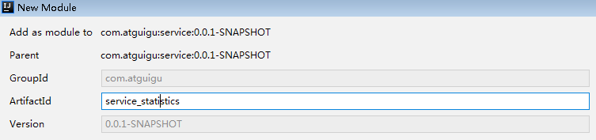
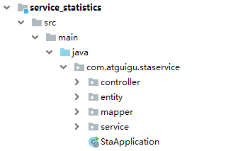
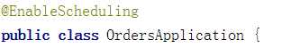

# 一、数据库设计

## 1、数据库

guli_statistics

## **2、数据表**

```
guli_statistics.sql
```

#

# **二、创建微服务**

## 1、在service模块下创建子模块

service_statistics



## **2**、application.properties

resources目录下创建文件

```
# 服务端口
server.port=8008
# 服务名
spring.application.name=service-statistics

# mysql数据库连接
spring.datasource.driver-class-name=com.mysql.cj.jdbc.Driver
spring.datasource.url=jdbc:mysql://localhost:3306/guli?serverTimezone=GMT%2B8
spring.datasource.username=root
spring.datasource.password=root

#返回json的全局时间格式
spring.jackson.date-format=yyyy-MM-dd HH:mm:ss
spring.jackson.time-zone=GMT+8

#配置mapper xml文件的路径
mybatis-plus.mapper-locations=classpath:com/atguigu/staservice/mapper/xml/*.xml

#mybatis日志
mybatis-plus.configuration.log-impl=org.apache.ibatis.logging.stdout.StdOutImpl

# nacos服务地址
spring.cloud.nacos.discovery.server-addr=127.0.0.1:8848

#开启熔断机制
feign.hystrix.enabled=true
# 设置hystrix超时时间，默认1000ms
hystrix.command.default.execution.isolation.thread.timeoutInMilliseconds=3000
```

## 3、MP代码生成器生成代码



## 4、创建SpringBoot启动类

```
@SpringBootApplication
@MapperScan("com.atguigu.staservice.mapper")
@ComponentScan("com.atguigu")
@EnableDiscoveryClient
@EnableFeignClients
public class StaApplication {
    public static void main(String[] args) {
        SpringApplication.run(StaApplication.class, args);
    }
}
```

# 三、实现服务调用

## 1、在service_ucenter模块创建接口，统计某一天的注册人数

**controller**

```
@GetMapping(value = "countregister/{day}")
public R registerCount(
        @PathVariable String day){
    Integer count = memberService.countRegisterByDay(day);
    return R.ok().data("countRegister", count);
}
```

## service

```
@Override
public Integer countRegisterByDay(String day) {
    return baseMapper.selectRegisterCount(day);
}
```

## mapper

```
<select id="selectRegisterCount" resultType="java.lang.Integer">
    SELECT COUNT(1)
    FROM ucenter_member
    WHERE DATE(gmt_create) = #{value}
</select>
```

## 2、在service_statistics模块创建远程调用接口

创建client包和UcenterClient接口

```
@Component
@FeignClient("service-ucenter")
public interface UcenterClient {

    @GetMapping(value = "/ucenterservice/member/countregister/{day}")
    public R registerCount(@PathVariable("day") String day);
}
```

## 3、在service_statistics模块调用微服务

**service**

```
@Service
public class StatisticsDailyServiceImpl extends ServiceImpl<StatisticsDailyMapper, StatisticsDaily> implements StatisticsDailyService {

    @Autowired
    private UcenterClient ucenterClient;

    @Override
    public void createStatisticsByDay(String day) {
        //删除已存在的统计对象
        QueryWrapper<StatisticsDaily> dayQueryWrapper = new QueryWrapper<>();
        dayQueryWrapper.eq("date_calculated", day);
        baseMapper.delete(dayQueryWrapper);


        //获取统计信息
        Integer registerNum = (Integer) ucenterClient.registerCount(day).getData().get("countRegister");
        Integer loginNum = RandomUtils.nextInt(100, 200);//TODO
        Integer videoViewNum = RandomUtils.nextInt(100, 200);//TODO
        Integer courseNum = RandomUtils.nextInt(100, 200);//TODO

        //创建统计对象
        StatisticsDaily daily = new StatisticsDaily();
        daily.setRegisterNum(registerNum);
        daily.setLoginNum(loginNum);
        daily.setVideoViewNum(videoViewNum);
        daily.setCourseNum(courseNum);
        daily.setDateCalculated(day);

        baseMapper.insert(daily);
    }
}
```

## controller

```
@PostMapping("{day}")
public R createStatisticsByDate(@PathVariable String day) {
    dailyService.createStatisticsByDay(day);
    return R.ok();
}
```

##

# 四、添加定时任务

## 1、创建定时任务类，使用cron表达式

**复制日期工具类**

```
@Component
public class ScheduledTask {

    @Autowired
    private StatisticsDailyService dailyService;

    /**
     * 测试
     * 每天七点到二十三点每五秒执行一次
     */
    @Scheduled(cron = "0/5 * * * * ?")
    public void task1() {
        System.out.println("*********++++++++++++*****执行了");
    }

    /**
     * 每天凌晨1点执行定时
     */
    @Scheduled(cron = "0 0 1 * * ?")
    public void task2() {
        //获取上一天的日期
        String day = DateUtil.formatDate(DateUtil.addDays(new Date(), -1));
        dailyService.createStatisticsByDay(day);

    }
}
```

## 2、在启动类上添加注解



**3、在线生成cron表达式**

http://cron.qqe2.com/
