# 一、权限管理需求描述

**不同角色的用户登录后台管理系统拥有不同的菜单权限与功能权限，****权限管理包含三个功能模块：菜单管理、角色管理和用户管理**

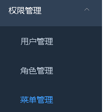

**1、菜单管理**

## （1）菜单列表：使用树形结构显示菜单列表

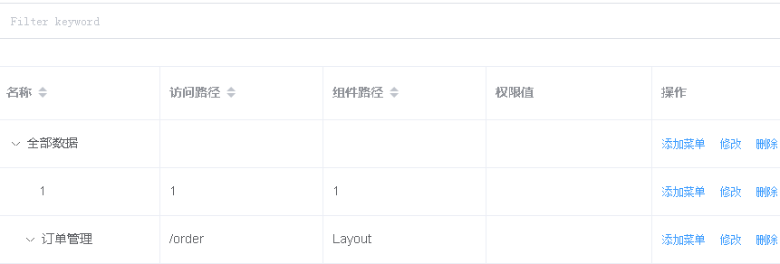

**（2）添加菜单：点击添加菜单，弹框进行添加**

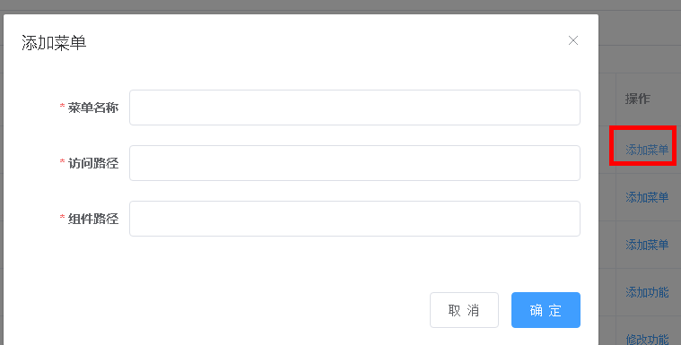

（3）修改菜单

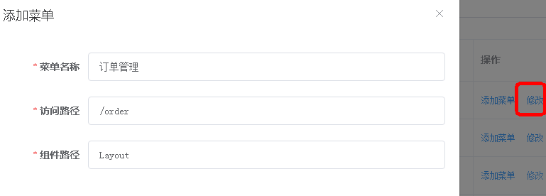

（4）删除菜单

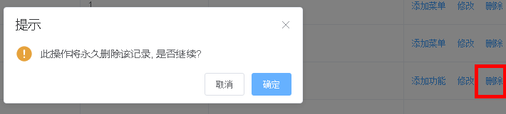

**2、角色管理**

## （1）角色列表：实现角色的条件查询带分页功能

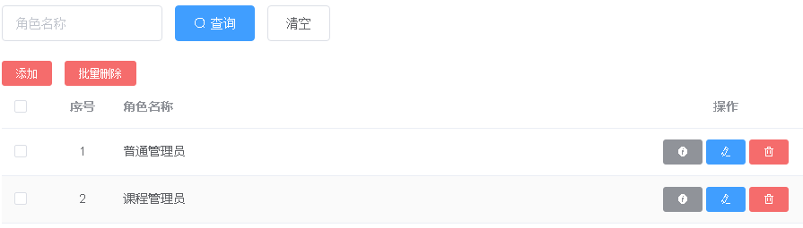

**（2）角色添加**

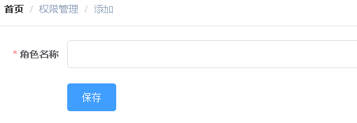

**（3）角色修改**

**点击修改按钮**

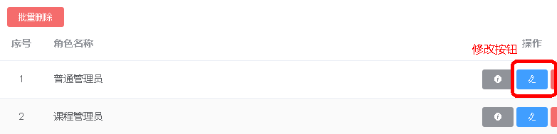

**数据回显，进行修改**

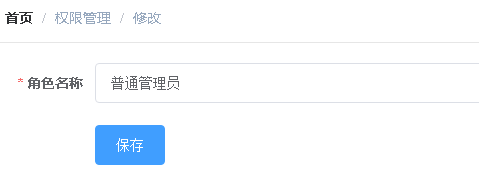

**（4）角色删除**

**普通删除**

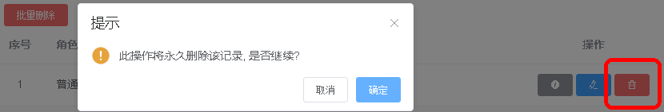

**批量删除**

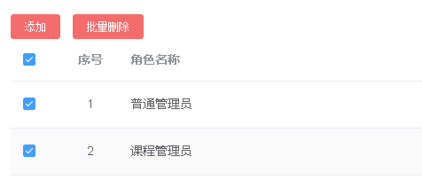

**（5）角色分配菜单**

**点击分配按钮**

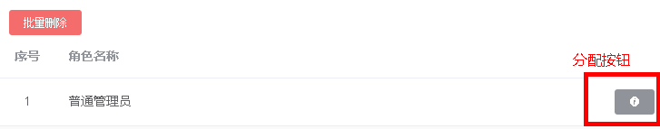

给角色分配菜单

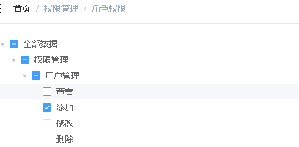

**3、用户管理**

## （1）用户列表

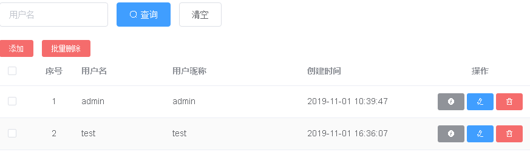

**（2）用户添加**

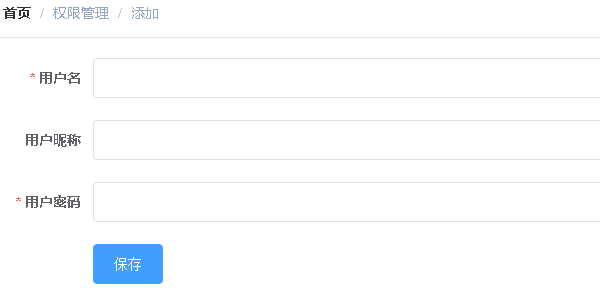

**（3）用户修改**

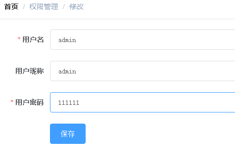

**（4）用户删除**

**普通删除和批量删除**

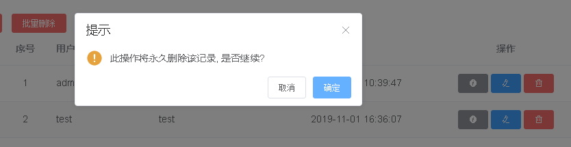

**（5）用户分配角色**

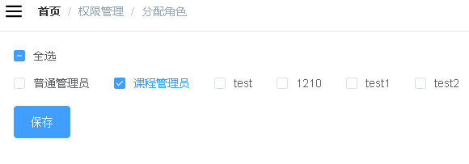