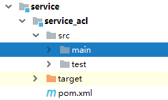
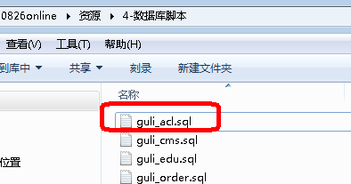
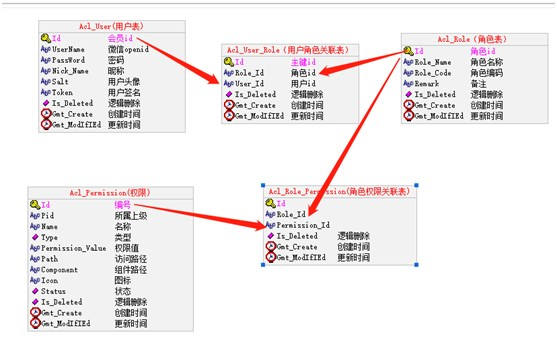
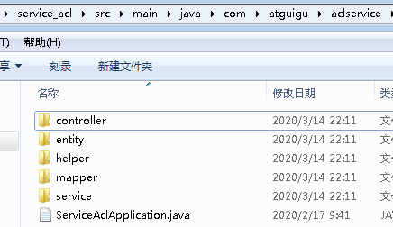
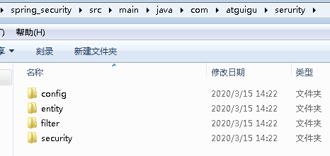

# 一、创建权限管理服务

**1、在service模块下创建子模块service-acl**



**2、在service_acl模块中引入依赖**

```
<dependencies>
    <dependency>
        <groupId>com.atguigu</groupId>
        <artifactId>spring_security</artifactId>
        <version>0.0.1-SNAPSHOT</version>
    </dependency>
    <dependency>
        <groupId>com.alibaba</groupId>
        <artifactId>fastjson</artifactId>
    </dependency>
</dependencies>
```

**3、创建权限管理相关的表**





**4、复制权限管理接口代码**



**5、复制整合Spring Security代码**

**（1）在common模块下创建子模块spring_security**



**6、编写application.properties配置文件**

```
# 服务端口
server.port=8009
# 服务名
spring.application.name=service-acl

# mysql数据库连接
spring.datasource.driver-class-name=com.mysql.cj.jdbc.Driver
spring.datasource.url=jdbc:mysql://localhost:3306/guli?serverTimezone=GMT%2B8
spring.datasource.username=root
spring.datasource.password=root

#返回json的全局时间格式
spring.jackson.date-format=yyyy-MM-dd HH:mm:ss
spring.jackson.time-zone=GMT+8

spring.redis.host=192.168.44.132
spring.redis.port=6379
spring.redis.database= 0
spring.redis.timeout=1800000

spring.redis.lettuce.pool.max-active=20
spring.redis.lettuce.pool.max-wait=-1
#最大阻塞等待时间(负数表示没限制)
spring.redis.lettuce.pool.max-idle=5
spring.redis.lettuce.pool.min-idle=0
#最小空闲

#配置mapper xml文件的路径
mybatis-plus.mapper-locations=classpath:com/atguigu/aclservice/mapper/xml/*.xml

#指定注册中心地址
eureka.client.service-url.defaultZone=http://127.0.0.1:8761/eureka/
#eureka服务器上获取的是服务器的ip地址，否则是主机名
eureka.instance.prefer-ip-address=true

#mybatis日志
mybatis-plus.configuration.log-impl=org.apache.ibatis.logging.stdout.StdOutImpl
```

## 二、开发权限管理接口

**1、****获取所有菜单**

（1）controller

```
@RestController
@RequestMapping("/admin/acl/permission")
@CrossOrigin
public class PermissionController {

    @Autowired
    private PermissionService permissionService;

    //获取全部菜单
    @GetMapping
    public R indexAllPermission() {
        List<Permission> list =  permissionService.queryAllMenu();
        return R.ok().data("children",list);
    }
}
```

## （2）service

```
//获取全部菜单
@Override
public List<Permission> queryAllMenu() {

    QueryWrapper<Permission> wrapper = new QueryWrapper<>();
    wrapper.orderByDesc("id");
    List<Permission> permissionList = baseMapper.selectList(wrapper);

    List<Permission> result = bulid(permissionList);
    return result;
}
```

## （3）在Permission实体类添加属性

```
@ApiModelProperty(value = "层级")
@TableField(exist = false)
private Integer level;

@ApiModelProperty(value = "下级")
@TableField(exist = false)
private List<Permission> children;

@ApiModelProperty(value = "是否选中")
@TableField(exist = false)
private boolean isSelect;
```

## （4）编写工具类，根据菜单构建数据

```
package com.atguigu.aclservice.helper;

import com.atguigu.aclservice.entity.Permission;
import java.util.ArrayList;
import java.util.List;
/**
 * <p>
 * 根据权限数据构建菜单数据
 * </p>
 */
public class PermissionHelper {

    /**
     * 使用递归方法建菜单
     * @param treeNodes
     * @return
     */
    public static List<Permission> bulid(List<Permission> treeNodes) {
        List<Permission> trees = new ArrayList<>();
        for (Permission treeNode : treeNodes) {
            if ("0".equals(treeNode.getPid())) {
                treeNode.setLevel(1);
                trees.add(findChildren(treeNode,treeNodes));
            }
        }
        return trees;
    }

    /**
     * 递归查找子节点
     * @param treeNodes
     * @return
     */
    public static Permission findChildren(Permission treeNode,List<Permission> treeNodes) {
        treeNode.setChildren(new ArrayList<Permission>());

        for (Permission it : treeNodes) {
            if(treeNode.getId().equals(it.getPid())) {
                int level = treeNode.getLevel() + 1;
                it.setLevel(level);
                if (treeNode.getChildren() == null) {
                    treeNode.setChildren(new ArrayList<>());
                }
                treeNode.getChildren().add(findChildren(it,treeNodes));
            }
        }
        return treeNode;
    }
}
```

## ***\**\*\*\*2、递归删除菜单\*\*\*\*\****

（1）controller

```
@ApiOperation(value = "递归删除菜单")
@DeleteMapping("remove/{id}")
public R remove(@PathVariable String id) {
    permissionService.removeChildById(id);
    return R.ok();
}
```

## （2）service

```
//递归删除菜单
@Override
public void removeChildById(String id) {
    List<String> idList = new ArrayList<>();
    this.selectChildListById(id, idList);
    //把根据节点id放到list中
    idList.add(id);
    baseMapper.deleteBatchIds(idList);
}

/**
     *  递归获取子节点
     * @param id
     * @param idList
     */
private void selectChildListById(String id, List<String> idList) {
    List<Permission> childList = baseMapper.selectList(new QueryWrapper<Permission>().eq("pid", id).select("id"));
    childList.stream().forEach(item -> {
        idList.add(item.getId());
        this.selectChildListById(item.getId(), idList);
    });
}
```

## ***\**\*\*\*3、给角色分配权限\*\*\*\*\****

**（1）controller**

```
@ApiOperation(value = "给角色分配权限")
@PostMapping("/doAssign")
public R doAssign(String roleId,String[] permissionId) {
    permissionService.saveRolePermissionRealtionShip(roleId,permissionId);
    return R.ok();
}
```

##

## （2）service

```
//给角色分配权限
@Override
public void saveRolePermissionRealtionShip(String roleId, String[] permissionIds) {

    rolePermissionService.remove(new QueryWrapper<RolePermission>().eq("role_id", roleId));

    List<RolePermission> rolePermissionList = new ArrayList<>();
    for(String permissionId : permissionIds) {
        if(StringUtils.isEmpty(permissionId)) continue;
        RolePermission rolePermission = new RolePermission();
        rolePermission.setRoleId(roleId);
        rolePermission.setPermissionId(permissionId);
        rolePermissionList.add(rolePermission);
    }
    rolePermissionService.saveBatch(rolePermissionList);
}
```
