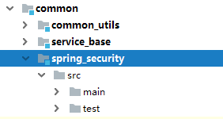
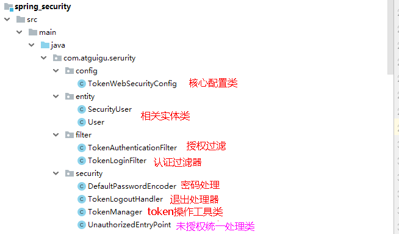
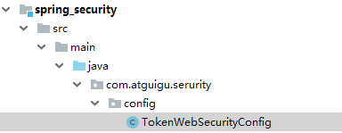
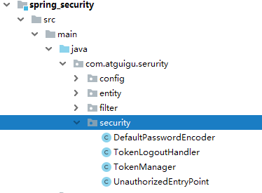
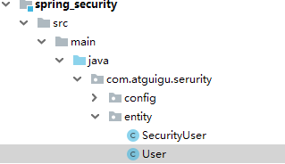
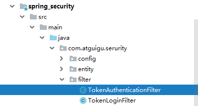

# 一、Spring Security介绍

**1、框架介绍**

Spring 是一个非常流行和成功的 Java 应用开发框架。Spring Security 基于 Spring 框架，提供了一套 Web 应用安全性的完整解决方案。一般来说，Web
应用的安全性包括**用户认证****（****Authentication****）和用户授权（****Authorization****）**两个部分。

（1）用户认证指的是：验证某个用户是否为系统中的合法主体，也就是说用户能否访问该系统。用户认证一般要求用户提供用户名和密码。系统通过校验用户名和密码来完成认证过程。

（2）用户授权指的是验证某个用户是否有权限执行某个操作。在一个系统中，不同用户所具有的权限是不同的。比如对一个文件来说，有的用户只能进行读取，而有的用户可以进行修改。一般来说，系统会为不同的用户分配不同的角色，而每个角色则对应一系列的权限。

**Spring Security其实就是用filter，多请求的路径进行过滤。**

（1）如果是基于Session，那么Spring-security会对cookie里的sessionid进行解析，找到服务器存储的sesion信息，然后判断当前用户是否符合请求的要求。

（2）如果是token，则是解析出token，然后将当前请求加入到Spring-security管理的权限信息中去

**2、认证与授权实现思路**

如果系统的模块众多，每个模块都需要就行授权与认证，所以我们选择基于token的形式进行授权与认证，用户根据用户名密码认证成功，然后获取当前用户角色的一系列权限值，并以用户名为key，权限列表为value的形式存入redis缓存中，根据用户名相关信息生成token返回，浏览器将token记录到cookie中，每次调用api接口都默认将token携带到header请求头中，Spring-security解析header头获取token信息，解析token获取当前用户名，根据用户名就可以从redis中获取权限列表，这样Spring-security就能够判断当前请求是否有权限访问

## 二、整合Spring Security

**1、在common下创建spring_security模块**



**2、在spring_security引入相关依赖**

```
<dependencies>
    <dependency>
        <groupId>com.atguigu</groupId>
        <artifactId>common_utils</artifactId>
        <version>0.0.1-SNAPSHOT</version>
    </dependency>

    <!-- Spring Security依赖 -->
    <dependency>
        <groupId>org.springframework.boot</groupId>
        <artifactId>spring-boot-starter-security</artifactId>
    </dependency>

    <dependency>
        <groupId>io.jsonwebtoken</groupId>
        <artifactId>jjwt</artifactId>
    </dependency>
</dependencies>
```

**3、在service_acl引入\**spring_security\**依赖**

```
<dependency>
    <groupId>com.atguigu</groupId>
    <artifactId>spring_security</artifactId>
    <version>0.0.1-SNAPSHOT</version>
</dependency>
```

**0、代码结构说明：**



**4、创建spring security核心配置类**



Spring Security的核心配置就是继承WebSecurityConfigurerAdapter并注解@EnableWebSecurity的配置。

这个配置指明了用户名密码的处理方式、请求路径的开合、登录登出控制等和安全相关的配置

```
import com.atguigu.serurity.filter.TokenAuthenticationFilter;
import com.atguigu.serurity.filter.TokenLoginFilter;
import com.atguigu.serurity.security.DefaultPasswordEncoder;
import com.atguigu.serurity.security.TokenLogoutHandler;
import com.atguigu.serurity.security.TokenManager;
import com.atguigu.serurity.security.UnauthorizedEntryPoint;
import org.springframework.beans.factory.annotation.Autowired;
import org.springframework.context.annotation.Configuration;
import org.springframework.data.redis.core.RedisTemplate;
import org.springframework.security.config.annotation.authentication.builders.AuthenticationManagerBuilder;
import org.springframework.security.config.annotation.method.configuration.EnableGlobalMethodSecurity;
import org.springframework.security.config.annotation.web.builders.HttpSecurity;
import org.springframework.security.config.annotation.web.builders.WebSecurity;
import org.springframework.security.config.annotation.web.configuration.EnableWebSecurity;
import org.springframework.security.config.annotation.web.configuration.WebSecurityConfigurerAdapter;
import org.springframework.security.core.userdetails.UserDetailsService;

/**
 * <p>
 * Security配置类
 * </p>
 */
@Configuration
@EnableWebSecurity
@EnableGlobalMethodSecurity(prePostEnabled = true)
public class TokenWebSecurityConfig extends WebSecurityConfigurerAdapter {

    private UserDetailsService userDetailsService;
    private TokenManager tokenManager;
    private DefaultPasswordEncoder defaultPasswordEncoder;
    private RedisTemplate redisTemplate;

    @Autowired
    public TokenWebSecurityConfig(UserDetailsService userDetailsService, DefaultPasswordEncoder defaultPasswordEncoder,
                                  TokenManager tokenManager, RedisTemplate redisTemplate) {
        this.userDetailsService = userDetailsService;
        this.defaultPasswordEncoder = defaultPasswordEncoder;
        this.tokenManager = tokenManager;
        this.redisTemplate = redisTemplate;
    }

    /**
     * 配置设置
     * @param http
     * @throws Exception
     */
    @Override
    protected void configure(HttpSecurity http) throws Exception {
        http.exceptionHandling()
                .authenticationEntryPoint(new UnauthorizedEntryPoint())
                .and().csrf().disable()
                .authorizeRequests()
                .anyRequest().authenticated()
                .and().logout().logoutUrl("/admin/acl/index/logout")
                .addLogoutHandler(new TokenLogoutHandler(tokenManager,redisTemplate)).and()
                .addFilter(new TokenLoginFilter(authenticationManager(), tokenManager, redisTemplate))
                .addFilter(new TokenAuthenticationFilter(authenticationManager(), tokenManager, redisTemplate)).httpBasic();
    }

    /**
     * 密码处理
     * @param auth
     * @throws Exception
     */
    @Override
    public void configure(AuthenticationManagerBuilder auth) throws Exception {
        auth.userDetailsService(userDetailsService).passwordEncoder(defaultPasswordEncoder);
    }

    /**
     * 配置哪些请求不拦截
     * @param web
     * @throws Exception
     */
    @Override
    public void configure(WebSecurity web) throws Exception {
        web.ignoring().antMatchers("/api/**",
                "/swagger-resources/**", "/webjars/**", "/v2/**", "/swagger-ui.html/**"
               );
    }
}
```

**5、创建认证授权相关的工具类**



```
（1）DefaultPasswordEncoder：密码处理的方法
package com.atguigu.serurity.security;

import com.atguigu.commonutils.utils.MD5;
import org.springframework.security.crypto.password.PasswordEncoder;
import org.springframework.stereotype.Component;

/**
 * <p>
 * 密码的处理方法类型
 * </p>
 */
@Component
public class DefaultPasswordEncoder implements PasswordEncoder {

    public DefaultPasswordEncoder() {
        this(-1);
    }

    /**
     * @param strength
     *            the log rounds to use, between 4 and 31
     */
    public DefaultPasswordEncoder(int strength) {

    }

    public String encode(CharSequence rawPassword) {
        return MD5.encrypt(rawPassword.toString());
    }

    public boolean matches(CharSequence rawPassword, String encodedPassword) {
        return encodedPassword.equals(MD5.encrypt(rawPassword.toString()));
    }
}
```

**（2）**

**`TokenManager：token操作的工具类`**

```
import io.jsonwebtoken.CompressionCodecs;
import io.jsonwebtoken.Jwts;
import io.jsonwebtoken.SignatureAlgorithm;
import org.springframework.stereotype.Component;

import java.util.Date;

/**
 * <p>
 * token管理
 * </p>
 */
@Component
public class TokenManager {

    private long tokenExpiration = 24*60*60*1000;
    private String tokenSignKey = "123456";

    public String createToken(String username) {
        String token = Jwts.builder().setSubject(username)
                .setExpiration(new Date(System.currentTimeMillis() + tokenExpiration))
                .signWith(SignatureAlgorithm.HS512, tokenSignKey).compressWith(CompressionCodecs.GZIP).compact();
        return token;
    }

    public String getUserFromToken(String token) {
        String user = Jwts.parser().setSigningKey(tokenSignKey).parseClaimsJws(token).getBody().getSubject();
        return user;
    }

    public void removeToken(String token) {
        //jwttoken无需删除，客户端扔掉即可。
    }
}
```

**（3）**

**`TokenLogoutHandler：退出实现`**

**
**

```
import com.atguigu.commonutils.R;
import com.atguigu.commonutils.utils.ResponseUtil;
import org.springframework.data.redis.core.RedisTemplate;
import org.springframework.security.core.Authentication;
import org.springframework.security.web.authentication.logout.LogoutHandler;

import javax.servlet.http.HttpServletRequest;
import javax.servlet.http.HttpServletResponse;

/**
 * <p>
 * 登出业务逻辑类
 * </p>
 */
public class TokenLogoutHandler implements LogoutHandler {

    private TokenManager tokenManager;
    private RedisTemplate redisTemplate;

    public TokenLogoutHandler(TokenManager tokenManager, RedisTemplate redisTemplate) {
        this.tokenManager = tokenManager;
        this.redisTemplate = redisTemplate;
    }

    @Override
    public void logout(HttpServletRequest request, HttpServletResponse response, Authentication authentication) {
        String token = request.getHeader("token");
        if (token != null) {
            tokenManager.removeToken(token);

            //清空当前用户缓存中的权限数据
            String userName = tokenManager.getUserFromToken(token);
            redisTemplate.delete(userName);
        }
        ResponseUtil.out(response, R.ok());
    }
}
```

（4）

```
UnauthorizedEntryPoint：未授权统一处理
import com.atguigu.commonutils.R;
import com.atguigu.commonutils.utils.ResponseUtil;
import org.springframework.security.core.AuthenticationException;
import org.springframework.security.web.AuthenticationEntryPoint;
import javax.servlet.ServletException;
import javax.servlet.http.HttpServletRequest;
import javax.servlet.http.HttpServletResponse;
import java.io.IOException;
/**
 * <p>
 * 未授权的统一处理方式
 * </p>
 */
public class UnauthorizedEntryPoint implements AuthenticationEntryPoint {

    @Override
    public void commence(HttpServletRequest request, HttpServletResponse response,
                         AuthenticationException authException) throws IOException, ServletException {

        ResponseUtil.out(response, R.error());
    }
}
```

**6、创建认证授权实体类**



（1）SecutityUser

```
import lombok.Data;
import lombok.extern.slf4j.Slf4j;
import org.springframework.security.core.GrantedAuthority;
import org.springframework.security.core.authority.SimpleGrantedAuthority;
import org.springframework.security.core.userdetails.UserDetails;
import org.springframework.util.StringUtils;

import java.util.ArrayList;
import java.util.Collection;
import java.util.List;

/**
 * <p>
 * 安全认证用户详情信息
 * </p>
 */
@Data
@Slf4j
public class SecurityUser implements UserDetails {

    //当前登录用户
    private transient User currentUserInfo;

    //当前权限
    private List<String> permissionValueList;

    public SecurityUser() {
    }

    public SecurityUser(User user) {
        if (user != null) {
            this.currentUserInfo = user;
        }
    }

    @Override
    public Collection<? extends GrantedAuthority> getAuthorities() {
        Collection<GrantedAuthority> authorities = new ArrayList<>();
        for(String permissionValue : permissionValueList) {
            if(StringUtils.isEmpty(permissionValue)) continue;
            SimpleGrantedAuthority authority = new SimpleGrantedAuthority(permissionValue);
            authorities.add(authority);
        }

        return authorities;
    }

    @Override
    public String getPassword() {
        return currentUserInfo.getPassword();
    }

    @Override
    public String getUsername() {
        return currentUserInfo.getUsername();
    }

    @Override
    public boolean isAccountNonExpired() {
        return true;
    }

    @Override
    public boolean isAccountNonLocked() {
        return true;
    }

    @Override
    public boolean isCredentialsNonExpired() {
        return true;
    }

    @Override
    public boolean isEnabled() {
        return true;
    }
}
```

**（2）User**

```
import io.swagger.annotations.ApiModel;
import io.swagger.annotations.ApiModelProperty;
import lombok.Data;
import java.io.Serializable;

/**
 * <p>
 * 用户实体类
 * </p>
 */
@Data
@ApiModel(description = "用户实体类")
public class User implements Serializable {

    private static final long serialVersionUID = 1L;

    @ApiModelProperty(value = "微信openid")
    private String username;

    @ApiModelProperty(value = "密码")
    private String password;

    @ApiModelProperty(value = "昵称")
    private String nickName;

    @ApiModelProperty(value = "用户头像")
    private String salt;

    @ApiModelProperty(value = "用户签名")
    private String token;
}
```

**7、创建认证和授权的filter**



（1）TokenLoginFilter：认证的filter

```
import com.atguigu.commonutils.R;
import com.atguigu.commonutils.utils.ResponseUtil;
import com.atguigu.serurity.entity.SecurityUser;
import com.atguigu.serurity.entity.User;
import com.atguigu.serurity.security.TokenManager;
import com.fasterxml.jackson.databind.ObjectMapper;
import org.springframework.data.redis.core.RedisTemplate;
import org.springframework.security.authentication.AuthenticationManager;
import org.springframework.security.authentication.UsernamePasswordAuthenticationToken;
import org.springframework.security.core.Authentication;
import org.springframework.security.core.AuthenticationException;
import org.springframework.security.web.authentication.UsernamePasswordAuthenticationFilter;
import org.springframework.security.web.util.matcher.AntPathRequestMatcher;

import javax.servlet.FilterChain;
import javax.servlet.ServletException;
import javax.servlet.http.HttpServletRequest;
import javax.servlet.http.HttpServletResponse;
import java.io.IOException;
import java.util.ArrayList;

/**
 * <p>
 * 登录过滤器，继承UsernamePasswordAuthenticationFilter，对用户名密码进行登录校验
 * </p>
 */
public class TokenLoginFilter extends UsernamePasswordAuthenticationFilter {

    private AuthenticationManager authenticationManager;
    private TokenManager tokenManager;
    private RedisTemplate redisTemplate;

    public TokenLoginFilter(AuthenticationManager authenticationManager, TokenManager tokenManager, RedisTemplate redisTemplate) {
        this.authenticationManager = authenticationManager;
        this.tokenManager = tokenManager;
        this.redisTemplate = redisTemplate;
        this.setPostOnly(false);
        this.setRequiresAuthenticationRequestMatcher(new AntPathRequestMatcher("/admin/acl/login","POST"));
    }

    @Override
    public Authentication attemptAuthentication(HttpServletRequest req, HttpServletResponse res)
            throws AuthenticationException {
        try {
            User user = new ObjectMapper().readValue(req.getInputStream(), User.class);

            return authenticationManager.authenticate(new UsernamePasswordAuthenticationToken(user.getUsername(), user.getPassword(), new ArrayList<>()));
        } catch (IOException e) {
            throw new RuntimeException(e);
        }

    }

    /**
     * 登录成功
     * @param req
     * @param res
     * @param chain
     * @param auth
     * @throws IOException
     * @throws ServletException
     */
    @Override
    protected void successfulAuthentication(HttpServletRequest req, HttpServletResponse res, FilterChain chain,
                                            Authentication auth) throws IOException, ServletException {
        SecurityUser user = (SecurityUser) auth.getPrincipal();
        String token = tokenManager.createToken(user.getCurrentUserInfo().getUsername());
        redisTemplate.opsForValue().set(user.getCurrentUserInfo().getUsername(), user.getPermissionValueList());

        ResponseUtil.out(res, R.ok().data("token", token));
    }

    /**
     * 登录失败
     * @param request
     * @param response
     * @param e
     * @throws IOException
     * @throws ServletException
     */
    @Override
    protected void unsuccessfulAuthentication(HttpServletRequest request, HttpServletResponse response,
                                              AuthenticationException e) throws IOException, ServletException {
        ResponseUtil.out(response, R.error());
    }
}
```

***\**\*\*\*\*\*\*\*\*\*\*\*\*\*\*\*\*\*\*\*\*\*\*\*\*\*\*\*\*\*\*\*
`（2）TokenAuthenticationFilter：`\*\*\*\*\*\*\*\*\*\*\*\*\*\*\*\*\*\*\*\*\*\*\*\*\*\*\*\*\*\*\*\*\****

```
授权filter
package com.atguigu.serurity.filter;

import com.atguigu.commonutils.R;
import com.atguigu.commonutils.utils.ResponseUtil;
import com.atguigu.serurity.security.TokenManager;
import org.springframework.data.redis.core.RedisTemplate;
import org.springframework.security.authentication.AuthenticationManager;
import org.springframework.security.authentication.UsernamePasswordAuthenticationToken;
import org.springframework.security.core.GrantedAuthority;
import org.springframework.security.core.authority.SimpleGrantedAuthority;
import org.springframework.security.core.context.SecurityContextHolder;
import org.springframework.security.web.authentication.www.BasicAuthenticationFilter;
import org.springframework.util.StringUtils;

import javax.servlet.FilterChain;
import javax.servlet.ServletException;
import javax.servlet.http.HttpServletRequest;
import javax.servlet.http.HttpServletResponse;
import java.io.IOException;
import java.util.ArrayList;
import java.util.Collection;
import java.util.List;

/**
 * <p>
 * 访问过滤器
 * </p>
 */
public class TokenAuthenticationFilter extends BasicAuthenticationFilter {
    private TokenManager tokenManager;
    private RedisTemplate redisTemplate;

    public TokenAuthenticationFilter(AuthenticationManager authManager, TokenManager tokenManager,RedisTemplate redisTemplate) {
        super(authManager);
        this.tokenManager = tokenManager;
        this.redisTemplate = redisTemplate;
    }

    @Override
    protected void doFilterInternal(HttpServletRequest req, HttpServletResponse res, FilterChain chain)
            throws IOException, ServletException {
        logger.info("================="+req.getRequestURI());
        if(req.getRequestURI().indexOf("admin") == -1) {
            chain.doFilter(req, res);
            return;
        }

        UsernamePasswordAuthenticationToken authentication = null;
        try {
            authentication = getAuthentication(req);
        } catch (Exception e) {
            ResponseUtil.out(res, R.error());
        }

        if (authentication != null) {
            SecurityContextHolder.getContext().setAuthentication(authentication);
        } else {
            ResponseUtil.out(res, R.error());
        }
        chain.doFilter(req, res);
    }

    private UsernamePasswordAuthenticationToken getAuthentication(HttpServletRequest request) {
        // token置于header里
        String token = request.getHeader("token");
        if (token != null && !"".equals(token.trim())) {
            String userName = tokenManager.getUserFromToken(token);

            List<String> permissionValueList = (List<String>) redisTemplate.opsForValue().get(userName);
            Collection<GrantedAuthority> authorities = new ArrayList<>();
            for(String permissionValue : permissionValueList) {
                if(StringUtils.isEmpty(permissionValue)) continue;
                SimpleGrantedAuthority authority = new SimpleGrantedAuthority(permissionValue);
                authorities.add(authority);
            }

            if (!StringUtils.isEmpty(userName)) {
                return new UsernamePasswordAuthenticationToken(userName, token, authorities);
            }
            return null;
        }
        return null;
    }
}
```
