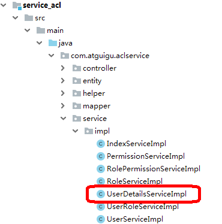

# ***\**\*\*\*\*\*\*\*一、创建自定义查询用户类\*\*\*\*\*\*\*\*\**** 

（1）在service_acl模块创建，因为其他模板不会用到




```
二、后端接口和前端页面对接
1、在前端项目中下载依赖
npm install --save vuex-persistedstate


2、替换相关文件


3、在node_modules文件夹中替换element-ui依赖
```