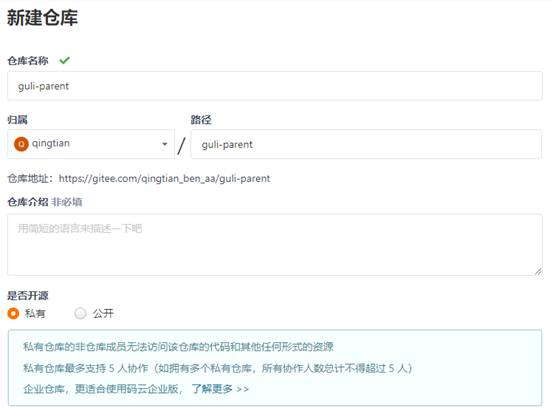
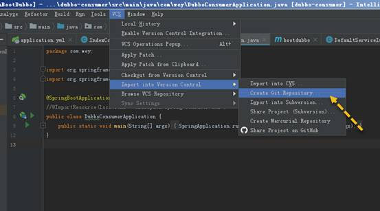
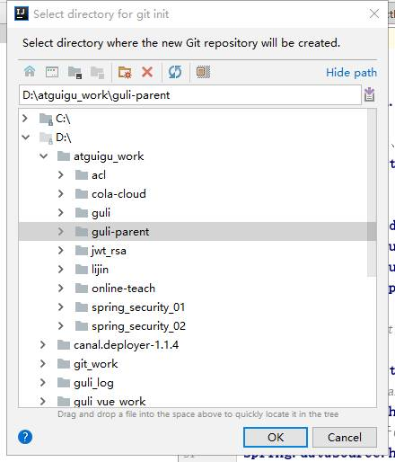
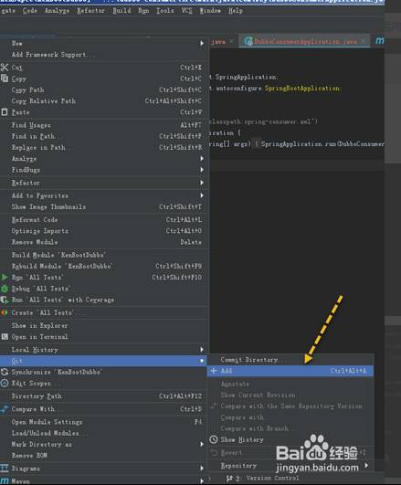
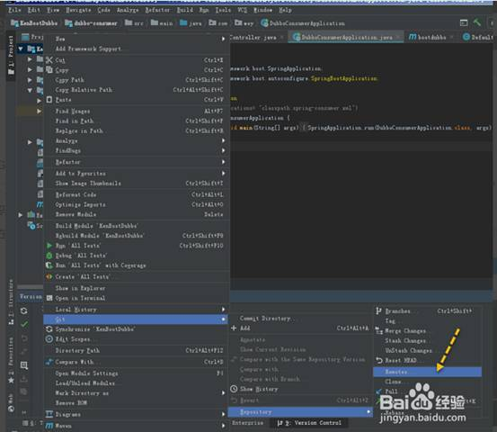
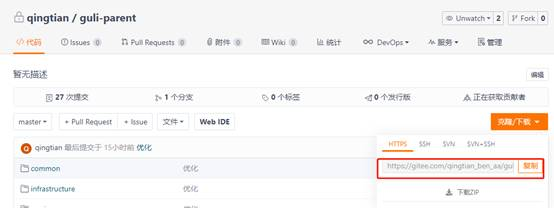
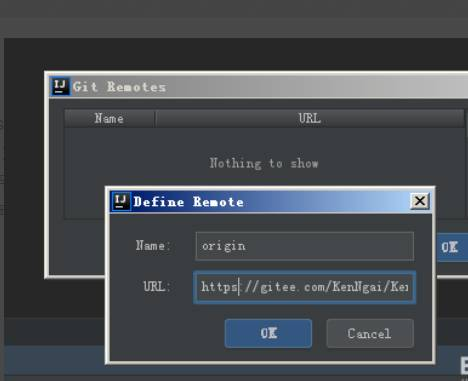
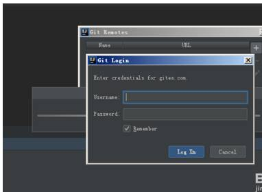

1. 准备 Git 仓库

码云：https://gitee.com

## 1.1. 通过网站右上角的「+」号，选择「新建仓库」，进入新建仓库页面

## 1.2. 新建仓库

## 1.3. 打开项目并点击菜单栏上的【CVS】--》【Import into version control】--》【Create Git Repository】创建本地仓库

## 1.4. 在打开的【Create Git Repository】对话框内选择本地仓库的位置，这里我选择项目的根目录。

## 1.5. 右击项目点击【Git】--》【Add】，接着点击【Git】--》【Commit Directory】在打开的窗口中选择要上传到本地仓库的代码并添加注释后提交到本地仓库内。

## 1.6. 右击项目点击【Git】--》【Repository】--》【Remotes...】。在打开的【Git Remotes】窗口中添加码云的远程仓库。码云的远程仓库地址可以在码云仓库内找到。

## 1.7. 点击【OK】后接着输入码云的账号密码。

## 1.8. 上传代码到码云，右击项目点击【Git】--》【Repository】--》【Push...】在打开的【Push commits】内可以看到已提交到本地仓库的提交信息。点击【Push】按钮将本地仓库的代码上传到码云上，上传成功后就可以在码云上看到啦。
