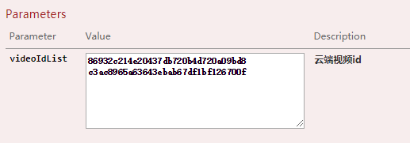

**需求**

删除课程的同时删除云端视频

# 一、vod服务

## 1、业务

业务接口：VideoService.java

```
void removeVideoList(List<String> videoIdList);
```

业务实现：VideoServiceImpl.java

```
@Override
public void removeVideoList(List<String> videoIdList) {
    try {
        //初始化
        DefaultAcsClient client = AliyunVodSDKUtils.initVodClient(
            ConstantPropertiesUtil.ACCESS_KEY_ID,
            ConstantPropertiesUtil.ACCESS_KEY_SECRET);

        //创建请求对象
        //一次只能批量删20个
        String str = org.apache.commons.lang.StringUtils.join(videoIdList.toArray(), ",");
        DeleteVideoRequest request = new DeleteVideoRequest();
        request.setVideoIds(str);

        //获取响应
        DeleteVideoResponse response = client.getAcsResponse(request);

        System.out.print("RequestId = " + response.getRequestId() + "\n");

    } catch (ClientException e) {
        throw new GuliException(20001, "视频删除失败");
    }
}
```

## 2、web层接口

controller：VideoAdminController.java

```
/**
     * 批量删除视频
     * @param videoIdList
     * @return
     */
@DeleteMapping("delete-batch")
public R removeVideoList(
    @ApiParam(name = "videoIdList", value = "云端视频id", required = true)
    @RequestParam("videoIdList") List videoIdList){

    videoService.removeVideoList(videoIdList);
    return R.ok().message("视频删除成功");
}
```

## 3、Swagger测试

输入多个id，每个一行



# 二、edu服务

## 1、client

VodClient.java

```
@DeleteMapping(value = "/admin/vod/video/delete-batch")
public R removeVideoList(@RequestParam("videoIdList") List<String> videoIdList);
```

## 2、业务

VideoServiceImpl.java

```
@Override
public boolean removeByCourseId(String courseId) {

    //根据课程id查询所有视频列表
    QueryWrapper<Video> queryWrapper = new QueryWrapper<>();
    queryWrapper.eq("course_id", courseId);
    queryWrapper.select("video_source_id");
    List<Video> videoList = baseMapper.selectList(queryWrapper);

    //得到所有视频列表的云端原始视频id
    List<String> videoSourceIdList = new ArrayList<>();
    for (int i = 0; i < videoList.size(); i++) {
        Video video = videoList.get(i);
        String videoSourceId = video.getVideoSourceId();
        if(!StringUtils.isEmpty(videoSourceId)){
            videoSourceIdList.add(videoSourceId);
        }
    }

    //调用vod服务删除远程视频
    if(videoSourceIdList.size() > 0){
        vodClient.removeVideoList(videoSourceIdList);
    }

    //删除video表示的记录
    QueryWrapper<Video> queryWrapper2 = new QueryWrapper<>();
    queryWrapper2.eq("course_id", courseId);
    Integer count = baseMapper.delete(queryWrapper2);
    return null != count && count > 0;
}

```

CourseServiceImpl.java

```
@Override
public boolean removeCourseById(String id) {

    //根据id删除所有视频
    videoService.removeByCourseId(id);

    //根据id删除所有章节
    chapterService.removeByCourseId(id);

    //根据id删除所有课程详情
    courseDescriptionService.removeById(id);

    //删除封面 TODO 独立完成

    Integer result = baseMapper.deleteById(id);
    return null != result && result > 0;
}

```