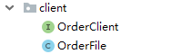

# 一、修改课程详情接口

## 1、在service_order模块添加接口

**根据用户id和课程id查询订单信息**

```
@GetMapping("isBuyCourse/{memberid}/{id}")
public boolean isBuyCourse(@PathVariable String memberid,
                           @PathVariable String id) {
    //订单状态是1表示支付成功
    int count = orderService.count(new QueryWrapper<TOrder>().eq("member_id", memberid).eq("course_id", id).eq("status", 1));
    if(count>0) {
        return true;
    } else {
        return false;
    }
}
```

**2、在service_edu模块课程详情接口远程调用**

**（1）创建OrderClient接口**



```
@Component
@FeignClient(value = "service-order", fallback = OrderFile.class)
public interface OrderClient {
    //查询订单信息
    @GetMapping("/orderservice/order/isBuyCourse/{memberid}/{id}")
    public boolean isBuyCourse(@PathVariable("memberid") String memberid, @PathVariable("id") String id);
}
```

## 

**（2）****在课程详情接口调用**

```
//根据id查询课程详情信息
@GetMapping("getCourseInfo/{id}")
public R getCourseInfo(@PathVariable String id, HttpServletRequest request) {
    //课程查询课程基本信息
    CourseFrontInfo courseFrontInfo = courseService.getFrontCourseInfo(id);
    //查询课程里面大纲数据
    List<ChapterVo> chapterVideoList = chapterService.getChapterVideoById(id);
    
    //远程调用，判断课程是否被购买
    boolean buyCourse = orderClient.isBuyCourse(JwtUtils.getMemberIdByJwtToken(request), id);
    
    return R.ok().data("courseFrontInfo",courseFrontInfo).data("chapterVideoList",chapterVideoList).data("isbuy",buyCourse);
}
```

## 

# 二、修改课程详情页面

**1、页面内容修改**

```
<section v-if="isbuy || Number(courseInfo.price)===0" class="c-attr-mt">
              <a href="#" title="立即观看" class="comm-btn c-btn-3" >立即观看</a>
</section>
<section v-else class="c-attr-mt">
    <a href="#" title="立即购买" class="comm-btn c-btn-3" @click="createOrder()">立即购买</a>
</section>
```

## **2、调用方法修改** 

```
<script>
import course from '@/api/course'
export default {
  // asyncData({ params, error }) {
  //   return course.getCourseInfo(params.id)
  //     .then(response => {
  //       return {
  //         courseInfo: response.data.data.courseFrontInfo,
  //         chapterVideoList: response.data.data.chapterVideoList,
  //         isbuy: response.data.data.isbuy,
  //         courseId:params.id
  //       }
  //     })
  // },
   //和页面异步开始的
  asyncData({ params, error }) {
    return {courseId: params.id}
    
  },
  data() {
    return {
      courseInfo: {},
          chapterVideoList: [],
          isbuy: false,
    }
  },
  created() {
    this.initCourseInfo()
  },
  methods:{
    initCourseInfo() {
      course.getCourseInfo(this.courseId)
        .then(response => {
          this.courseInfo=response.data.data.courseFrontInfo,
          this.chapterVideoList=response.data.data.chapterVideoList,
          this.isbuy=response.data.data.isbuy
        })
    },
    createOrder(){
      course.createOrder(this.courseId).then(response => {
        if(response.data.success){
            this.$router.push({ path: '/order/'+ response.data.data.orderId })
        }
      })
    }
  }
};
</script>
```