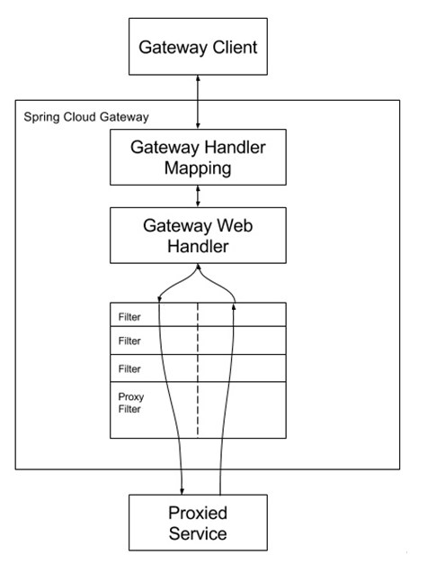
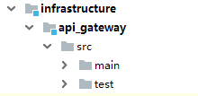
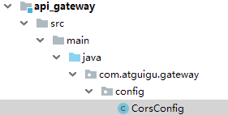
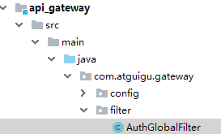
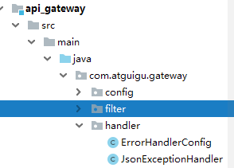

# 一、网关基本概念

# 1、API网关介绍

API 网关出现的原因是微服务架构的出现，不同的微服务一般会有不同的网络地址，而外部客户端可能需要调用多个服务的接口才能完成一个业务需求，如果让客户端直接与各个微服务通信，会有以下的问题：

（1）客户端会多次请求不同的微服务，增加了客户端的复杂性。

（2）存在跨域请求，在一定场景下处理相对复杂。

（3）认证复杂，每个服务都需要独立认证。

（4）难以重构，随着项目的迭代，可能需要重新划分微服务。例如，可能将多个服务合并成一个或者将一个服务拆分成多个。如果客户端直接与微服务通信，那么重构将会很难实施。

（5）某些微服务可能使用了防火墙 / 浏览器不友好的协议，直接访问会有一定的困难。

以上这些问题可以借助 API 网关解决。API 网关是介于客户端和服务器端之间的中间层，所有的外部请求都会先经过 API 网关这一层。也就是说，API 的实现方面更多的考虑业务逻辑，而安全、性能、监控可以交由 API 网关来做，这样既提高业务灵活性又不缺安全性

**2、Spring Cloud Gateway**

**Spring cloud gateway**是spring官方基于Spring 5.0、Spring Boot2.0和Project Reactor等技术开发的网关，Spring Cloud Gateway旨在为微服务架构提供简单、有效和统一的API路由管理方式，Spring Cloud Gateway作为Spring Cloud生态系统中的网关，目标是替代Netflix Zuul，其不仅提供统一的路由方式，并且还基于Filer链的方式提供了网关基本的功能，例如：安全、监控/埋点、限流等。


***\*3、Spring Cloud Gateway核心概念\****

网关提供API全托管服务，丰富的API管理功能，辅助企业管理大规模的API，以降低管理成本和安全风险，包括协议适配、协议转发、安全策略、防刷、流量、监控日志等贡呢。一般来说网关对外暴露的URL或者接口信息，我们统称为路由信息。如果研发过网关中间件或者使用过Zuul的人，会知道网关的核心是Filter以及Filter Chain（Filter责任链）。Sprig Cloud Gateway也具有路由和Filter的概念。下面介绍一下Spring Cloud Gateway中几个重要的概念。

（1）路由。路由是网关最基础的部分，路由信息有一个ID、一个目的URL、一组断言和一组Filter组成。如果断言路由为真，则说明请求的URL和配置匹配

（2）断言。Java8中的断言函数。Spring Cloud Gateway中的断言函数输入类型是Spring5.0框架中的ServerWebExchange。Spring Cloud Gateway中的断言函数允许开发者去定义匹配来自于http request中的任何信息，比如请求头和参数等。

（3）过滤器。一个标准的Spring webFilter。Spring cloud gateway中的filter分为两种类型的Filter，分别是Gateway Filter和Global Filter。过滤器Filter将会对请求和响应进行修改处理



如上图所示，Spring cloud Gateway发出请求。然后再由Gateway Handler Mapping中找到与请求相匹配的路由，将其发送到Gateway web handler。Handler再通过指定的过滤器链将请求发送到我们实际的服务执行业务逻辑，然后返回。

***\*二、创建api-gateway模块（网关服务）\****

**1、****在infrastructure模块下创建api_gateway模块**



2、在pom.xml引入依赖

```
<dependencies>
    <dependency>
        <groupId>com.atguigu</groupId>
        <artifactId>common_utils</artifactId>
        <version>0.0.1-SNAPSHOT</version>
    </dependency>

    <dependency>
        <groupId>org.springframework.cloud</groupId>
        <artifactId>spring-cloud-starter-alibaba-nacos-discovery</artifactId>
    </dependency>

    <dependency>
        <groupId>org.springframework.cloud</groupId>
        <artifactId>spring-cloud-starter-gateway</artifactId>
    </dependency>

    <!--gson-->
    <dependency>
        <groupId>com.google.code.gson</groupId>
        <artifactId>gson</artifactId>
    </dependency>

    <!--服务调用-->
    <dependency>
        <groupId>org.springframework.cloud</groupId>
        <artifactId>spring-cloud-starter-openfeign</artifactId>
    </dependency>
</dependencies>
```

**3、编写application.properties配置文件**

```
# 服务端口
server.port=8222
# 服务名
spring.application.name=service-gateway

# nacos服务地址
spring.cloud.nacos.discovery.server-addr=127.0.0.1:8848

#使用服务发现路由
spring.cloud.gateway.discovery.locator.enabled=true
#服务路由名小写
#spring.cloud.gateway.discovery.locator.lower-case-service-id=true

#设置路由id
spring.cloud.gateway.routes[0].id=service-acl
#设置路由的uri
spring.cloud.gateway.routes[0].uri=lb://service-acl
#设置路由断言,代理servicerId为auth-service的/auth/路径
spring.cloud.gateway.routes[0].predicates= Path=/*/acl/**

#配置service-edu服务
spring.cloud.gateway.routes[1].id=service-edu
spring.cloud.gateway.routes[1].uri=lb://service-edu
spring.cloud.gateway.routes[1].predicates= Path=/eduservice/**

#配置service-ucenter服务
spring.cloud.gateway.routes[2].id=service-ucenter
spring.cloud.gateway.routes[2].uri=lb://service-ucenter
spring.cloud.gateway.routes[2].predicates= Path=/ucenterservice/**

#配置service-ucenter服务
spring.cloud.gateway.routes[3].id=service-cms
spring.cloud.gateway.routes[3].uri=lb://service-cms
spring.cloud.gateway.routes[3].predicates= Path=/cmsservice/**

spring.cloud.gateway.routes[4].id=service-msm
spring.cloud.gateway.routes[4].uri=lb://service-msm
spring.cloud.gateway.routes[4].predicates= Path=/edumsm/**

spring.cloud.gateway.routes[5].id=service-order
spring.cloud.gateway.routes[5].uri=lb://service-order
spring.cloud.gateway.routes[5].predicates= Path=/orderservice/**

spring.cloud.gateway.routes[6].id=service-order
spring.cloud.gateway.routes[6].uri=lb://service-order
spring.cloud.gateway.routes[6].predicates= Path=/orderservice/**

spring.cloud.gateway.routes[7].id=service-oss
spring.cloud.gateway.routes[7].uri=lb://service-oss
spring.cloud.gateway.routes[7].predicates= Path=/eduoss/**

spring.cloud.gateway.routes[8].id=service-statistic
spring.cloud.gateway.routes[8].uri=lb://service-statistic
spring.cloud.gateway.routes[8].predicates= Path=/staservice/**

spring.cloud.gateway.routes[9].id=service-vod
spring.cloud.gateway.routes[9].uri=lb://service-vod
spring.cloud.gateway.routes[9].predicates= Path=/eduvod/**

spring.cloud.gateway.routes[10].id=service-edu
spring.cloud.gateway.routes[10].uri=lb://service-edu
spring.cloud.gateway.routes[10].predicates= Path=/eduuser/**
```

## yml文件：

```
server:
  port: 8222

spring:
  application:
  cloud:
    gateway:
      discovery:
        locator:
          enabled: true
      routes:
      - id: SERVICE-ACL
        uri: lb://SERVICE-ACL
        predicates:
        - Path=/*/acl/** # 路径匹配
      - id: SERVICE-EDU
        uri: lb://SERVICE-EDU
        predicates:
        - Path=/eduservice/** # 路径匹配
      - id: SERVICE-UCENTER
        uri: lb://SERVICE-UCENTER
        predicates:
        - Path=/ucenter/** # 路径匹配
    nacos:
      discovery:
        server-addr: 127.0.0.1:8848
```

## **4、编写启动类** 

```
@SpringBootApplication
public class ApiGatewayApplication {
    public static void main(String[] args) {
        SpringApplication.run(ApiGatewayApplication.class, args);
    }
}
```

## 


## 二、网关相关配置

**1、网关解决跨域问题**

**（1）创建配置类**



```
@Configuration
public class CorsConfig {
    @Bean
    public CorsWebFilter corsFilter() {
        CorsConfiguration config = new CorsConfiguration();
        config.addAllowedMethod("*");
        config.addAllowedOrigin("*");
        config.addAllowedHeader("*");

        UrlBasedCorsConfigurationSource source = new UrlBasedCorsConfigurationSource(new PathPatternParser());
        source.registerCorsConfiguration("/**", config);

        return new CorsWebFilter(source);
    }
}
```

# 

**2、全局Filter，统一处理会员登录与外部不允许访问的服务**



```
import com.google.gson.JsonObject;
import org.springframework.cloud.gateway.filter.GatewayFilterChain;
import org.springframework.cloud.gateway.filter.GlobalFilter;
import org.springframework.core.Ordered;
import org.springframework.core.io.buffer.DataBuffer;
import org.springframework.http.server.reactive.ServerHttpRequest;
import org.springframework.http.server.reactive.ServerHttpResponse;
import org.springframework.stereotype.Component;
import org.springframework.util.AntPathMatcher;
import org.springframework.web.server.ServerWebExchange;
import reactor.core.publisher.Mono;

import java.nio.charset.StandardCharsets;
import java.util.List;

/**
 * <p>
 * 全局Filter，统一处理会员登录与外部不允许访问的服务
 * </p>
 */
@Component
public class AuthGlobalFilter implements GlobalFilter, Ordered {

    private AntPathMatcher antPathMatcher = new AntPathMatcher();

    @Override
    public Mono<Void> filter(ServerWebExchange exchange, GatewayFilterChain chain) {
        ServerHttpRequest request = exchange.getRequest();
        String path = request.getURI().getPath();
        //谷粒学院api接口，校验用户必须登录
        if(antPathMatcher.match("/api/**/auth/**", path)) {
            List<String> tokenList = request.getHeaders().get("token");
            if(null == tokenList) {
                ServerHttpResponse response = exchange.getResponse();
                return out(response);
            } else {
//                Boolean isCheck = JwtUtils.checkToken(tokenList.get(0));
//                if(!isCheck) {
                    ServerHttpResponse response = exchange.getResponse();
                    return out(response);
//                }
            }
        }
        //内部服务接口，不允许外部访问
        if(antPathMatcher.match("/**/inner/**", path)) {
            ServerHttpResponse response = exchange.getResponse();
            return out(response);
        }
        return chain.filter(exchange);
    }

    @Override
    public int getOrder() {
        return 0;
    }

    private Mono<Void> out(ServerHttpResponse response) {
        JsonObject message = new JsonObject();
        message.addProperty("success", false);
        message.addProperty("code", 28004);
        message.addProperty("data", "鉴权失败");
        byte[] bits = message.toString().getBytes(StandardCharsets.UTF_8);
        DataBuffer buffer = response.bufferFactory().wrap(bits);
        //response.setStatusCode(HttpStatus.UNAUTHORIZED);
        //指定编码，否则在浏览器中会中文乱码
        response.getHeaders().add("Content-Type", "application/json;charset=UTF-8");
        return response.writeWith(Mono.just(buffer));
    }
}

```

# 

**3、自定义异常处理**

服务网关调用服务时可能会有一些异常或服务不可用，它返回错误信息不友好，需要我们覆盖处理



```
ErrorHandlerConfig：
import org.springframework.beans.factory.ObjectProvider;
import org.springframework.boot.autoconfigure.web.ResourceProperties;
import org.springframework.boot.autoconfigure.web.ServerProperties;
import org.springframework.boot.context.properties.EnableConfigurationProperties;
import org.springframework.boot.web.reactive.error.ErrorAttributes;
import org.springframework.boot.web.reactive.error.ErrorWebExceptionHandler;
import org.springframework.context.ApplicationContext;
import org.springframework.context.annotation.Bean;
import org.springframework.context.annotation.Configuration;
import org.springframework.core.Ordered;
import org.springframework.core.annotation.Order;
import org.springframework.http.codec.ServerCodecConfigurer;
import org.springframework.web.reactive.result.view.ViewResolver;

import java.util.Collections;
import java.util.List;

/**
 * 覆盖默认的异常处理
 *
 */
@Configuration
@EnableConfigurationProperties({ServerProperties.class, ResourceProperties.class})
public class ErrorHandlerConfig {

    private final ServerProperties serverProperties;

    private final ApplicationContext applicationContext;

    private final ResourceProperties resourceProperties;

    private final List<ViewResolver> viewResolvers;

    private final ServerCodecConfigurer serverCodecConfigurer;

    public ErrorHandlerConfig(ServerProperties serverProperties,
                                     ResourceProperties resourceProperties,
                                     ObjectProvider<List<ViewResolver>> viewResolversProvider,
                                        ServerCodecConfigurer serverCodecConfigurer,
                                     ApplicationContext applicationContext) {
        this.serverProperties = serverProperties;
        this.applicationContext = applicationContext;
        this.resourceProperties = resourceProperties;
        this.viewResolvers = viewResolversProvider.getIfAvailable(Collections::emptyList);
        this.serverCodecConfigurer = serverCodecConfigurer;
    }

    @Bean
    @Order(Ordered.HIGHEST_PRECEDENCE)
    public ErrorWebExceptionHandler errorWebExceptionHandler(ErrorAttributes errorAttributes) {
        JsonExceptionHandler exceptionHandler = new JsonExceptionHandler(
                errorAttributes,
                this.resourceProperties,
                this.serverProperties.getError(),
                this.applicationContext);
        exceptionHandler.setViewResolvers(this.viewResolvers);
        exceptionHandler.setMessageWriters(this.serverCodecConfigurer.getWriters());
        exceptionHandler.setMessageReaders(this.serverCodecConfigurer.getReaders());
        return exceptionHandler;
    }
}

```

***\*`JsonExceptionHandler：`\****

```
import org.springframework.boot.autoconfigure.web.ErrorProperties;
import org.springframework.boot.autoconfigure.web.ResourceProperties;
import org.springframework.boot.autoconfigure.web.reactive.error.DefaultErrorWebExceptionHandler;
import org.springframework.boot.web.reactive.error.ErrorAttributes;
import org.springframework.context.ApplicationContext;
import org.springframework.http.HttpStatus;
import org.springframework.web.reactive.function.server.*;

import java.util.HashMap;
import java.util.Map;

/**
 * 自定义异常处理
 *
 * <p>异常时用JSON代替HTML异常信息<p>
 *
 */
public class JsonExceptionHandler extends DefaultErrorWebExceptionHandler {

    public JsonExceptionHandler(ErrorAttributes errorAttributes, ResourceProperties resourceProperties,
                                ErrorProperties errorProperties, ApplicationContext applicationContext) {
        super(errorAttributes, resourceProperties, errorProperties, applicationContext);
    }

    /**
     * 获取异常属性
     */
    @Override
    protected Map<String, Object> getErrorAttributes(ServerRequest request, boolean includeStackTrace) {
        Map<String, Object> map = new HashMap<>();
        map.put("success", false);
        map.put("code", 20005);
        map.put("message", "网关失败");
        map.put("data", null);
        return map;
    }

    /**
     * 指定响应处理方法为JSON处理的方法
     * @param errorAttributes
     */
    @Override
    protected RouterFunction<ServerResponse> getRoutingFunction(ErrorAttributes errorAttributes) {
        return RouterFunctions.route(RequestPredicates.all(), this::renderErrorResponse);
    }

    /**
     * 根据code获取对应的HttpStatus
     * @param errorAttributes
     */
    @Override
    protected HttpStatus getHttpStatus(Map<String, Object> errorAttributes) {
        return HttpStatus.OK;
    }
}
```